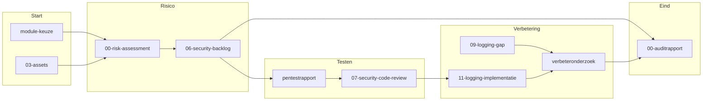

# Documentatie — OpenMRS `webservices.rest` (ATx 2.4)

**Module:** OpenMRS Webservices REST Module (`webservices.rest` v3.2.0)  
**Onderwerp:** software security en compliance (NEN-7510:2024-2)  
**Classificatie:** Vertrouwelijk (NEN-7510 5.12)

Centrale inhoudsopgave voor alle documenten in `docs/`. Dit dossier bestaat uit drie sporen die elkaar voeden: **audit**, **pentest** en **onderhoudbaarheid**, aangevuld met pipeline- en scanbeleid.

---

## Waar begin je?

| Doel | Startdocument |
|------|---------------|
| Overzicht van het hele dossier | Dit bestand |
| Audit en compliance | [auditrapport/00-risk-assessment.md](auditrapport/00-risk-assessment.md) |
| Pentestresultaten | [pentest/pentestrapport-definitief.md](pentest/pentestrapport-definitief.md) |
| Onderhoudbaarheidsverbetering (auditlogging + auth) | [verbeteronderzoek-onderhoudbaarheid.md](verbeteronderzoek-onderhoudbaarheid.md) |
| CI/CD en branchstrategie | [pipeline-strategie.md](pipeline-strategie.md) |
| SBOM en dependency-risico's (Sprint 4) | [auditrapport/00-auditrapport.md](auditrapport/00-auditrapport.md) |

---

## Dossierstructuur

```text
docs/
├── README.md                          ← dit bestand
├── module-keuze.md                    ← projectstart: waarom deze module
├── pipeline-strategie.md              ← trunk-based, OTAP, workflows
├── false-positives-beleid.md          ← Snyk/CodeQL triage (NEN 8.8)
├── verbeteronderzoek-onderhoudbaarheid.md
├── sbom.cdx.json                      ← SBOM uit CI (actuele pipeline-run)
├── auditrapport/                      ← risico, gap, review, logging, SBOM-bijlagen
└── pentest/                           ← plan, testcases, bevindingen, hertest
```

**Buiten deze repo (testomgeving):** `openmrs-webservices-test/` in de bovenliggende map `OpenMRS Security/`. Sommige oudere documenten verwijzen nog naar `testing/openmrs/`; dat pad bestaat niet in de repository.

---

## Aanbevolen leesvolgorde

### 1. Projectcontext

1. [module-keuze.md](module-keuze.md) — modulekeuze en motivatie  
2. [auditrapport/03-assets.md](auditrapport/03-assets.md) — kroonjuwelen en assets  

### 2. Risico en dreigingen

3. [auditrapport/threat-model.md](auditrapport/threat-model.md) — threat model  
4. [auditrapport/04-risico-matrix.md](auditrapport/04-risico-matrix.md) — risicomatrix  
5. [auditrapport/05-bowtie.md](auditrapport/05-bowtie.md) — bow-tie applicatierisico's  
6. [auditrapport/10-attack-surface.md](auditrapport/10-attack-surface.md) — attack surface  
7. [auditrapport/00-risk-assessment.md](auditrapport/00-risk-assessment.md) — samenvattend risk assessment  

### 3. CI/CD en compliance

8. [pipeline-strategie.md](pipeline-strategie.md) — pipeline-ontwerp  
9. [auditrapport/02-pipeline-compliance.md](auditrapport/02-pipeline-compliance.md) — pipeline-compliance  
10. [auditrapport/04b-cicd-risico.md](auditrapport/04b-cicd-risico.md) — CI/CD-risicoanalyse  
11. [auditrapport/04b-cicd-bow-tie.md](auditrapport/04b-cicd-bow-tie.md) — bow-tie CI/CD (secret leak)  
12. [false-positives-beleid.md](false-positives-beleid.md) — scanbeleid  

### 4. Gap, backlog en tests

13. [auditrapport/01-gap-analyse.md](auditrapport/01-gap-analyse.md) — NEN-7510 gap-analyse  
14. [auditrapport/06-security-backlog.md](auditrapport/06-security-backlog.md) — geprioriteerde security backlog  
15. [auditrapport/07-security-code-review.md](auditrapport/07-security-code-review.md) — security code review  
16. [auditrapport/07-code-coverage.md](auditrapport/07-code-coverage.md) — JaCoCo-onderbouwing  

### 5. Pentest

17. [pentest/pentestrapport-definitief.md](pentest/pentestrapport-definitief.md) — **canoniek eindrapport**  
18. Ondersteunend: `01-plan` → `02-testcases` → `03-bevindingen` → `04-burp-requests`  
19. Per gefixte bevinding: `bevinding-PT-003/004/006-voor|mitigatie|na.md`  

### 6. Logging en onderhoudbaarheid

20. [auditrapport/09-logging-gap-analyse.md](auditrapport/09-logging-gap-analyse.md) — logging gap  
21. [auditrapport/11-logging-implementatie.md](auditrapport/11-logging-implementatie.md) — PoC-implementatie auditlogging  
22. [verbeteronderzoek-onderhoudbaarheid.md](verbeteronderzoek-onderhoudbaarheid.md) — ontwerp, realisatie en validatie  

### 7. Eindrapportage Sprint 4

23. [auditrapport/00-auditrapport.md](auditrapport/00-auditrapport.md) — SBOM (§5) en restrisico's (§6)  
24. [auditrapport/bijlage-sbom.cdx.json](auditrapport/bijlage-sbom.cdx.json) — auditbijlage SBOM  
25. [auditrapport/bijlage-dependency-updateadvies.md](auditrapport/bijlage-dependency-updateadvies.md) — CVE-prioritering  
26. [auditrapport/cra-mapping.md](auditrapport/cra-mapping.md) — CRA-mapping (aanvullend op NEN 7510)  

---

## Relaties tussen dossiers



---

## Volledige bestandsindex

### Root (`docs/`)

| Bestand | Rol |
|---------|-----|
| [module-keuze.md](module-keuze.md) | Keuze en motivatie van `webservices.rest` als auditmodule |
| [pipeline-strategie.md](pipeline-strategie.md) | Trunk-based development, OTAP, CI-workflows |
| [false-positives-beleid.md](false-positives-beleid.md) | Triage van Snyk/CodeQL-bevindingen (NEN 8.8) |
| [verbeteronderzoek-onderhoudbaarheid.md](verbeteronderzoek-onderhoudbaarheid.md) | Onderhoudbaarheid: `AuditLogService`, auth-patroon, validatie |
| [sbom.cdx.json](sbom.cdx.json) | CycloneDX SBOM gegenereerd door CI (actuele run) |

### `docs/auditrapport/`

| Bestand | Rol |
|---------|-----|
| [00-risk-assessment.md](auditrapport/00-risk-assessment.md) | Risk Assessment Report (samenvatting risico's) |
| [00-auditrapport.md](auditrapport/00-auditrapport.md) | Sprint 4: SBOM + restrisico's (geen volledig eindrapport) |
| [01-gap-analyse.md](auditrapport/01-gap-analyse.md) | Gap-analyse t.o.v. NEN-7510:2024-2 |
| [02-pipeline-compliance.md](auditrapport/02-pipeline-compliance.md) | Mini-complianceverslag pipeline |
| [03-assets.md](auditrapport/03-assets.md) | Asset-identificatie en kroonjuwelen |
| [04-risico-matrix.md](auditrapport/04-risico-matrix.md) | Risicomatrix (dreigingen T1–T8) |
| [04b-cicd-risico.md](auditrapport/04b-cicd-risico.md) | CI/CD-risicoanalyse |
| [04b-cicd-bow-tie.md](auditrapport/04b-cicd-bow-tie.md) | Bow-tie secret leak in CI/CD |
| [05-bowtie.md](auditrapport/05-bowtie.md) | Bow-tie applicatierisico's |
| [06-security-backlog.md](auditrapport/06-security-backlog.md) | Security backlog (SEC-xxx items) |
| [07-security-code-review.md](auditrapport/07-security-code-review.md) | Security code review (SCR-xxx) |
| [07-code-coverage.md](auditrapport/07-code-coverage.md) | Code coverage onderbouwing (JaCoCo) |
| [09-logging-gap-analyse.md](auditrapport/09-logging-gap-analyse.md) | Logging gap-analyse |
| [10-attack-surface.md](auditrapport/10-attack-surface.md) | Attack surface analyse |
| [11-logging-implementatie.md](auditrapport/11-logging-implementatie.md) | Logging-implementatie (PoC-detail) |
| [threat-model.md](auditrapport/threat-model.md) | Threat model |
| [cra-mapping.md](auditrapport/cra-mapping.md) | CRA-mapping bijlage |
| [bijlage-sbom.cdx.json](auditrapport/bijlage-sbom.cdx.json) | SBOM als auditbijlage (vast moment) |
| [bijlage-dependency-updateadvies.md](auditrapport/bijlage-dependency-updateadvies.md) | Dependency-updateadvies met CVE-prioritering |
| [log4j2.xml](auditrapport/log4j2.xml) | Voorbeeldconfiguratie auditlogger (bewijs) |
| [openmrs-rest-audit.log](auditrapport/openmrs-rest-audit.log) | Voorbeeld auditlog (bewijs) |

### `docs/pentest/`

| Bestand | Rol |
|---------|-----|
| [pentestrapport-definitief.md](pentest/pentestrapport-definitief.md) | Canoniek pentest-eindrapport |
| [01-plan.md](pentest/01-plan.md) | Pentestplan: scope, methodologie, tools |
| [02-testcases.md](pentest/02-testcases.md) | Testcase-catalogus |
| [03-bevindingen.md](pentest/03-bevindingen.md) | Volledige bevindingdetails |
| [04-burp-requests.md](pentest/04-burp-requests.md) | Copy-paste Burp/HTTP-requests |
| [bevinding-PT-003-voor.md](pentest/bevinding-PT-003-voor.md) | PT-003 vóór fix (cleardbcache) |
| [bevinding-PT-003-mitigatie.md](pentest/bevinding-PT-003-mitigatie.md) | PT-003 mitigatie |
| [bevinding-PT-003-na.md](pentest/bevinding-PT-003-na.md) | PT-003 hertest |
| [bevinding-PT-004-voor.md](pentest/bevinding-PT-004-voor.md) | PT-004 vóór fix (settings.form) |
| [bevinding-PT-004-mitigatie.md](pentest/bevinding-PT-004-mitigatie.md) | PT-004 mitigatie |
| [bevinding-PT-004-na.md](pentest/bevinding-PT-004-na.md) | PT-004 hertest |
| [bevinding-PT-006-voor.md](pentest/bevinding-PT-006-voor.md) | PT-006 vóór fix |
| [bevinding-PT-006-mitigatie.md](pentest/bevinding-PT-006-mitigatie.md) | PT-006 mitigatie |
| [bevinding-PT-006-na.md](pentest/bevinding-PT-006-na.md) | PT-006 hertest |

---

## Artefacten en dubbele bestanden

| Bestand | Verschil |
|---------|----------|
| `docs/sbom.cdx.json` | SBOM uit de **actuele CI-pipeline** |
| `docs/auditrapport/bijlage-sbom.cdx.json` | SBOM als **vast auditbewijs** (timestamp in bijlage) |
| `docs/auditrapport/log4j2.xml` | **Voorbeeld/bewijs** van auditlogger-configuratie |
| `docs/auditrapport/openmrs-rest-audit.log` | **Voorbeeld/bewijs** van auditlogregels na runtime-test |

---

## Nummering in auditrapport

De bestandsnamen volgen de **opdrachtstructuur** (WS02/WS06) en zijn niet strikt sequentieel:

- `00-`, `01-` … = audit- en compliancehoofdstukken  
- `2.1`, `2.2`, `2.3` in titels = risicofase (assets, threat model, bow-tie)  
- `04b` = twee gerelateerde CI/CD-documenten (risico + bow-tie)  
- `07-` = twee parallelle kwaliteitsdocumenten (code review + coverage)  

Gebruik deze README of de leeswijzer in het pentestrapport als navigatie; niet de bestandsnaam alleen.

---

## Traceerbaarheid kernketen

| Van | Naar | Via |
|-----|------|-----|
| Pentest PT-003/004 | Code-fix | `06-security-backlog` → `bevinding-PT-00x-mitigatie` |
| Logging gap | PoC | `09-logging-gap` → `11-logging-implementatie` → `verbeteronderzoek` |
| SCA/SBOM | Actie | `00-auditrapport` §5 → `bijlage-dependency-updateadvies` → `06-security-backlog` SEC-006 |
| Fixes | Validatie | unit tests → JaCoCo → Docker/Postman/Burp (zie `verbeteronderzoek` §6) |

---

*Laatste update: juni 2026 — Auditteam C8*
