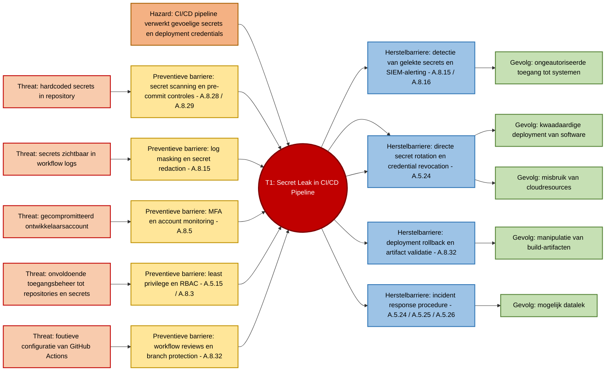

# 4b. Bow-Tie Analyse – Secret Leak in CI/CD Pipeline

## Geselecteerd risico

**C1 – Secret Leak in de CI/CD Pipeline**

Risicoscore: **20 (Kritiek)**

Dit top event is geselecteerd op basis van de CI/CD-risicoanalyse.  
Zie: **04b-cicd-risico.md**, waarin C1 als hoogste risico (score 20) is geïdentificeerd en als uitgangspunt dient voor deze bow-tie analyse.

Dit risico heeft de hoogste score binnen de CI/CD-risicoanalyse en kan leiden tot ongeautoriseerde toegang tot build-, deployment- en productieomgevingen.

## Hazard

**Aanwezigheid van gevoelige secrets en deployment-credentials binnen de CI/CD-pipeline.**

De hazard is niet het secret-lek zelf, maar de situatie waarin de CI/CD-pipeline toegang heeft tot gevoelige informatie zoals API-keys, access tokens, service accounts, deployment keys en cloudcredentials. Deze secrets zijn noodzakelijk voor build-, test- en deploymentprocessen en vormen daardoor een aantrekkelijk doelwit.

Wanneer beveiligingsmaatregelen rondom opslag, gebruik, logging of toegangsbeheer tekortschieten, kunnen deze secrets worden blootgesteld aan onbevoegden. Dit kan leiden tot ongeautoriseerde toegang tot systemen, manipulatie van softwaredeployments, misbruik van cloudresources en mogelijk een datalek.

## Bow-Tie Overzicht

---

## Preventieve Maatregelen

### Secrets Management

- Gebruik van GitHub Secrets
- Geen credentials in source code
- Secrets opslaan in beveiligde secret stores

### Secret Scanning

- GitHub Secret Scanning
- Gitleaks
- TruffleHog

### Toegangsbeheer

- Least Privilege principe
- Rolgebaseerde toegang
- Regelmatige review van toegangsrechten

### Authenticatie

- Verplichte Multi-Factor Authentication (MFA)
- Sterke wachtwoordvereisten

### Workflow Beveiliging

- Branch Protection Rules
- Pull Request Reviews
- Verplichte goedkeuring van workflowwijzigingen

---

## Correctieve Maatregelen

Wanneer een secret-lek wordt vastgesteld:

### Incident Response

- Incident registreren
- Omvang van het lek bepalen
- Onderzoeken welke systemen zijn geraakt

### Intrekken Toegang

- Tokens direct ongeldig maken
- Deployment keys vervangen
- Accounts tijdelijk blokkeren

### Containment

- CI/CD-pipeline tijdelijk stilleggen
- Verdachte deployments blokkeren

---

## Herstelmaatregelen

### Secret Rotatie

- Nieuwe API-keys genereren
- Nieuwe deployment credentials uitrollen

### Herstel Omgeving

- Buildomgeving controleren
- Deploymentomgeving opnieuw valideren

### Security Review

- Controle van repositoryhistorie
- Controle van workflowconfiguraties
- Controle van toegangsrechten

### Lessons Learned

- Evaluatie van oorzaak
- Verbetering van processen en controles

---

## Relatie met CI/CD Beveiligingscontroles

| Onderdeel | Relatie met risico |
|------------|-------------------|
| Pipeline | Secrets worden gebruikt tijdens build en deployment |
| Secrets | Direct doelwit van het risico |
| SAST | Secret Scanning |
| SCA | Beperkt risico op kwetsbare dependencies |
| SBOM | Ondersteunt impactanalyse bij incidenten |
| Deployment Approval | Verkleint kans op misbruik van gelekte credentials |

---

## Conclusie

Een secret leak vormt het grootste risico binnen het CI/CD-proces. Door toepassing van secret management, scanning, toegangscontrole en incidentresponsmaatregelen kan zowel de kans als de impact van dit risico aanzienlijk worden verminderd.
