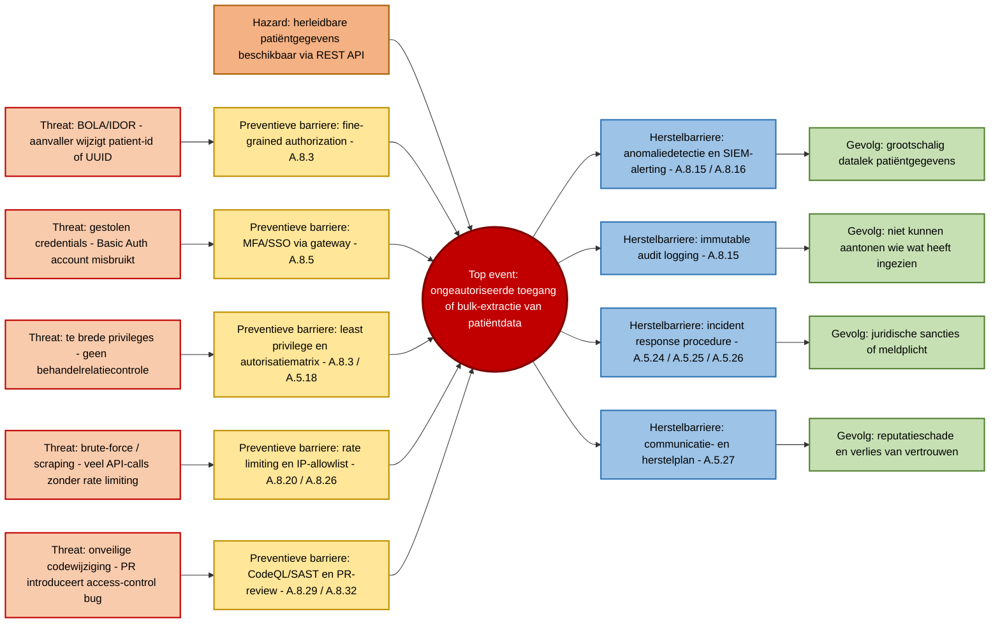

# 2.3 Bow-tie analyse — OpenMRS REST Web Services Module

## Context

Deze bow-tie analyse is opgesteld voor de gekozen OpenMRS module `webservices.rest`. Deze module vormt een REST API-laag bovenop OpenMRS en kan daardoor toegang geven tot medische gegevens zoals patiëntgegevens, encounters en observaties.

De bow-tie methode wordt gebruikt om één concreet risicoscenario uit te werken: links staan de dreigingen en preventieve barrières, in het midden het top event, en rechts de gevolgen en herstelbarrières. De methode helpt om zowel preventieve als correctieve maatregelen inzichtelijk te maken.

## Gekozen hoogste risico

Het hoogste risico is:

> Ongeautoriseerde toegang tot of bulk-extractie van patiëntgegevens via de OpenMRS REST API.

Dit risico is gekozen omdat patiëntgegevens kroonjuwelen zijn binnen een healthcare-omgeving. De impact is hoog op vertrouwelijkheid, juridische verplichtingen, reputatie en auditbaarheid.

## Hazard

**Aanwezigheid van herleidbare patiëntgegevens via REST endpoints.**

De hazard is niet de aanval zelf, maar de gevaarlijke situatie: de module verwerkt of ontsluit gevoelige medische gegevens via API-endpoints.

## Top event

**Ongeautoriseerde toegang tot of bulk-extractie van patiëntgegevens via een REST endpoint.**

Dit betekent dat een onbevoegde of onvoldoende bevoegde gebruiker via de REST API patiëntgegevens kan ophalen, bijvoorbeeld door misbruik van credentials, onvoldoende autorisatie of massale API-calls.

## Risico-inschatting

| Onderdeel | Waarde |
|---|---|
| Kans | 4 — Waarschijnlijk |
| Impact | 5 — Catastrofaal |
| Risicoscore | 20 |
| Risiconiveau | Rood — onacceptabel risico |
| CIA/BIV-impact | Vertrouwelijkheid hoog, integriteit midden, beschikbaarheid laag/midden |

De score is gebaseerd op de risicomatrix uit WS03: risico = kans × impact. Een score van 15 of hoger valt in rood en vereist directe mitigatie.

---

## Bow-tie diagram

