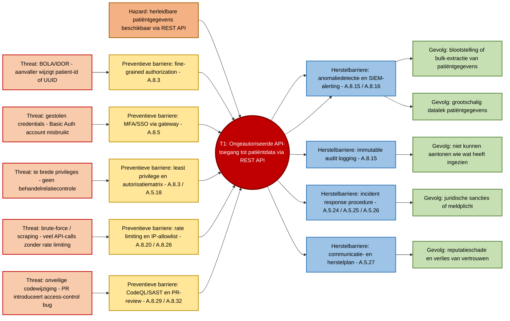

# 2.3 Bow-tie analyse — OpenMRS REST Web Services Module

## Context

Deze bow-tie analyse is opgesteld voor de gekozen OpenMRS module `webservices.rest`. Deze module vormt een REST API-laag bovenop OpenMRS en ontsluit medische gegevens zoals patiëntgegevens, encounters en observaties via HTTP-endpoints.

De bow-tie methode wordt gebruikt om één concreet risicoscenario uit te werken. Links staan de dreigingen en preventieve barrières, in het midden staat het top event, en rechts staan de gevolgen en herstelbarrières. Hierdoor wordt zichtbaar welke maatregelen nodig zijn om de kans op het incident te verkleinen en welke maatregelen nodig zijn om de impact te beperken als het incident toch optreedt.

## Koppeling met de risicomatrix

Deze bow-tie werkt het hoogste risico uit `04-risicomatrix.md` uit:

| Onderdeel      | Waarde                                                                  |
| -------------- | ----------------------------------------------------------------------- |
| Threat ID      | T1                                                                      |
| Risico         | Ongeautoriseerde API-toegang                                            |
| Kans           | 4 — Hoog                                                                |
| Impact         | 5 — Zeer hoog                                                           |
| Risicoscore    | 20                                                                      |
| Risiconiveau   | Kritiek                                                                 |
| CIA/BIV-impact | Vertrouwelijkheid hoog, integriteit midden, beschikbaarheid laag/midden |

Dit risico is gekozen omdat de OpenMRS REST Web Services Module directe toegang kan geven tot gevoelige medische gegevens. Misbruik van de REST API kan leiden tot ongeautoriseerde inzage in patiëntdata, datalekken, juridische gevolgen en verlies van vertrouwen.

De CI/CD-risico’s vallen buiten de scope van deze bow-tie. Die worden apart uitgewerkt in `04b-cicd-risico.md`.

## Hazard

**Aanwezigheid van herleidbare patiëntgegevens via REST endpoints.**

De hazard is niet de aanval zelf, maar de gevaarlijke situatie: de module verwerkt en ontsluit gevoelige medische gegevens via API-endpoints. Daardoor kan een fout in authenticatie, autorisatie, logging of API-beveiliging leiden tot ongeautoriseerde toegang.

## Top event

**Ongeautoriseerde API-toegang tot patiëntdata via de REST API.**

Dit betekent dat een onbevoegde of onvoldoende bevoegde actor via de REST API toegang krijgt tot patiëntgegevens. Dit kan bijvoorbeeld gebeuren door misbruik van credentials, onvoldoende autorisatie, te brede privileges, scraping of een kwetsbaarheid in de API-laag.

Bulk-extractie en blootstelling van patiëntdata worden in deze bow-tie beschouwd als mogelijke gevolgen van het top event.

---

## Bow-tie diagram

---

## Linkerkant — dreigingen en preventieve barrières

| Threat                  | Beschrijving                                                                                                          | Preventieve barrière                                                                                                      | NEN-7510:2024-2 control                |
| ----------------------- | --------------------------------------------------------------------------------------------------------------------- | ------------------------------------------------------------------------------------------------------------------------- | -------------------------------------- |
| BOLA / IDOR             | Een aanvaller past een patiënt-ID, UUID of resource-ID in de URL aan om gegevens van een andere patiënt op te vragen. | Fine-grained authorization: controleer per resource of de gebruiker toegang heeft tot deze specifieke patiënt of dataset. | A.8.3 Toegangsbeperking tot informatie |
| Gestolen credentials    | Een gebruikersnaam/wachtwoord of API-account wordt buitgemaakt en gebruikt voor REST API-toegang.                     | MFA/SSO via gateway; API-toegang niet alleen baseren op gebruikersnaam/wachtwoord.                                        | A.8.5 Beveiligde authenticatie         |
| Te brede privileges     | Een gebruiker heeft toegang tot meer patiëntdata dan nodig is voor diens rol.                                         | Least privilege en autorisatiematrix per endpoint, methode en rol.                                                        | A.8.3 / A.5.18                         |
| Brute-force / scraping  | Een script voert veel API-calls uit om credentials te raden of patiëntdata systematisch op te halen.                  | Rate limiting, account-based throttling en IP-allowlist.                                                                  | A.8.20 / A.8.26                        |
| Onveilige codewijziging | Een pull request introduceert broken access control of een autorisatiefout.                                           | CodeQL/SAST, verplichte PR-review en security testcases.                                                                  | A.8.29 / A.8.32                        |

---

## Rechterkant — gevolgen en herstelbarrières

| Gevolg                                              | Beschrijving                                                              | Herstelbarrière                                                                               | NEN-7510:2024-2 control  |
| --------------------------------------------------- | ------------------------------------------------------------------------- | --------------------------------------------------------------------------------------------- | ------------------------ |
| Blootstelling of bulk-extractie van patiëntgegevens | Een onbevoegde actor leest of exporteert medische gegevens.               | Anomaliedetectie en SIEM-alerting bij afwijkende patronen zoals veel requests of bulk-export. | A.8.15 / A.8.16          |
| Grootschalig datalek                                | Patiëntgegevens komen ongeautoriseerd beschikbaar buiten de organisatie.  | Anomaliedetectie, incidentclassificatie en snelle containment.                                | A.8.15 / A.8.16          |
| Niet kunnen aantonen wie wat heeft ingezien         | Onvoldoende audit trail maakt reconstructie van een incident onmogelijk.  | Immutable audit logging: log gebruiker, tijdstip, endpoint, resource, resultaat en bron-IP.   | A.8.15 Logging           |
| Juridische sancties / meldplicht                    | Mogelijke AVG-melding, toezichtmaatregelen of andere juridische gevolgen. | Incident response procedure voor classificatie, containment, melding en opvolging.            | A.5.24 / A.5.25 / A.5.26 |
| Reputatieschade                                     | Vertrouwen van patiënten, zorgverleners en stakeholders neemt af.         | Communicatie- en herstelplan.                                                                 | A.5.27                   |

---

## Escalation factors

Escalation factors zijn omstandigheden waardoor barrières minder effectief worden of kunnen falen.

| Barrière                   | Escalation factor                                                                        | Extra maatregel                                                                            |
| -------------------------- | ---------------------------------------------------------------------------------------- | ------------------------------------------------------------------------------------------ |
| MFA/SSO via gateway        | Legacy clients of service accounts ondersteunen geen MFA.                                | Gebruik scoped service accounts, kortlevende tokens en extra monitoring.                   |
| Fine-grained authorization | Autorisatie wordt alleen op rolniveau gedaan, niet op patiënt- of behandelrelatieniveau. | Voeg contextuele autorisatie toe, inclusief behandelrelatiecontrole.                       |
| Rate limiting              | Aanvaller gebruikt meerdere IP-adressen of meerdere accounts.                            | Combineer rate limiting per IP met limieten per account en detectie van afwijkend gedrag.  |
| Immutable audit logging    | Logging is te beperkt, staat op debug-niveau of wordt niet centraal opgeslagen.          | Stuur audit-events naar centrale logopslag/SIEM en bescherm logs tegen wijziging.          |
| PR-review / SAST           | Securityfouten worden niet door tooling of reviewer herkend.                             | Voeg security testcases en aanvullende handmatige code review toe voor kritieke endpoints. |

---

## Audit-mindset

Een belangrijk uitgangspunt is:

> Niet gelogd = niet gebeurd.

Daarom is preventie alleen niet voldoende. Als een preventieve maatregel faalt, moet de organisatie achteraf kunnen aantonen:

* welk account toegang had;
* welke patiëntgegevens zijn geraadpleegd;
* wanneer dit gebeurde;
* vanaf welk IP-adres of systeem;
* of er sprake was van bulk-extractie;
* welke herstelactie is genomen.

Dit maakt logging, monitoring en incident response essentieel als herstelbarrières.

---

## Koppeling met pentest en security backlog

Deze bow-tie vormt input voor de penetration test en security backlog. De meest relevante tests zijn:

| Scenario             | Pentest-idee                                                                                                    | Verwachte uitkomst                                       |
| -------------------- | --------------------------------------------------------------------------------------------------------------- | -------------------------------------------------------- |
| BOLA / IDOR          | Wijzig patiënt-ID of UUID in een request en controleer of toegang tot andere patiëntdata mogelijk is.           | Bevestigen of resource-level autorisatie voldoende is.   |
| Gestolen credentials | Test in een gecontroleerde omgeving of een account met beperkte rechten toch gevoelige REST-data kan benaderen. | Aantonen of authenticatie en autorisatie voldoende zijn. |
| Geen rate limiting   | Voer herhaalde requests uit op kritieke endpoints.                                                              | Controleren of scraping of bulk-opvraging wordt beperkt. |
| Logging              | Controleer of succesvolle en mislukte API-toegangspogingen worden gelogd.                                       | Aantonen of audit logging toereikend is.                 |

De resultaten hiervan kunnen worden opgenomen in:

* `docs/pentest/`
* `docs/auditrapport/06-security-backlog.md`

---

## Restrisico

Ook na implementatie van de beschreven barrières blijft restrisico bestaan, bijvoorbeeld:

* insider threats met geldige rechten;
* misbruik van service accounts;
* onbekende kwetsbaarheden in dependencies of OpenMRS core;
* onvoldoende detailniveau in logging;
* fouten in configuratie van reverse proxy, gateway of identity provider.

Deze restrisico’s moeten periodiek worden herbeoordeeld en opgenomen worden in de security backlog.

---

## Conclusie

Deze bow-tie analyse werkt het hoogste risico uit de risicomatrix uit: **T1 — Ongeautoriseerde API-toegang**.

De analyse laat zien dat ongeautoriseerde API-toegang kan ontstaan door onder andere:

1. BOLA/IDOR;
2. gestolen credentials;
3. te brede privileges;
4. brute-force of scraping;
5. onveilige codewijzigingen.

De belangrijkste preventieve maatregelen zijn:

1. fine-grained authorization;
2. MFA/SSO via gateway;
3. least privilege en autorisatiematrix;
4. rate limiting en IP-allowlist;
5. SAST/CodeQL en PR-review.

De belangrijkste herstelmaatregelen zijn:

1. anomaliedetectie en SIEM-alerting;
2. immutable audit logging;
3. incident response;
4. communicatie- en herstelplan.

Daarmee maakt de bow-tie inzichtelijk hoe dit kritieke risico ontstaat, welke gevolgen het kan hebben en welke maatregelen nodig zijn om de kans en impact te verlagen.
