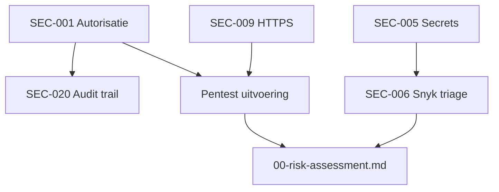

# 5.6 Security backlog

**Document:** `docs/auditrapport/06-security-backlog.md`  
**Module:** OpenMRS `webservices.rest` v3.2.0  
**Status:** Definitief — pentest P1 (2026-06-09, Boyan) bevestigt SEC-007, SEC-019, SEC-010; SEC-001 deels effectief (T2 Pass); besluiten nog open

---

## 1. Inleiding

Dit document bevat geprioriteerde security requirements op basis van gevonden risico's, compliance-gaps en geplande testactiviteiten. De backlog voedt het pentest-plan (`docs/pentest/`) en het Risk Assessment Report (`00-risk-assessment.md`).

### Bronnen

| Bron | Document | Gebruik in backlog |
|------|----------|-------------------|
| Kroonjuwelen & CIA | `03-assets.md` | Impactweging patiëntdata |
| Risicomatrix | `04-risico-matrix` | Dreigingen T1–T8, scores |
| Bow-tie | `05-bowtie.md` | Top event + preventieve barrières |
| Pipeline GAP | `02-pipeline-compliance.md` | 23 NEN 7510-2 controlgebieden |
| GAP-spreadsheet | `gap_analyse.xlsx` | Zelfde 23 items, detail |
| Scanbeleid | `false-positives-beleid.md` | Triage Snyk/CodeQL (8.8) |
| CI-pipeline | `.github/workflows/snyk.yml`, `codeql.yml` | SAST/SCA/SBOM |
| DAST-scope | `docs/pentest/` (Burp Suite; ZAP niet uitgevoerd) | Runtime-testcases |

### Prioriteringsmodel

| Prioriteit | Risicoscore | Deadline (richtlijn) |
|------------|-------------|----------------------|
| **P1 — Kritiek** | 15–25 (T1, T2, T4) | ≤ 1 sprint / vóór productie |
| **P2 — Hoog** | 10–14 (T3, T5) | ≤ 2 sprints |
| **P3 — Midden** | 5–9 (T6, T7) | Backlog met tijdlijn |
| **P4 — Laag / organisatorisch** | 1–4 (T8) of buiten module | Acceptatie of platform |

Risicoscore = kans × impact (schaal 1–5), conform `04-risico-matrix`.

---

## 2. Samenvatting

| Prioriteit | Aantal | Focus |
|------------|--------|-------|
| P1 | 10 | Patiëntdata-lek, auth, secrets, supply chain |
| P2 | 10 | RBAC, logging, integriteit medische data |
| P3 | 8 | Monitoring, IRP, encryptie-at-rest (platform) |
| P4 | 4 | Documentatie, terminologie, organisatie |
| **Totaal** | **32** | |

---

## 3. P1 — Kritieke requirements

| ID | Requirement | Dreiging / asset | NEN-7510:2024-2 | Acceptatiecriterium | Eigenaar |
|----|-------------|------------------|-----------------|----------------------|----------|
| SEC-001 | **Fine-grained autorisatie** op alle REST-resources (`patient`, `obs`, `order`, `allergy`, …) | T1, T2 — A-01 t/m A-10 | **8.3** Informatietoegangsbeperking | Anonieme GET (ffuf/curl) op REST-resources → 401/403; geen `results[]` zonder privilege | Module-team |
| SEC-002 | **Sterke authenticatie (MFA)** via gateway/IdP voor API-toegang | T1 — A-04, A-05 | **8.5** Veilige authenticatie | MFA verplicht voor accounts met toegang tot patiëntdata; gedocumenteerd in deployment | Platform / IAM |
| SEC-003 | **Brute-force bescherming** op login (`/ws/rest/v1/session`) | T1, T6 — A-04 | **8.5** + **8.6** Capaciteitsbeheer | Lockout of exponential backoff na N mislukte pogingen; getest in pentest TC-AUTH-03 | Module + gateway |
| SEC-004 | **Rate limiting** op REST API (per IP / token) | T1, T6 | **8.6** + **8.20** Netwerkbeveiliging | Bulk-scraping `patient?limit=N` wordt begrensd; gateway of module-cap actief | Platform |
| SEC-005 | **Secrets management** — geen credentials in repo/compose/Actions | T4 — A-05, A-13 | **8.9** Configuratiebeheer | GitHub secret scanning actief; geen plaintext secrets in git history; Vault of GH Secrets | DevOps |
| SEC-006 | **Supply-chain hardening** — SAST/SCA-triage en patchproces | T5 — A-14 | **8.8** Kwetsbaarhedenbeheer, **8.29** Testen | Elke `snyk-results.json` bevinding getriaged (patchen/accepteren/supprimeren); Critical ≤ 24u | Security champion |
| SEC-007 | **Module-instellingen afschermen** (`settings.form`) | Bow-tie T5 | **8.9** + **8.26** Applicatie-eisen | `settings.form` → 401/403 zonder admin-sessie (TC-CONF-03, curl/Burp) | Module-team |
| SEC-008 | **XML/XXE-blokkade** via ContentTypeFilter | Injectie-risico | **8.26** + **8.28** Veilig coderen | POST `/session` met `application/xml` → HTTP 415 | Module-team |
| SEC-009 | **HTTPS afdwingen** incl. HSTS op productie-endpoint | T2 — vertrouwelijkheid | **8.24** Cryptografie | Productie-URL alleen HTTPS; HSTS-header aanwezig; geen downgrade | Platform |
| SEC-010 | **Stack traces uitzetten** in productie | Info disclosure | **8.26** | `webservices.rest.enableStackTraceDetails=false`; foutresponses zonder interne details | Module-team |

---

## 4. P2 — Hoge requirements

| ID | Requirement | Dreiging / asset | NEN-7510:2024-2 | Acceptatiecriterium | Eigenaar |
|----|-------------|------------------|-----------------|----------------------|----------|
| SEC-011 | **Least-privilege RBAC** — periodieke review rollen/privileges | T7 — A-06 | **5.18** Toegangsrechten, **8.3** | Autorisatiematrix gedocumenteerd; testaccount met beperkte rol kan geen `order` wijzigen | Functioneel beheer |
| SEC-012 | **IP-allowlist** voor REST API (bestaande module-feature activeren) | T1 | **8.20** | Alleen vertrouwde netwerken; configuratie in `settings.form` of gateway | Platform |
| SEC-013 | **Security logging authenticatie** (login, logout, mislukte pogingen) | T1, T4 | **8.15** Logging | Events naar centraal log; velden: user, IP, timestamp, resultaat | Module + SIEM |
| SEC-014 | **Logging privilege-escalaties** (rol/privilege-wijzigingen) | T7 | **8.15** + **5.18** | Elke wijziging in `role`/`privilege` gelogd met actor en oude/nieuwe waarde | Module-team |
| SEC-015 | **maxResults-cap** afdwingen (`maxResultsAbsolute`) | T1 bulk-extractie | **8.6** | `patient?limit=5000` retourneert ≤ 100 records of HTTP 400 | Module-team |
| SEC-016 | **Integriteit kritieke medische records** (orders, allergieën) | T3 — A-09, A-10 | **8.3** + **5.33** Bescherming dossiers | Wijzigingen alleen met juiste privilege + audit trail; optioneel signing | Module-team |
| SEC-017 | **CI/CD pipeline pinning** — Actions op commit-SHA | T5 | **8.32** Wijzigingsbeheer | Geen `@v4` floating tags op security-workflows; review op workflow-PR's | DevOps |
| SEC-018 | **Wachtwoordbeleid afdwingen** (lengte, complexiteit, rotatie) | T4 | **8.5** | Policy gedocumenteerd en technisch afgedwongen bij `password`-endpoint | Platform |
| SEC-019 | **Bescherming speciale endpoints** (`cleardbcache`, `password`, `loggedinusers`) | Bow-tie T4 | **8.3** + **8.26** | POST/GET zonder auth → 401/403; geen datalek op `loggedinusers` | Module-team |
| SEC-020 | **Audit trail zorggegevens** uitbreiden (NEN 7513) | T2 — alle A-xx patiënt | **8.15** + NEN 7513 | Wie-wat-wanneer voor lees/toegang patiëntdata; niet alleen creator/changer | Module + compliance |

---

## 5. P3 — Middel requirements

| ID | Requirement | Dreiging / asset | NEN-7510:2024-2 | Acceptatiecriterium | Eigenaar |
|----|-------------|------------------|-----------------|----------------------|----------|
| SEC-021 | **Monitoring beveiligingsincidenten** (SIEM-koppeling) | T1 detectie | **8.16** Bewaking | Alerts op mislukte logins, bulk-API-calls, privilege-wijzigingen | SOC / platform |
| SEC-022 | **Anomaliedetectie** op API-patronen | T6, T1 | **8.16** | Baseline + afwijkingsmelding (bijv. >1000 patient-GETs/uur) | Platform |
| SEC-023 | **Incidentresponsprocedure (IRP)** documenteren | Alle T-xx | **5.24–5.27** Incidentbeheer | `docs/incident-response.md` met meldplicht, rollen, escalatie | CISO / management |
| SEC-024 | **Encryptie data-at-rest** database en backups | T2 | **8.24** | DB-encryptie of TDE aan; key management gedocumenteerd | Platform |
| SEC-025 | **Continuïteit / BCP-DRP** voor OpenMRS-omgeving | T6 | **5.29** + **5.30** | RTO/RPO gedefinieerd; jaarlijkse test | Platform |
| SEC-026 | **Back-upstrategie** en hersteltest | T6 | **8.13** Back-up | Dagelijkse backup; restore getest; bewijs in runbook | Ops |
| SEC-027 | **Leveranciersbeveiliging** (OpenMRS, Snyk, GitHub) | T5 | **5.19–5.22** Leveranciersrelaties | Vendor-assessment voor kritieke SaaS; contractuele security-eisen | Inkoop |
| SEC-028 | **Compliance-rapportage** geautomatiseerd | Audit | **5.36** Naleving beleid | Dashboard of export uit pipeline-artifacts + backlog-status | Security champion |

---

## 6. P4 — Lage / organisatorische requirements

| ID | Requirement | Dreiging / asset | NEN-7510:2024-2 | Acceptatiecriterium | Eigenaar |
|----|-------------|------------------|-----------------|----------------------|----------|
| SEC-029 | **Swagger/apiDocs beperken** in productie | Info disclosure | **8.26** | Documentatie alleen voor geauthenticeerde admins of intern netwerk | Platform |
| SEC-030 | **Concept dictionary changemanagement** | T8 — A-12 | **8.32** | Wijzigingen SNOMED/ICD via goedgekeurd proces; checksum op imports | Functioneel beheer |
| SEC-031 | **Functiescheiding** organisatorisch borgen | T7 | **5.3** + **6.1** (organisatie) | Scheiding dev/beheer/audit gedocumenteerd en toegepast | Management |
| SEC-032 | **Sessie-diagnostiek** (`/session/diag`) afschermen | Reconnaissance | **8.26** | Alleen admin; niet publiek bereikbaar | Module-team |

---

## 7. Koppeling dreiging → backlog

| Dreiging | Score | Primaire backlog-items |
|----------|-------|------------------------|
| T1 Ongeautoriseerde API-toegang | 20 | SEC-001, SEC-002, SEC-003, SEC-004, SEC-012, SEC-015, SEC-019 |
| T4 Credential-lek repository | 16 | SEC-005, SEC-006, SEC-017 |
| T2 Blootstelling patiëntdata | 15 | SEC-001, SEC-009, SEC-020 |
| T3 Manipulatie orders/allergieën | 10 | SEC-011, SEC-016 |
| T5 Supply chain CI/CD | 10 | SEC-006, SEC-017, SEC-027 |
| T6 Denial of Service | 9 | SEC-003, SEC-004, SEC-025, SEC-026 |
| T7 Privilege escalatie | 8 | SEC-011, SEC-014, SEC-031 |
| T8 Concept dictionary poisoning | 4 | SEC-030 |

---

## 8. Afhankelijkheden en volgorde

**Aanbevolen implementatievolgorde (eerste sprint):**

1. SEC-005, SEC-010, SEC-007, SEC-008 (quick wins, lage kosten)
2. SEC-001, SEC-019 (kern access control)
3. SEC-006 (Snyk-triage op basis van `snyk-results.json` artifact)
4. Pentest uitvoeren (validatie P1-items)
5. SEC-002, SEC-003, SEC-004 (platform, parallel)

---

## 9. Openstaande items (wacht op input)

| Item | Wacht op | Actie |
|------|----------|-------|
| SEC-006 detail (CVE-lijst) | Nieuwste `snyk-results.json` uit CI | Triage per `false-positives-beleid.md`; SEC-028+ indien nodig |
| Threat-model controls | `threat-model.md` (Jeroen) | Aanvullen met STRIDE-specifieke requirements |
| CI/CD bow-tie mitigaties | `04b-cicd-risico.md` (Tjeerd) | Eventueel SEC-033+ voor pipeline-specifieke risks |

---

## 10. NEN-7510:2024-2 dekking

| Control | Backlog-items |
|---------|---------------|
| 5.12 Classificatie informatie | Alle items rond patiëntdata (SEC-001, SEC-020) |
| 5.18 Toegangsrechten | SEC-011, SEC-014 |
| 5.24–5.27 Incidentbeheer | SEC-023 |
| 8.3 Informatietoegangsbeperking | SEC-001, SEC-011, SEC-016, SEC-019 |
| 8.5 Veilige authenticatie | SEC-002, SEC-003, SEC-018 |
| 8.8 Kwetsbaarhedenbeheer | SEC-006 |
| 8.15 Logging | SEC-013, SEC-014, SEC-020 |
| 8.16 Bewaking | SEC-021, SEC-022 |
| 8.20 Netwerkbeveiliging | SEC-004, SEC-012 |
| 8.24 Cryptografie | SEC-009, SEC-024 |
| 8.26 Applicatie-eisen | SEC-007, SEC-008, SEC-010, SEC-019 |
| 8.28 Veilig coderen | SEC-008 |
| 8.29 Beveiligingstesten | SEC-006 + pentest (`docs/pentest/`) |
| 8.32 Wijzigingsbeheer | SEC-017, SEC-030 |

---

*Laatste update: 2026-06-09 — Boyan / ATx-2.4 Software security & compliance*
