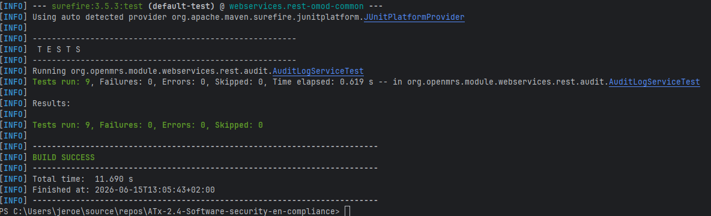

# 11. Logging implementatie — OpenMRS REST Web Services Module

## 1. Doel

Deze implementatie voegt ontbrekende auditlogging toe aan de OpenMRS REST Web Services Module, zodat patiëntgerelateerde wijzigingen beter aansluiten op **NEN-7510 A.8.15 — Logging**.

Uit de logging gap-analyse bleek dat relevante acties op patiëntgegevens onvoldoende of niet expliciet werden gelogd. Vooral create-, update-, delete/void- en purge-acties zijn belangrijk, omdat deze direct invloed hebben op de integriteit en beschikbaarheid van patiëntgegevens.

Het doel van deze wijziging is daarom:

* relevante succesvolle patiëntacties loggen;
* relevante mislukte patiëntacties loggen;
* geen gevoelige patiëntgegevens in logregels opnemen;
* een consistent auditlogformaat introduceren;
* de implementatie testbaar en herleidbaar maken;
* de wijziging aantoonbaar maken via tests, PR en documentatie.

---

## 2. Scope

De implementatie richt zich in deze iteratie op patiëntgerelateerde write-acties binnen de REST API.

Binnen scope:

| Actie                                        | Resource             | Auditactie              |
| -------------------------------------------- | -------------------- | ----------------------- |
| Patient create                               | `PatientResource1_8` | `CREATE`                |
| Patient update                               | `PatientResource1_8` | `UPDATE`                |
| Patient delete/void                          | `PatientResource1_8` | `DELETE_VOID`           |
| Patient purge                                | `PatientResource1_8` | `PURGE`                 |
| Idempotente delete van reeds voided patient  | `PatientResource1_8` | `DELETE_ALREADY_VOIDED` |
| Idempotente purge van niet-bestaande patient | `PatientResource1_8` | `PURGE_NOT_FOUND`       |

Buiten scope voor deze iteratie:

| Onderdeel                                     | Reden                                                                                                                                                                 |
| --------------------------------------------- | --------------------------------------------------------------------------------------------------------------------------------------------------------------------- |
| Read-acties via `GET /patient/{uuid}`         | `getByUniqueId` wordt ook intern gebruikt door updateflows, waardoor read-logging eerst apart ontworpen moet worden om dubbele of misleidende auditlogs te voorkomen. |
| Observations, encounters, orders en allergies | Deze resources zijn relevant, maar vallen buiten de eerste implementatiescope om de PR klein en controleerbaar te houden.                                             |
| Centrale SIEM- of WORM-opslag                 | De code schrijft auditregels via het logging-framework. Centrale opslag en retentie zijn configuratie-/beheermaatregelen buiten deze codewijziging.                   |
| Volledige incidentdetectie of alerting        | Deze implementatie legt audit-events vast, maar voert nog geen patroonherkenning of automatische alarmering uit.                                                      |

---

## 3. Afbakening en beperkingen

Deze PR implementeert auditlogging voor patiëntgerelateerde write-acties: create, update, delete/void en purge. Read-acties en andere medische resources zoals observations, encounters, orders en allergies vallen buiten deze iteratie.

Deze keuze is gemaakt om de wijziging klein, testbaar en reviewbaar te houden. De logging gap-analyse toont aan dat ook deze overige resources relevant zijn voor NEN-7510 A.8.15, maar uitbreiding daarvan wordt als vervolgactie opgenomen.

De implementatie verlaagt het risico op ontbrekende audittrail voor patiëntwijzigingen, maar lost nog niet alle logging-gaps binnen de module op.

---

## 4. Traceerbaarheid naar logging gap-analyse

De implementatie is gebaseerd op de eerder uitgevoerde logging gap-analyse. In onderstaande tabel staat welke gap door deze wijziging wordt geraakt.

| Gap uit logging gap-analyse                                                 | Oplossing in deze implementatie                                                                          | Status                |
| --------------------------------------------------------------------------- | -------------------------------------------------------------------------------------------------------- | --------------------- |
| Create-acties op patiëntrecords worden niet expliciet auditbaar gelogd      | `create(...)` in `PatientResource1_8` logt `CREATE` met `SUCCESS` of `FAILURE`                           | Gedeeltelijk opgelost |
| Update-acties op patiëntrecords worden niet expliciet auditbaar gelogd      | `update(...)` in `PatientResource1_8` logt `UPDATE` met `SUCCESS` of `FAILURE`                           | Gedeeltelijk opgelost |
| Delete/void-acties op patiëntrecords worden niet expliciet auditbaar gelogd | `delete(...)` logt `DELETE_VOID` of `DELETE_ALREADY_VOIDED`                                              | Gedeeltelijk opgelost |
| Purge-acties worden niet expliciet auditbaar gelogd                         | `purge(...)` logt `PURGE` of `PURGE_NOT_FOUND`                                                           | Gedeeltelijk opgelost |
| Mislukte patiëntgerelateerde write-acties zijn onvoldoende zichtbaar        | Foutpaden loggen `outcome=FAILURE` en gooien daarna de oorspronkelijke exception opnieuw                 | Gedeeltelijk opgelost |
| Gevoelige data kan onbedoeld in logs terechtkomen                           | Auditlogformaat bevat alleen metadata en tests controleren dat gevoelige termen niet standaard voorkomen | Gedeeltelijk opgelost |

De status is bewust als “gedeeltelijk opgelost” aangeduid, omdat deze PR alleen patiëntgerelateerde write-acties implementeert en nog niet alle medische resources of read-acties dekt.

---

## 5. Implementatiekeuze

Er is een centrale klasse toegevoegd:

```text
omod-common/src/main/java/org/openmrs/module/webservices/rest/audit/AuditLogService.java
```

Deze klasse bouwt auditlogregels op in een vast key-value-formaat en schrijft deze via een aparte auditlogger:

```text
OPENMRS_REST_AUDIT
```

De patiëntresource is aangepast in:

```text
omod-common/src/main/java/org/openmrs/module/webservices/rest/web/v1_0/resource/openmrs1_8/PatientResource1_8.java
```

Daar zijn auditlog-aanroepen toegevoegd rond patiëntgerelateerde write-acties:

* `create(...)`
* `update(...)`
* `delete(...)`
* `purge(...)`

De methode `save(...)` is bewust niet gebruikt als centrale plek voor logging, omdat deze methode zowel door create- als updateflows wordt gebruikt. Logging in `save(...)` zou daardoor onduidelijk maken of een actie een create of update was en kan leiden tot dubbele of verkeerd geïnterpreteerde auditregels.

Ook `getByUniqueId(...)` is in deze iteratie bewust niet aangepast. Deze methode wordt niet alleen gebruikt voor directe read-acties, maar ook intern door andere flows zoals update. Logging op deze plek kan daardoor leiden tot extra read-logs die niet altijd overeenkomen met een expliciete gebruikeractie.

---

## 6. Auditlogformaat

Elke auditlogregel bevat minimaal de volgende velden:

| Veld           | Betekenis                                                                    |
| -------------- | ---------------------------------------------------------------------------- |
| `event`        | Type security-event, bijvoorbeeld `PATIENT_ACCESS` of `ACCESS_DENIED`        |
| `outcome`      | Resultaat van de actie: `SUCCESS` of `FAILURE`                               |
| `userId`       | UUID of technische identificatie van de geauthenticeerde gebruiker           |
| `resourceType` | Type resource, bijvoorbeeld `Patient`                                        |
| `resourceUuid` | UUID van de betrokken resource                                               |
| `action`       | Uitgevoerde actie, bijvoorbeeld `CREATE`, `UPDATE`, `DELETE_VOID` of `PURGE` |
| `timestamp`    | Tijdstip waarop de auditregel is opgebouwd                                   |

Voorbeeld van een auditregel:

```text
event=PATIENT_ACCESS outcome=SUCCESS userId=<user-uuid> resourceType=Patient resourceUuid=<patient-uuid> action=UPDATE timestamp=<timestamp>
```

Dit formaat is bewust gekozen omdat het consistent, machineleesbaar en geschikt is voor latere verwerking door monitoring- of loganalyse-oplossingen.

---

## 7. Privacy en dataminimalisatie

De auditlogging is bewust beperkt tot metadata. Er wordt geen medische inhoud of direct identificerende patiëntinformatie gelogd.

Niet gelogd:

* BSN;
* patiëntnaam;
* adresgegevens;
* diagnose;
* medicatie;
* allergie-inhoud;
* wachtwoorden;
* Authorization-header;
* Basic Auth-header;
* sessietokens;
* JSESSIONID;
* volledige request body;
* volledige response body.

Voor patiëntacties wordt alleen de `Patient`-resource en de UUID van de patiënt vastgelegd. Dit is voldoende om achteraf te kunnen herleiden welke resource is geraakt, zonder medische inhoud in de logregel op te nemen.

Deze keuze ondersteunt dataminimalisatie: er wordt alleen gelogd wat nodig is voor auditbaarheid en incidentonderzoek.

---

## 8. Afhandeling van succesvolle en mislukte acties

De implementatie logt zowel succesvolle als mislukte acties.

Bij succesvolle acties wordt gelogd met:

```text
outcome=SUCCESS
```

Bij fouten wordt gelogd met:

```text
outcome=FAILURE
```

Daarna wordt de oorspronkelijke exception opnieuw gegooid. Hierdoor verandert de functionele foutafhandeling van de REST API niet, maar wordt het falen wel auditbaar.

Voorbeeld bij een mislukte update:

```text
event=PATIENT_ACCESS outcome=FAILURE resourceType=Patient resourceUuid=<patient-uuid> action=UPDATE
```

Deze aanpak zorgt ervoor dat de logging geen functioneel gedrag maskeert of afvangt. De REST API blijft dezelfde fout teruggeven, terwijl het falen wel zichtbaar wordt in de auditlog.

---

## 9. Sanitization van logvelden

Alle velden die in de auditlogregel worden geplaatst, worden via een `safe(...)`-methode opgeschoond.

De sanitization doet het volgende:

| Situatie             | Resultaat |
| -------------------- | --------- |
| `null`               | Wordt `-` |
| Lege waarde          | Wordt `-` |
| Nieuwe regel `\n`    | Wordt `_` |
| Carriage return `\r` | Wordt `_` |
| Tab `\t`             | Wordt `_` |

Hiermee wordt voorkomen dat invoer logregels kan manipuleren of meerdere logregels kan injecteren.

Voorbeeld:

```text
Invoer:  patient
456
Output: patient_456
```

---

## 10. Testaanpak

De implementatie is getest met unit tests op `AuditLogService`.

Testbestand:

```text
omod-common/src/test/java/org/openmrs/module/webservices/rest/audit/AuditLogServiceTest.java
```

De tests richten zich op:

* vaste auditlogvelden;
* succesvolle acties;
* mislukte acties;
* access-denied-events;
* sanitization van logvelden;
* veilige fallback bij ontbrekende waarden;
* voorkomen dat gevoelige waarden onderdeel zijn van het logformat.

De tests valideren vooral het auditlogformaat en de privacy-/sanitizationmaatregelen. De integratie met `PatientResource1_8` is aanvullend beoordeeld via code review en kan handmatig worden gevalideerd door REST-acties uit te voeren en de applicatielog te controleren.

---

## 11. Uitgevoerde tests

| Test                                                                               | Doel                                                                                  | Resultaat |
| ---------------------------------------------------------------------------------- | ------------------------------------------------------------------------------------- | --------- |
| `safe_shouldReturnDashForNull`                                                     | Controleert dat `null` veilig als `-` wordt gelogd                                    | Geslaagd  |
| `safe_shouldReturnDashForBlankValue`                                               | Controleert dat lege waarden veilig als `-` worden gelogd                             | Geslaagd  |
| `safe_shouldRemoveNewlinesTabsAndCarriageReturns`                                  | Controleert bescherming tegen log-injectie via newline, carriage return en tab        | Geslaagd  |
| `buildAuditMessage_shouldContainRequiredAuditFieldsForSuccessfulPatientAction`     | Controleert dat succesvolle patiëntacties alle verplichte auditvelden bevatten        | Geslaagd  |
| `buildAuditMessage_shouldContainFailureOutcomeForFailedPatientAction`              | Controleert dat mislukte patiëntacties als `FAILURE` worden vastgelegd                | Geslaagd  |
| `buildAuditMessage_shouldSanitizeAllUserControlledFields`                          | Controleert dat alle logvelden worden opgeschoond                                     | Geslaagd  |
| `buildAuditMessage_shouldUseDashForMissingOptionalValues`                          | Controleert veilige fallback bij ontbrekende waarden                                  | Geslaagd  |
| `buildAuditMessage_shouldNotContainSensitivePatientDataWhenOnlyMetadataIsProvided` | Controleert dat het logformat geen medische inhoud, BSN, wachtwoorden of tokens bevat | Geslaagd  |
| `buildAuditMessage_shouldSupportAccessDeniedEvent`                                 | Controleert dat access-denied-events in hetzelfde auditlogformaat passen              | Geslaagd  |

De tests zijn uitgevoerd met Maven:

```powershell
mvn -pl omod-common -Dtest=AuditLogServiceTest test
```

Resultaat:

```text
[INFO] -------------------------------------------------------
[INFO]  T E S T S
[INFO] -------------------------------------------------------
[INFO] Running org.openmrs.module.webservices.rest.audit.AuditLogServiceTest
[INFO] Tests run: 9, Failures: 0, Errors: 0, Skipped: 0, Time elapsed: 0.619 s -- in org.openmrs.module.webservices.rest.audit.AuditLogServiceTest
[INFO] 
[INFO] Results:
[INFO]
[INFO] Tests run: 9, Failures: 0, Errors: 0, Skipped: 0
[INFO]
[INFO] ------------------------------------------------------------------------
[INFO] BUILD SUCCESS
[INFO] ------------------------------------------------------------------------
[INFO] Total time:  11.690 s
[INFO] Finished at: 2026-06-15T13:05:43+02:00
[INFO] ------------------------------------------------------------------------

```

---

## 12. Handmatige validatie

Naast de unit tests kan de implementatie handmatig worden gevalideerd door patiëntgerelateerde acties via de REST API uit te voeren en de applicatielog te controleren op auditregels met logger `OPENMRS_REST_AUDIT`.

| Actie                 | Verwachte auditregel                                      | Resultaat                     |
| --------------------- | --------------------------------------------------------- | ----------------------------- |
| Patient create        | `event=PATIENT_ACCESS outcome=SUCCESS action=CREATE`      | TODO: Geslaagd / Te valideren |
| Patient update        | `event=PATIENT_ACCESS outcome=SUCCESS action=UPDATE`      | TODO: Geslaagd / Te valideren |
| Patient delete/void   | `event=PATIENT_ACCESS outcome=SUCCESS action=DELETE_VOID` | TODO: Geslaagd / Te valideren |
| Patient purge         | `event=PATIENT_ACCESS outcome=SUCCESS action=PURGE`       | TODO: Geslaagd / Te valideren |
| Mislukte patiëntactie | `event=PATIENT_ACCESS outcome=FAILURE`                    | TODO: Geslaagd / Te valideren |

Voor auditbewijs kunnen screenshots worden toegevoegd van:

* de uitgevoerde REST-call;
* de gegenereerde auditlogregel;
* de Maven-testoutput;
* de PR met codewijzigingen.

---

## 13. Bewijsstukken

| Bewijsstuk                         | Locatie / verwijzing                                                                                                 | Toelichting                                                       |
| ---------------------------------- | -------------------------------------------------------------------------------------------------------------------- | ----------------------------------------------------------------- |
| Codewijziging `AuditLogService`    | `omod-common/src/main/java/org/openmrs/module/webservices/rest/audit/AuditLogService.java`                           | Centrale auditlogger toegevoegd                                   |
| Codewijziging `PatientResource1_8` | `omod-common/src/main/java/org/openmrs/module/webservices/rest/web/v1_0/resource/openmrs1_8/PatientResource1_8.java` | Auditlogging toegevoegd voor create, update, delete/void en purge |
| Unit tests                         | `omod-common/src/test/java/org/openmrs/module/webservices/rest/audit/AuditLogServiceTest.java`                       | Test auditlogformaat, sanitization en privacy                     |
| Maven testresultaat                |                                                                              | Toont dat de testset succesvol is uitgevoerd                      |
| PR                                 | TODO: PR-link toevoegen                                                                                              | Laat zien dat de wijziging reviewbaar is aangeboden               |
| Commit                             | TODO: commit hash toevoegen                                                                                          | Maakt de wijziging herleidbaar                                    |
| Handmatige validatie               | TODO: screenshot/logfragment toevoegen indien uitgevoerd                                                             | Toont dat REST-acties daadwerkelijk auditregels genereren         |

---

## 14. Relatie met NEN-7510

Deze wijziging ondersteunt de volgende NEN-7510-controls:

| Control                                              | Relatie met implementatie                                                                                                                                        |
| ---------------------------------------------------- | ---------------------------------------------------------------------------------------------------------------------------------------------------------------- |
| A.8.15 — Logging                                     | Patiëntgerelateerde create-, update-, delete/void- en purge-acties worden als audit-events gelogd, inclusief gebruiker, actie, resource, resultaat en timestamp. |
| A.8.16 — Monitoren van activiteiten                  | De auditregels kunnen worden gebruikt als input voor monitoring of incidentdetectie.                                                                             |
| A.5.24 — Plannen en voorbereiden van incidentbeheer  | Auditregels ondersteunen incidentonderzoek doordat relevante acties herleidbaar zijn.                                                                            |
| A.5.28 — Verzamelen van bewijsmateriaal              | De logregels bevatten metadata die gebruikt kan worden als technisch bewijsmateriaal bij incidentanalyse.                                                        |
| A.5.34 — Privacy en bescherming van persoonsgegevens | Er wordt bewust geen medische inhoud, BSN, wachtwoord of sessietoken gelogd.                                                                                     |

---

## 15. Risicoreductie

| Risico vóór implementatie                                    | Maatregel                                                                | Risico na implementatie                                                |
| ------------------------------------------------------------ | ------------------------------------------------------------------------ | ---------------------------------------------------------------------- |
| Wijzigingen aan patiëntrecords waren onvoldoende herleidbaar | Auditlogging voor create, update, delete/void en purge                   | Wijzigingen zijn beter herleidbaar via auditmetadata                   |
| Mislukte patiëntacties waren onvoldoende zichtbaar           | Failure-logging in foutpaden                                             | Mislukte acties zijn zichtbaar in auditlogs                            |
| Kans op te veel gevoelige data in logs                       | Metadata-only logformat en sanitization                                  | Minder kans op logging van medische inhoud of authenticatiegegevens    |
| Forensisch onderzoek na incident was beperkt mogelijk        | Consistente auditregels met user, action, resource, outcome en timestamp | Onderzoek naar patiëntgerelateerde wijzigingen wordt beter ondersteund |

Deze risicoreductie is gedeeltelijk. Het risico is verlaagd voor patiëntgerelateerde write-acties, maar niet volledig weggenomen voor read-acties en andere medische resources.

---

## 16. Beperkingen en vervolgacties

Deze implementatie is een eerste verbetering van de auditlogging. De volgende punten blijven open voor vervolgwerk:

| Vervolgactie                                                               | Reden                                                                                    |
| -------------------------------------------------------------------------- | ---------------------------------------------------------------------------------------- |
| Read-logging ontwerpen voor `GET /patient/{uuid}`                          | Nodig voor volledige audittrail van inzage in patiëntgegevens.                           |
| Logging uitbreiden naar `obs`, `encounter`, `order` en `allergy` resources | Deze resources bevatten ook gevoelige medische gegevens.                                 |
| Access denied en authentication failure breder loggen                      | Nodig om mislukte toegangspogingen beter te detecteren.                                  |
| Logconfiguratie documenteren                                               | Nodig om te bepalen waar auditlogs worden opgeslagen en hoe lang ze worden bewaard.      |
| Centrale monitoring/SIEM-koppeling beschrijven                             | Nodig voor detectie en opvolging van verdachte patronen.                                 |
| Integratie- of REST-test toevoegen                                         | Nodig om automatisch aan te tonen dat `PatientResource1_8` runtime auditregels schrijft. |

---

## 17. Conclusie

Met deze wijziging is een eerste auditlogging-implementatie toegevoegd voor patiëntgerelateerde write-acties binnen de OpenMRS REST Web Services Module.

De implementatie zorgt ervoor dat succesvolle en mislukte wijzigingen aan patiëntrecords worden vastgelegd in een consistent auditlogformaat. Tegelijkertijd wordt dataminimalisatie toegepast door geen medische inhoud, BSN, wachtwoorden, tokens of volledige request/response bodies te loggen.

De toegevoegde tests tonen aan dat het auditlogformaat verplichte velden bevat, invoer wordt gesanitized en gevoelige gegevens niet standaard onderdeel zijn van de logregels. Hiermee sluit de module beter aan op NEN-7510 A.8.15.

De implementatie is bewust beperkt gehouden tot patiëntgerelateerde write-acties. Verdere uitbreiding naar read-acties, andere medische resources, centrale logopslag en monitoring blijft nodig voor volledige dekking van de logging gap-analyse.
