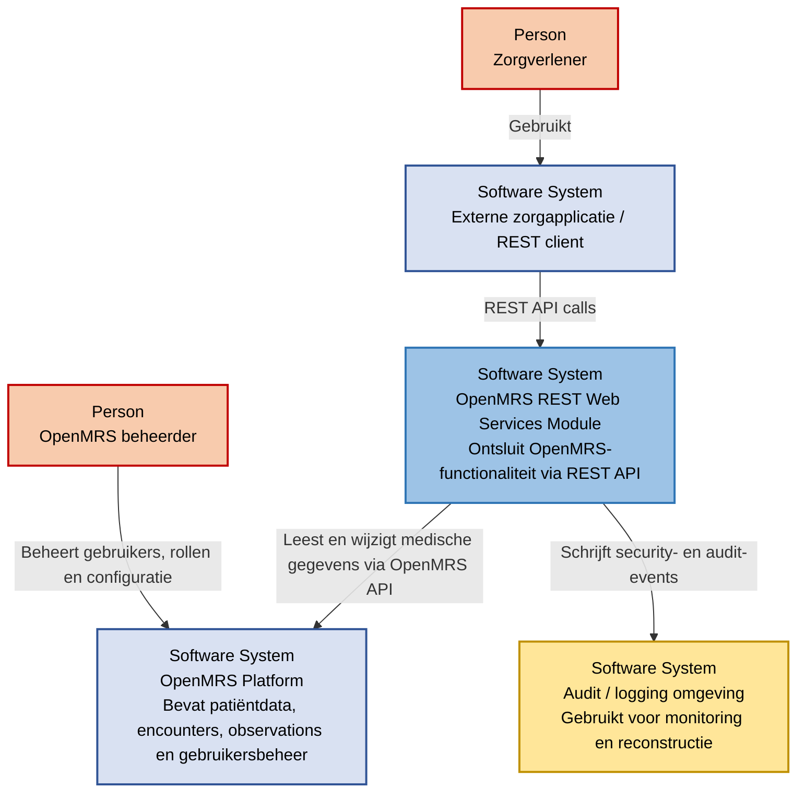
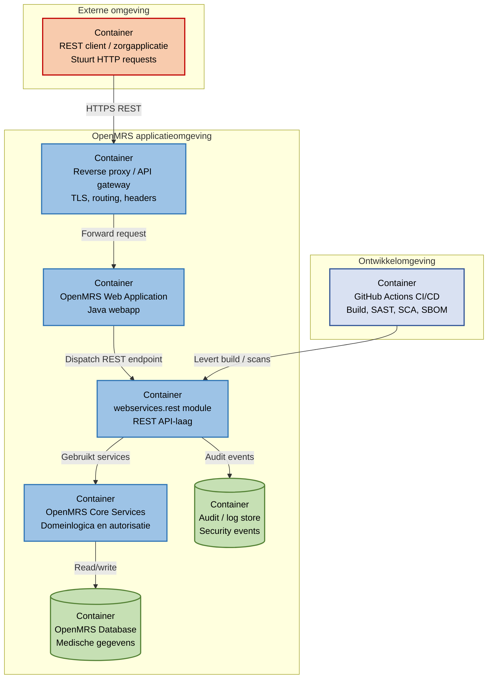
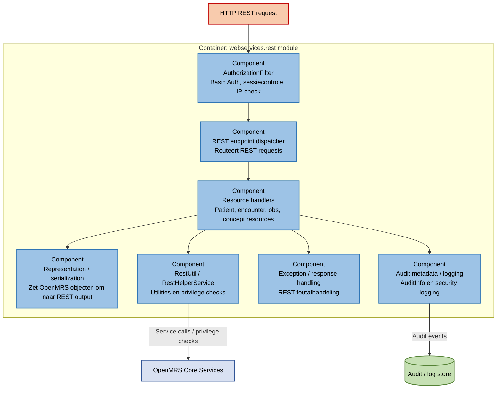

# 2.2 Threat model — OpenMRS REST Web Services Module

## 1. Context

Dit threat model is opgesteld voor de gekozen OpenMRS module `webservices.rest`. Deze module vormt een REST API-laag bovenop OpenMRS. Via deze module kunnen externe applicaties medische gegevens ophalen of wijzigen via HTTP/REST-endpoints.

De module is security-relevant omdat deze toegang kan geven tot gevoelige gegevens zoals patiëntgegevens, encounters, observations, gebruikersgegevens, sessies en auditinformatie. Een fout in authenticatie, autorisatie, logging of API-beveiliging kan leiden tot ongeautoriseerde toegang tot medische gegevens.

## 2. Doel

Het doel van dit threat model is om inzichtelijk te maken:

* welke actoren en systemen betrokken zijn;
* welke containers en componenten security-relevant zijn;
* waar gevoelige dataflows en trust boundaries zitten;
* welke Level 0 en Level 1 threats aanwezig zijn;
* welke threats doorstromen naar de risicomatrix, bow-tie, pentest en security backlog.

## 3. Methodiek

Voor dit threat model wordt het C4-model gebruikt.

| C4-niveau | Doel | Threatniveau |
|---|---|---|
| Context | Toont het systeem in zijn omgeving met gebruikers en externe systemen. | Level 0 threats |
| Container | Toont de belangrijkste technische bouwblokken en dataflows. | Level 1 threats |
| Component | Zoomt in op security-relevante onderdelen binnen de module. | Technische verdieping van Level 1 threats |

In dit document betekenen de threat levels het volgende:

* **Level 0 threats**: dreigingen op systeem- en contextniveau. Deze beschrijven wat er op hoofdlijnen mis kan gaan met de OpenMRS REST API.
* **Level 1 threats**: concrete dreigingen op container-, component- of dataflowniveau. Deze beschrijven hoe een Level 0 threat technisch kan ontstaan.

---

## 4. C4 Context diagram

### 4.1 Uitleg contextniveau

Op contextniveau is de OpenMRS REST Web Services Module de toegangspoort tot medische gegevens. Externe clients kunnen via REST-calls gegevens ophalen of wijzigen. De belangrijkste trust boundary ligt tussen externe REST-clients en de REST API.

Requests van buiten de applicatieomgeving worden niet standaard vertrouwd. Daarom zijn authenticatie, autorisatie, inputvalidatie, logging en monitoring belangrijk.

In dit C4-contextdiagram worden alleen reguliere gebruikers en samenwerkende systemen weergegeven. Kwaadwillende actoren worden niet als normale systeemactor gemodelleerd, maar meegenomen in de threatanalyse. Daarbij wordt gekeken naar externe aanvallers, kwaadwillende insiders en aanvallers die beschikken over gestolen credentials of sessies.

Omdat de scope van deze analyse de `webservices.rest` module is, wordt het bredere OpenMRS Platform in dit contextdiagram als extern samenwerkend systeem weergegeven. In het containerdiagram wordt vervolgens ingezoomd op de applicatieomgeving waarin de module draait.

### 4.2 Threat actors

| Actor | Beschrijving | Relevante threats |
|---|---|---|
| Externe aanvaller | Persoon of systeem buiten de organisatie dat REST endpoints probeert te misbruiken. | BOLA/IDOR, brute-force, scraping |
| Kwaadwillende insider | Gebruiker met legitieme toegang die meer gegevens probeert te benaderen dan toegestaan. | Te brede privileges, ongeautoriseerde inzage |
| Aanvaller met gestolen credentials | Actor die toegang krijgt via buitgemaakte Basic Auth credentials of sessies. | Ongeautoriseerde API-toegang |
| Ontwikkelaar / maintainer | Persoon die wijzigingen aan de module of pipeline kan doorvoeren. Fouten of onvoldoende review kunnen kwetsbaarheden introduceren. | Broken access control, logging gaps, kwetsbare dependency |

### 4.3 Level 0 threats op basis van het contextdiagram

| ID | Level 0 threat | Beschrijving | Geraakte assets | CIA/BIV-impact | Vervolg |
|---|---|---|---|---|---|
| L0-01 | Ongeautoriseerde toegang tot patiëntdata | Een onbevoegde actor krijgt via de REST API toegang tot medische gegevens. | Patiëntdata, medische gegevens | Vertrouwelijkheid hoog, integriteit midden | Risicomatrix, bow-tie, pentest |
| L0-02 | Blootstelling of bulk-extractie van patiëntdata | Grote hoeveelheden patiëntdata worden via API-calls opgehaald of gelekt. | Patiëntdata, logging en auditinformatie | Vertrouwelijkheid hoog | Risicomatrix, pentest |
| L0-03 | Manipulatie van medische gegevens | Een actor wijzigt patiëntdata, observations of andere medische records. | Medische gegevens | Integriteit hoog | Risicomatrix, security backlog |
| L0-04 | Verstoring van beschikbaarheid van de REST API | De REST API wordt traag of onbeschikbaar door misbruik of overload. | REST API endpoints, zorgprocessen | Beschikbaarheid hoog | Risicomatrix |
| L0-05 | Onvoldoende aantoonbaarheid na incident | De organisatie kan niet reconstrueren wie welke gegevens heeft ingezien of gewijzigd. | Logging en auditinformatie, patiëntdata | Integriteit hoog, vertrouwelijkheid midden | Logging gap-analyse |
| L0-06 | Verslechtering van beveiliging door onveilige wijziging | Kwetsbare code of dependency kan via het ontwikkelproces invloed hebben op de REST module. | Ontwikkel- en infrastructuuromgeving, REST API endpoints | Integriteit hoog, beschikbaarheid midden | CI/CD-risicoanalyse |

---

## 5. C4 Container diagram

### 5.1 Uitleg containerniveau

Op containerniveau worden de technische bouwblokken zichtbaar. De REST client communiceert via een gateway of reverse proxy met de OpenMRS webapplicatie. De webapplicatie routeert REST-calls naar de `webservices.rest` module. De module gebruikt OpenMRS Core services om gegevens te lezen of te wijzigen.

Belangrijke securitygrenzen zijn:

| Trust boundary | Risico |
|---|---|
| REST client → gateway/API | Misbruik door externe actor, gestolen credentials, scraping |
| Gateway → OpenMRS webapp | Foutieve forwarding, ontbrekende TLS-afdwinging of ontbrekende security headers |
| OpenMRS webapp → REST module | Onvoldoende authenticatie of sessiecontrole |
| REST module → OpenMRS Core | Te brede privileges of ontbrekende resource-level autorisatie |
| OpenMRS Core → database | Ongeautoriseerde wijziging of uitlezing van medische data |
| CI/CD → module | Onveilige codewijziging of kwetsbare dependency |

### 5.2 Level 1 threats op basis van het containerdiagram

| ID | Container / dataflow | Level 1 threat | Beschrijving | Bestaande maatregel | Gap | NEN-7510 control |
|---|---|---|---|---|---|---|
| L1-01 | Client → REST API | Misbruik van Basic Auth credentials of sessie | Basic Auth credentials of sessies worden gebruikt om toegang te krijgen tot de REST API. | `AuthorizationFilter` verwerkt Basic Auth en sessiecontrole. | MFA/SSO en tokenbeleid zijn niet in de module zelf afgedwongen. | A.8.5 |
| L1-02 | REST API → resource handler | BOLA / IDOR via UUID of resource-ID | Aanvaller wijzigt een patiënt-ID, UUID of resource-ID om gegevens van een andere patiënt op te vragen. | OpenMRS privilege checks bestaan. | Uit het threat model blijkt niet automatisch dat elke REST-resource ook patiëntspecifieke autorisatie of behandelrelatiecontrole afdwingt. | A.8.3 |
| L1-03 | REST API | Brute-force, scraping of bulk requests | Veel API-calls worden gebruikt om data systematisch op te halen of de API te belasten. | IP-allowlist lijkt aanwezig via de REST authorization filter/configuratie. | Rate limiting en account throttling zijn niet duidelijk aangetoond. | A.8.20 / A.8.26 |
| L1-04 | REST module → OpenMRS Core | Te brede privileges | Een gebruiker heeft toegang tot meer resources dan nodig is voor diens rol. | Rollen en privileges via OpenMRS. | Autorisatiematrix per endpoint en methode ontbreekt. | A.8.3 / A.5.18 |
| L1-05 | REST module → logging/audit store | Onvoldoende audit trail | Niet volledig aantoonbaar wie welke patiëntdata heeft ingezien of gewijzigd. | Audit metadata is aanwezig op resources. | Niet aangetoond dat alle API-inzage, bulktoegang en security events volledig en immutable worden gelogd. | A.8.15 |
| L1-06 | REST write endpoints → OpenMRS Core | Ongeautoriseerde wijziging van patiëntgegevens | Een actor kan medische gegevens wijzigen via write endpoints. | OpenMRS service- en privilegechecks. | Extra validatie en logging op kritieke wijzigingen nodig. | A.8.3 / A.8.15 |
| L1-07 | CI/CD → module | Onveilige codewijziging | Een PR introduceert een autorisatiefout of kwetsbaarheid in de REST laag. | CodeQL/SAST en PR-review. | Security testcases voor kritieke endpoints zijn nodig. | A.8.29 / A.8.32 |
| L1-08 | Dependencies → build | Kwetsbare dependency | Een bekende kwetsbaarheid in een dependency blijft aanwezig. | SBOM en SCA-scans. | Patchbeleid en updateadvies moeten traceerbaar zijn. | A.8.8 |

L1-07 en L1-08 zijn opgenomen als raakvlak met het ontwikkelproces. De volledige CI/CD-risicoanalyse staat in [04b-cicd-risico.md](./04b-cicd-risico.md).

---

## 6. C4 Component diagram

### 6.1 Uitleg componentniveau

Het componentdiagram zoomt in op de security-relevante onderdelen van de module.

| Component | Securityfunctie |
|---|---|
| `AuthorizationFilter` | Verwerkt Basic Auth, sessiecontrole en IP-allowlist voor REST-calls. |
| REST endpoint dispatcher | Routeert binnenkomende REST requests naar de juiste resource handlers. |
| Resource handlers | Verwerken OpenMRS resources zoals patiëntdata, encounters, observations en concepts. |
| Representation / serialization | Zet OpenMRS-objecten om naar REST-output en bepaalt welke velden zichtbaar worden. |
| `RestHelperService` / `RestUtil` | Ondersteunen autorisatie-, privilege- en utilitychecks. |
| Exception / response handling | Handelt fouten af en bepaalt welke foutinformatie aan clients wordt teruggegeven. |
| Audit metadata / logging | Nodig om achteraf te reconstrueren wie wat heeft gedaan. |

Het componentdiagram wordt gebruikt als technische onderbouwing voor de Level 1 threats. Vooral authenticatie, autorisatie, resource handlers, serialisatie en logging zijn relevant voor de hoogste risico’s uit de risicomatrix.

---

## 7. Assets / kroonjuwelen

De volledige en actuele asset-identificatie is uitgewerkt in [03-assets.md](./03-assets.md).

Voor dit threat model zijn vooral de volgende assetcategorieën relevant:

| Assetcategorie                       | Voorbeelden uit asset-identificatie                                           | Relevantie voor threat model                                                                              |
| ------------------------------------ | ----------------------------------------------------------------------------- | --------------------------------------------------------------------------------------------------------- |
| Patiëntdata                          | Patiëntrecords, patiëntidentifiers, persoonsgegevens                          | Belangrijkste vertrouwelijke gegevens die via de REST API ontsloten kunnen worden.                        |
| Medische gegevens                    | Observaties, encounters, orders, medicatievoorschriften, allergieregistraties | Gegevens waarvan manipulatie directe impact kan hebben op zorgprocessen en patiëntveiligheid.             |
| Authenticatie en autorisatie         | Sessietokens, Basic Auth, gebruikerscredentials, rollen en privileges         | Misbruik kan leiden tot ongeautoriseerde API-toegang of te brede rechten.                                 |
| Systeemconfiguratie                  | Global properties, Concept Dictionary                                         | Foutieve configuratie kan leiden tot zwakkere beveiliging of onjuiste verwerking van medische data.       |
| Logging en auditinformatie           | Audit logs, security events, audit metadata                                   | Nodig om achteraf te reconstrueren wie welke gegevens heeft ingezien of gewijzigd.                        |
| Ontwikkel- en infrastructuuromgeving | Docker-omgeving, compose-bestanden, CI/CD-pipeline                            | Relevant als raakvlak, omdat onveilige configuratie of codewijzigingen de REST module kunnen beïnvloeden. |

---

## 8. Trust boundaries en aannames

### Trust boundaries

| Boundary | Vertrouwen | Risico |
|---|---|---|
| Externe client → REST API | Niet vertrouwd | Requests kunnen kwaadaardig, foutief of geautomatiseerd zijn. |
| API gateway/reverse proxy → OpenMRS webapp | Gedeeltelijk vertrouwd | Gatewayconfiguratie moet TLS, headers en rate limiting correct afdwingen. |
| REST module → OpenMRS Core | Vertrouwd binnen applicatiecontext | Module vertrouwt op OpenMRS services en privileges. |
| Applicatie → database | Vertrouwd intern pad | Foutieve autorisatie kan toch leiden tot ongewenste databaseacties. |
| CI/CD → broncode/build | Gedeeltelijk vertrouwd | Pipeline moet beschermen tegen kwetsbare dependencies en ongewenste wijzigingen. |

### Aannames

* TLS wordt afgedwongen door infrastructuur, reverse proxy of gateway.
* Identity en MFA worden bij voorkeur op platform- of gatewayniveau ingericht.
* De module vertrouwt op OpenMRS Core voor een deel van authenticatie en autorisatie.
* Externe REST-clients worden niet standaard vertrouwd.
* Logging moet voldoende detail bevatten zonder gevoelige medische inhoud te loggen.
* Productie- en testsecrets zijn gescheiden via GitHub Environments.

---

## 9. Van threat naar risico

De onderstaande tabel koppelt de threats uit dit threat model aan de risico’s uit de risicomatrix.

| Threat model ID | Risicomatrix ID | Risico | Kans | Impact | Score | Vervolg |
|---|---|---|---:|---:|---:|---|
| L1-01 | T1 | Ongeautoriseerde API-toegang door misbruik van Basic Auth credentials of sessie | 4 | 5 | 20 | [04-risicomatrix.md](./04-risicomatrix.md), [05-bowtie.md](./05-bowtie.md) |
| L1-02 | T2 | Blootstelling patiëntdata door ontbrekende of onvoldoende autorisatiecheck | 3 | 5 | 15 | [04-risicomatrix.md](./04-risicomatrix.md), [docs/pentest/](../pentest/) |
| L1-06 | T3 | Manipulatie van medische orders of allergieën via write endpoints | 2 | 5 | 10 | [04-risicomatrix.md](./04-risicomatrix.md), security backlog |
| L1-07 | T4 | Credential-lek in repository of workflowconfiguratie | 4 | 4 | 16 | [04b-cicd-risico.md](./04b-cicd-risico.md) |
| L1-08 | T5 | Supply-chain aanval via CI/CD-pipeline of dependency | 2 | 5 | 10 | [04b-cicd-risico.md](./04b-cicd-risico.md), SBOM/SCA |
| L1-03 | T6 | Denial of Service op REST API door flooding of bulk requests | 3 | 3 | 9 | [04-risicomatrix.md](./04-risicomatrix.md), [docs/pentest/](../pentest/) |
| L1-04 | T7 | Privilege escalatie via RBAC-fout of te brede privileges | 2 | 4 | 8 | [04-risicomatrix.md](./04-risicomatrix.md) |
| L1-02 / L1-06 | T8 | Concept dictionary poisoning via ongeautoriseerde wijziging van medische terminologie | 1 | 4 | 4 | [04-risicomatrix.md](./04-risicomatrix.md) |

T4 en T5 raken de REST module via het ontwikkelproces, maar worden inhoudelijk verder uitgewerkt in de CI/CD-risicoanalyse. In dit threat model zijn ze opgenomen als raakvlak, omdat pipelinefouten of kwetsbare dependencies uiteindelijk invloed kunnen hebben op de veiligheid van de REST module.

Het hoogste risico uit de risicomatrix is T1 — Ongeautoriseerde API-toegang met score 20. Dit risico wordt verder uitgewerkt in [05-bowtie.md](./05-bowtie.md).

## 10. Selectie voor verdere validatie

Op basis van dit threat model worden de volgende risico’s meegenomen naar risicomatrix, bow-tie, pentest en security backlog:

| ID | Threat | Reden voor selectie | Vervolgdocument |
|---|---|---|---|
| L1-01 | Misbruik van Basic Auth credentials of sessie | Direct risico op ongeautoriseerde toegang tot patiëntdata. | [04-risicomatrix.md](./04-risicomatrix.md), [05-bowtie.md](./05-bowtie.md) |
| L1-02 | BOLA / IDOR via UUID of resource-ID | Direct risico op onbevoegde inzage in patiëntdata. | [04-risicomatrix.md](./04-risicomatrix.md), [05-bowtie.md](./05-bowtie.md), [docs/pentest/](../pentest/) |
| L1-03 | Brute-force, scraping of bulk requests | Kan leiden tot bulk-extractie of beschikbaarheidsproblemen. | [04-risicomatrix.md](./04-risicomatrix.md), [docs/pentest/](../pentest/) |
| L1-05 | Onvoldoende audit trail | Incidenten kunnen niet volledig gereconstrueerd worden. | [09-logging-gap-analyse.md](./09-logging-gap-analyse.md) |
| L1-07 | Onveilige codewijziging | Kan autorisatiefouten introduceren in kritieke endpoints. | [06-security-backlog.md](./06-security-backlog.md), code review |

---

## 11. Mitigaties

| Risico | Maatregel | Type | NEN-7510 control |
|---|---|---|---|
| Ongeautoriseerde API-toegang | MFA/SSO via gateway en strenger sessiebeleid | Preventief | A.8.5 |
| Onbevoegde inzage via BOLA/IDOR | Fine-grained authorization en behandelrelatiecontrole | Preventief | A.8.3 |
| Bulk-extractie of scraping | Rate limiting, account throttling en anomaliedetectie | Preventief / detectief | A.8.20 / A.8.26 / A.8.16 |
| Onvoldoende audit trail | Immutable audit logging voor API-toegang | Detectief / correctief | A.8.15 |
| Onveilige codewijziging | CodeQL/SAST, PR-review en security tests | Preventief | A.8.29 / A.8.32 |
| Kwetsbare dependency | SCA, SBOM en patchbeleid | Preventief | A.8.8 |

---

## 12. Traceerbaarheid

| Onderdeel                       | Verwijzing |
|---------------------------------|---|
| Assets / kroonjuwelen           | [03-assets.md](./03-assets.md) |
| Algemene risicomatrix           | [04-risicomatrix.md](./04-risicomatrix.md) |
| Hoogste risico en bow-tie | T1 — Ongeautoriseerde API-toegang, uitgewerkt in [05-bowtie.md](./05-bowtie.md) |
| CI/CD-risicoanalyse             | [04b-cicd-risico.md](./04b-cicd-risico.md) |
| Security backlog                | [06-security-backlog.md](./06-security-backlog.md) |
| Logging gap-analyse             | [09-logging-gap-analyse.md](./09-logging-gap-analyse.md) |
| Pentestdocumentatie             | [docs/pentest/](../pentest/) |

---

## 13. Conclusie

Het threat model laat zien dat de grootste risico’s rond de OpenMRS REST Web Services Module liggen bij ongeautoriseerde toegang tot patiëntdata via REST endpoints. De belangrijkste dreigingen zijn misbruik van credentials, BOLA/IDOR, te brede privileges, bulk requests en onvoldoende audit logging.

De Level 0 threats zijn afgeleid uit het C4-contextdiagram. De Level 1 threats zijn afgeleid uit het C4-containerdiagram en technisch onderbouwd met het componentdiagram.

Het hoogste risico wordt uitgewerkt in [05-bowtie.md](./05-bowtie.md). De logging- en attack-surface onderdelen worden in Sprint 3 verder aangescherpt en verwerkt in een bijgewerkte versie van dit threat model.