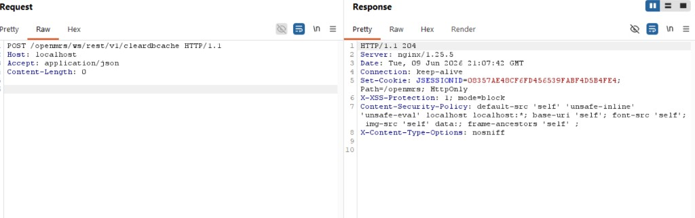
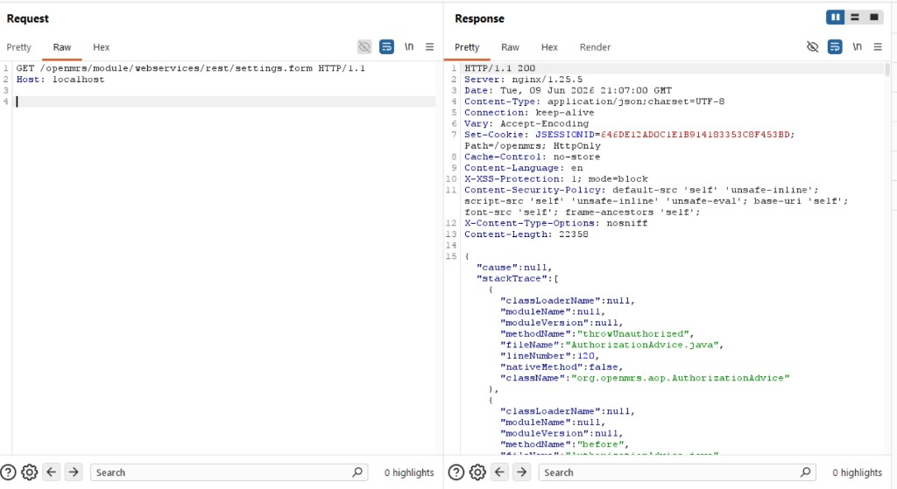
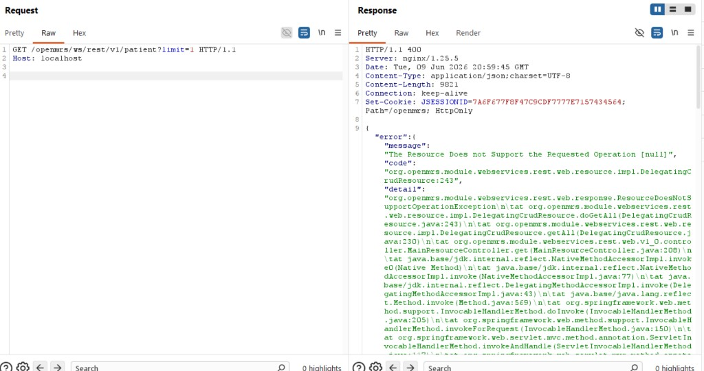
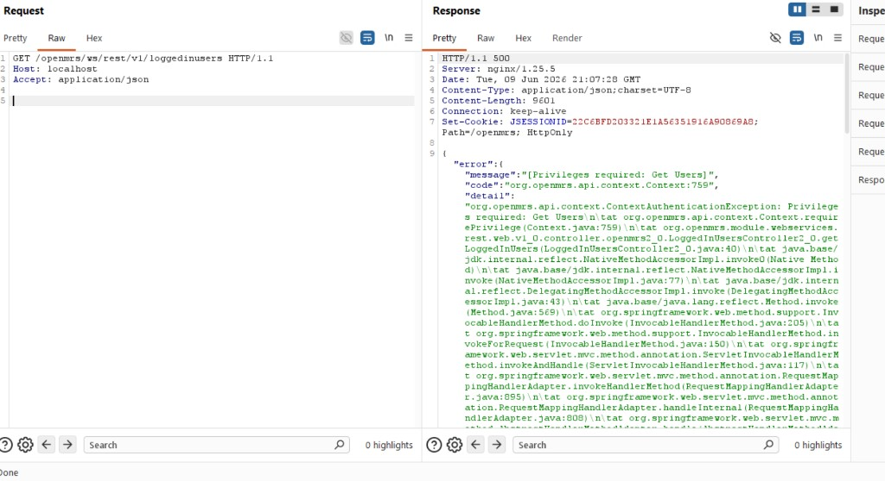
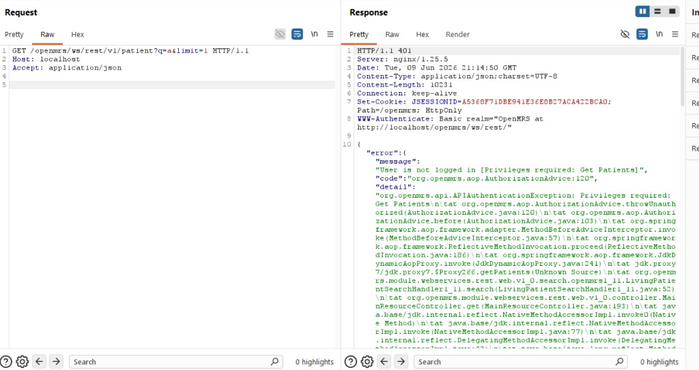

# Pentest-bevindingen — webservices.rest

> **Classificatie (NEN-7510:2024-2 — 5.12):** Vertrouwelijk

**Document:** `docs/pentest/03-bevindingen.md`  
**Status:** Afgerond (P1-scope T1/T2 per risicomatrix)  
**Label:** `Pentest-webservices-rest-2026-06`

---

## 1. Instructie

Definitief pentestrapport (P1-scope T1/T2) volgens `01-plan.md` en `02-testcases.md`. Besluiten fix/accept/defer vastgesteld — zie §8.

**Bronnen:**

1. **Burp Suite** — Repeater request/response, projectfile `.burp` (primair DAST-bewijs)
2. **Screenshots** — `docs/pentest/evidence/`

---

## 2. Besluitkader (fix / accept / defer)

| Besluit | Wanneer | Vastlegging | Review |
|---------|---------|-------------|--------|
| **Fix** | Risico op patiëntdata (T1/T2), Critical/High, mitigatie haalbaar | SEC-ID in `06-security-backlog.md` + deadline | Na fix: hertest in Burp |
| **Accept** | Laag restrisico, kosten >> impact | Risicoacceptatie: eigenaar, datum | Halfjaarlijks |
| **Defer** | Afhankelijk van platform, niet blocking test-OTAP | Backlog P3/P4 + datum | Bij volgende release |

---

## 3. Samenvatting

| Ernst | Aantal |
|-------|--------|
| Critical | 1 |
| High | 1 |
| Medium | 3 |
| Low | 0 |
| Info | 1 |

**Besluiten (fix / accept / defer): vastgesteld** — 2× Fix (PT-003, PT-004), 3× Defer (PT-001, PT-002, PT-005), 1× Accept (INFO-001). Zie §8.

**Testmetadata**

| Veld | Waarde |
|------|--------|
| Tester | Boyan |
| Datum uitvoering | 2026-06-09 |
| Pentest-scope | P1: T1 (score 20), T2 (score 15) — zie `04-risico-matrix` |
| Basis-URL | `http://localhost/openmrs` |
| REST-pad | `/ws/rest/v1` |
| Server | nginx/1.25.5 (Docker) |
| Burp project | `openmrs-pentest-2026-06.burp` |
| OWASP ZAP | Niet uitgevoerd — Burp Suite volstaat voor deze opdracht |
| Omgeving | Test / lokaal Docker |
| Testaccounts | `admin` ✓ — `nurse_readonly` **niet aangemaakt** |

---

## 4. Uitgevoerde testcases (Burp Repeater)

| TC-ID | Status | Resultaat | Bewijs |
|-------|--------|-----------|--------|
| TC-AUTH-01 | **Pass** | `GET /session` → 200, `authenticated: false` | [burp-02-session-anoniem.png](evidence/burp-02-session-anoniem.png) |
| TC-AUTHZ-01 | **Pass** | Anoniem `GET /patient?q=a&limit=1` → **401** + `Privileges required: Get Patients`; geen `results[]` | [burp-10-patient-anoniem-401.png](evidence/burp-10-patient-anoniem-401.png) |
| TC-AUTHZ-01 (oud) | **Info** | `GET /patient?limit=1` zonder `q=` → **400** (verkeerd endpoint, geen auth-test) | [burp-03-patient-anoniem-400.png](evidence/burp-03-patient-anoniem-400.png) |
| TC-CONF-05 | **Fail** | Zelfde request: volledige Java stack trace in JSON-body | [burp-03-patient-anoniem-400.png](evidence/burp-03-patient-anoniem-400.png) |
| Recon | **Info** | `GET /openmrs` → 302 naar `/openmrs/`; security headers aanwezig | [burp-01-openmrs-302-redirect.png](evidence/burp-01-openmrs-302-redirect.png) |
| TC-AUTH-04 | **Pass** | `GET /session` + `Authorization: Basic` (admin:Admin123) → `authenticated: true` | [burp-08-session-basic-auth-ok.png](evidence/burp-08-session-basic-auth-ok.png) |
| TC-AUTH-04 (POST) | **N/A** | `POST /session` + JSON username/password logt niet in (by design) | [burp-04-login-admin-fout.png](evidence/burp-04-login-admin-fout.png) |
| TC-AUTHZ-01 (admin) | **Pass** | `GET /patient?q=a&limit=1` + Basic Auth → **200**, `results: []` (geen match op "a") | [burp-11-patient-admin-200.png](evidence/burp-11-patient-admin-200.png) |
| TC-AUTHZ-04 | **N/A** | Buiten P1-minimumscope; geen IDOR getest | — |
| TC-AUTH-03 | **N/A** | Brute-force niet uitgevoerd; T4/T1 deels via backlog SEC-003 | — |
| TC-CONF-03 | **Fail** | Anoniem `GET settings.form` → **200** + stack trace (`throwUnauthorized`) i.p.v. 401/403 | [burp-05-settings-form-anoniem.png](evidence/burp-05-settings-form-anoniem.png) |
| TC-SPEC-01 | **Fail*** | `GET /session/diag` anoniem → **404** + stack trace (*zelfde patroon als PT-001, geen apart PT-ID*) | [burp-12-session-diag-404.png](evidence/burp-12-session-diag-404.png) |
| TC-SPEC-02 | **Fail** | Anoniem `GET /loggedinusers` → **500** + `Privileges required: Get Users`; geen user-lijst | [burp-06-loggedinusers-anoniem.png](evidence/burp-06-loggedinusers-anoniem.png) |
| TC-SPEC-03 | **Fail** | Anoniem `POST /cleardbcache` → **204** (zonder auth) | [burp-07-cleardbcache-anoniem-204.png](evidence/burp-07-cleardbcache-anoniem-204.png) |
| TC-SPEC-04 | **Pass** | Anoniem `POST /password` → **401** `Must be authenticated` | [burp-13-password-anoniem-401.png](evidence/burp-13-password-anoniem-401.png) |
| TC-SPEC-05 | **Pass** | Anoniem `POST /searchindexupdate` → **401** | [burp-14-searchindexupdate-anoniem-401.png](evidence/burp-14-searchindexupdate-anoniem-401.png) |
| TC-INJ-01 | **Pass** | `POST /session` met `application/xml` → **415** | [burp-15-xml-session-415.png](evidence/burp-15-xml-session-415.png) |
| TC-INJ-03 | **Pass** | `GET /patient?q=' OR 1=1--` → **400** (nginx), geen JSON/stack leak | [burp-16-sqli-patient-400.png](evidence/burp-16-sqli-patient-400.png) |
| TC-RBAC-01 (admin) | **Pass** | Admin `GET /patient?q=a&limit=1` → **200**, `results: []` | [burp-17-rbac-patient-admin-200.png](evidence/burp-17-rbac-patient-admin-200.png) |
| TC-RBAC-01 (nurse) | **Blocked** | Geen `nurse_readonly` testaccount in omgeving | — |
| TC-RBAC-02 | **Blocked** | Geen nurse-account voor vergelijking admin vs. nurse | — |
| TC-RBAC-03 (admin) | **Pass** | Admin `GET /user?q=admin&limit=1` → **200** + user-object | [burp-18-rbac-user-admin-200.png](evidence/burp-18-rbac-user-admin-200.png) |
| TC-RBAC-03 (nurse) | **Blocked** | Geen nurse-account | — |
| TC-RBAC-04 (admin) | **Pass** | Admin `GET /systemsetting?limit=1` → **200** + config-data | [burp-21-rbac-systemsetting-admin-200.png](evidence/burp-21-rbac-systemsetting-admin-200.png) |
| TC-RBAC-04 (oud pad) | **Info** | `GET /globalproperty` → **404** (verkeerd pad in testcase) | [burp-19-rbac-globalproperty-404.png](evidence/burp-19-rbac-globalproperty-404.png) |
| TC-RBAC-04 (nurse) | **Blocked** | Geen nurse-account | — |
| TC-RBAC-05 (admin) | **Pass*** | Admin `POST /cleardbcache` → **204** (superuser; verwacht gedrag) | [burp-20-cleardbcache-admin-204.png](evidence/burp-20-cleardbcache-admin-204.png) |
| TC-RBAC-05 (nurse) | **Blocked** | Geen nurse-account | — |

---

## 5. Bevindingen

---

### BEVINDING #PT-003

```
┌─────────────────────────────────────────────────────────────────┐
│ BEVINDING #PT-003                                               │
│                                                                 │
│ Titel: Anonieme POST cleardbcache zonder authenticatie          │
│ Ernst: Critical                                                 │
│ CVSS v3.1: 9.1 (AV:N/AC:L/PR:N/UI:N/S:U/C:N/I:H/A:H)           │
│ OWASP Cat.: API5:2023 – Broken Function Level Authorization    │
│ NEN-7510: 8.3 – Toegangsbeveiliging; 8.26 – Applicatie-eisen   │
│ Dreiging: T1 (score 20) | Backlog: SEC-019 | TC: TC-SPEC-03     │
│                                                                 │
│ BESCHRIJVING:                                                   │
│ Het endpoint POST /openmrs/ws/rest/v1/cleardbcache accepteert   │
│ requests zonder authenticatie en retourneert HTTP 204. Een        │
│ anonieme aanvaller kan daarmee de database-cache legen.          │
│                                                                 │
│ REPRODUCEERSTAPPEN:                                             │
│ 1. Open Burp Repeater (geen Cookie, geen Authorization)         │
│ 2. Verstuur:                                                    │
│    POST /openmrs/ws/rest/v1/cleardbcache HTTP/1.1               │
│    Host: localhost                                              │
│    Accept: application/json                                     │
│    Content-Length: 0                                            │
│ 3. Observeer HTTP 204 No Content                                │
│                                                                 │
│ BEWIJS: evidence/burp-07-cleardbcache-anoniem-204.png           │
│                                                                 │
│ IMPACT:                                                         │
│ Beschikbaarheids- en integriteitsrisico: performance-degradatie,│
│ inconsistent systeemgedrag, mogelijk DoS onder load. Geen        │
│ patiëntdata-lek, wel destructieve actie zonder enige auth.      │
│                                                                 │
│ MITIGATIE:                                                      │
│ Vereis geauthenticeerde superuser-sessie op cleardbcache;         │
│ retourneer 401/403 voor anonieme callers. Overweeg endpoint     │
│ uit te schakelen in productie-configuratie.                     │
│                                                                 │
│ BESLUIT: Fix                                                      │
│ AANBEVELING: Fix (≤ 24 uur)                                     │
│ STATUS: Open — fix verplicht                                      │
└─────────────────────────────────────────────────────────────────┘
```



---

### BEVINDING #PT-004

```
┌─────────────────────────────────────────────────────────────────┐
│ BEVINDING #PT-004                                               │
│                                                                 │
│ Titel: Module-instellingen (settings.form) anoniem bereikbaar   │
│ Ernst: High                                                     │
│ CVSS v3.1: 7.5 (AV:N/AC:L/PR:N/UI:N/S:U/C:H/I:L/A:N)           │
│ OWASP Cat.: API8:2023 – Security Misconfiguration               │
│ NEN-7510: 8.9 – Configuratiebeheer; 8.26 – Applicatie-eisen     │
│ Dreiging: T1/T5 | Backlog: SEC-007 | TC: TC-CONF-03            │
│                                                                 │
│ BESCHRIJVING:                                                   │
│ GET /openmrs/module/webservices/rest/settings.form is anoniem   │
│ bereikbaar (HTTP 200). Response bevat stack trace met           │
│ throwUnauthorized (AuthorizationAdvice.java:120) i.p.v. 401.   │
│                                                                 │
│ REPRODUCEERSTAPPEN:                                             │
│ 1. Burp Repeater, geen authenticatie                            │
│ 2. Verstuur:                                                    │
│    GET /openmrs/module/webservices/rest/settings.form HTTP/1.1  │
│    Host: localhost                                              │
│ 3. Observeer HTTP 200 + JSON met stack trace                    │
│                                                                 │
│ BEWIJS: evidence/burp-05-settings-form-anoniem.png               │
│                                                                 │
│ IMPACT:                                                         │
│ Configuratie-endpoint niet correct afgeschermd. Stack trace     │
│ onthult interne autorisatielaag en code-paden. Risico op        │
│ inzage of manipulatie van module-instellingen.                  │
│                                                                 │
│ MITIGATIE:                                                      │
│ settings.form alleen toegankelijk voor admin-sessie. Generieke  │
│ 401/403 naar client; stack trace alleen in server-side logging. │
│                                                                 │
│ BESLUIT: Fix                                                      │
│ AANBEVELING: Fix                                                │
│ STATUS: Open — fix verplicht                                      │
└─────────────────────────────────────────────────────────────────┘
```



---

### BEVINDING #PT-001

```
┌─────────────────────────────────────────────────────────────────┐
│ BEVINDING #PT-001                                               │
│                                                                 │
│ Titel: Stack trace in REST-foutresponse (info disclosure)       │
│ Ernst: Medium                                                   │
│ CVSS v3.1: 5.3 (AV:N/AC:L/PR:N/UI:N/S:U/C:L/I:N/A:N)           │
│ OWASP Cat.: API8:2023 – Security Misconfiguration               │
│ NEN-7510: 8.9 – Configuratiebeheer; 8.26 – Applicatie-eisen     │
│ Dreiging: T5 | Backlog: SEC-010 | TC: TC-CONF-05                │
│                                                                 │
│ BESCHRIJVING:                                                   │
│ Bij HTTP-fouten retourneert de API een volledige Java stack      │
│ trace in de JSON-body (ResourceDoesNotSupportOperationException,│
│ class-namen, methoden, regelnummers).                           │
│                                                                 │
│ REPRODUCEERSTAPPEN:                                             │
│ 1. Burp Repeater, geen authenticatie                            │
│ 2. Verstuur:                                                    │
│    GET /openmrs/ws/rest/v1/patient?limit=1 HTTP/1.1             │
│    Host: localhost                                              │
│    Accept: application/json                                     │
│ 3. Observeer HTTP 400 + "detail" met volledige stack trace      │
│                                                                 │
│ BEWIJS: evidence/burp-03-patient-anoniem-400.png                │
│                                                                 │
│ IMPACT:                                                         │
│ Aanvaller verkrijgt inzicht in interne architectuur, framework- │
│ versies en code-paden. Verlaagt drempel voor gerichte aanvallen.│
│ Geen direct patiëntdata-lek.                                    │
│                                                                 │
│ MITIGATIE:                                                      │
│ Exception-handler in webservices.rest: generieke foutmelding    │
│ naar client; stack trace uitsluitend in server-side logging.    │
│                                                                 │
│ BESLUIT: Defer                                                    │
│ AANBEVELING: Fix                                                │
│ STATUS: Uitgesteld — backlog P2 (SEC-010)                         │
└─────────────────────────────────────────────────────────────────┘
```



---

### BEVINDING #PT-005

```
┌─────────────────────────────────────────────────────────────────┐
│ BEVINDING #PT-005                                               │
│                                                                 │
│ Titel: loggedinusers geeft 500 + stack trace i.p.v. 401/403     │
│ Ernst: Medium                                                   │
│ CVSS v3.1: 5.3 (AV:N/AC:L/PR:N/UI:N/S:U/C:L/I:N/A:N)           │
│ OWASP Cat.: API8:2023 – Security Misconfiguration               │
│ NEN-7510: 8.9 – Configuratiebeheer; 8.26 – Applicatie-eisen     │
│ Dreiging: T1 | Backlog: SEC-019, SEC-010 | TC: TC-SPEC-02       │
│                                                                 │
│ BESCHRIJVING:                                                   │
│ GET /openmrs/ws/rest/v1/loggedinusers anoniem geeft HTTP 500    │
│ met "Privileges required: Get Users" en volledige stack trace.  │
│ Geen lijst ingelogde gebruikers in response.                    │
│                                                                 │
│ REPRODUCEERSTAPPEN:                                             │
│ 1. Burp Repeater, geen authenticatie                            │
│ 2. Verstuur:                                                    │
│    GET /openmrs/ws/rest/v1/loggedinusers HTTP/1.1                │
│    Host: localhost                                              │
│    Accept: application/json                                     │
│ 3. Observeer HTTP 500 + stack trace in JSON-body                │
│                                                                 │
│ BEWIJS: evidence/burp-06-loggedinusers-anoniem.png              │
│                                                                 │
│ IMPACT:                                                         │
│ Auth-weigering werkt inhoudelijk (geen user-data gelekt), maar  │
│ 500 + stack trace misleidt monitoring en lekt implementatie-    │
│ details (LoggedInUsersController2_0.java).                      │
│                                                                 │
│ MITIGATIE:                                                      │
│ Vang ContextAuthenticationException af → 401/403. Geen stack     │
│ trace in API-response; alleen generieke foutmelding.            │
│                                                                 │
│ BESLUIT: Defer                                                    │
│ AANBEVELING: Fix                                                │
│ STATUS: Uitgesteld — backlog P2 (SEC-019/010)                     │
└─────────────────────────────────────────────────────────────────┘
```



---

### BEVINDING #PT-002

```
┌─────────────────────────────────────────────────────────────────┐
│ BEVINDING #PT-002                                               │
│                                                                 │
│ Titel: Patient-endpoint zonder q= geeft 400 i.p.v. 401/403      │
│ Ernst: Medium                                                   │
│ CVSS v3.1: 4.3 (AV:N/AC:L/PR:N/UI:N/S:U/C:L/I:N/A:N)           │
│ OWASP Cat.: API2:2023 – Broken Authentication                   │
│ NEN-7510: 8.3 – Toegangsbeveiliging; 8.26 – Applicatie-eisen    │
│ Dreiging: T1 | Backlog: SEC-001 | TC: TC-AUTHZ-01               │
│                                                                 │
│ BESCHRIJVING:                                                   │
│ GET /patient?limit=1 zonder q= retourneert HTTP 400 i.p.v.      │
│ 401/403 — misleidend voor security scanners. Hertest met        │
│ GET /patient?q=a&limit=1: anoniem → 401 (correct), admin → 200. │
│ Geen patiëntdata-lek aangetoond.                                │
│                                                                 │
│ REPRODUCEERSTAPPEN:                                             │
│ 1. GET /session → "authenticated": false                        │
│ 2. GET /patient?limit=1 zonder auth → HTTP 400                  │
│ 3. GET /patient?q=a&limit=1 zonder auth → HTTP 401 (correct)    │
│                                                                 │
│ BEWIJS: burp-03-patient-anoniem-400.png,                        │
│         burp-10-patient-anoniem-401.png                         │
│                                                                 │
│ IMPACT:                                                         │
│ Verkeerd API-gebruik maskeert auth-gedrag. Met correct endpoint │
│ werkt autorisatie. Laag restrisico; verwarrend voor DAST-tools. │
│                                                                 │
│ MITIGATIE:                                                      │
│ Documenteer verplichte q= parameter in API-docs. Overweeg 401/   │
│ 405 i.p.v. 400 bij ontbrekende zoekterm.                       │
│                                                                 │
│ BESLUIT: Defer                                                    │
│ AANBEVELING: Defer (authz OK bij correct endpoint)              │
│ STATUS: Uitgesteld — documentatie API (`?q=`)                     │
└─────────────────────────────────────────────────────────────────┘
```



---

### BEVINDING #INFO-001

```
┌─────────────────────────────────────────────────────────────────┐
│ BEVINDING #INFO-001                                             │
│                                                                 │
│ Titel: Basis-URL redirect en security headers aanwezig          │
│ Ernst: Info                                                     │
│ CVSS v3.1: n.v.t.                                               │
│ OWASP Cat.: n.v.t.                                              │
│ NEN-7510: 8.20 – Netwerkbeveiliging (headers)                   │
│ Dreiging: — | TC: Recon / TC-TRANS-03/04                        │
│                                                                 │
│ BESCHRIJVING:                                                   │
│ GET /openmrs geeft HTTP 302 naar /openmrs/. Response bevat    │
│ Content-Security-Policy, X-XSS-Protection, X-Content-Type-    │
│ Options: nosniff. Normaal platformgedrag.                       │
│                                                                 │
│ REPRODUCEERSTAPPEN:                                             │
│ 1. GET /openmrs HTTP/1.1 → observeer 302 + security headers     │
│                                                                 │
│ BEWIJS: evidence/burp-01-openmrs-302-redirect.png               │
│                                                                 │
│ IMPACT: Geen beveiligingsrisico.                                │
│                                                                 │
│ MITIGATIE: Geen actie vereist.                                  │
│                                                                 │
│ BESLUIT: Accept                                                   │
│ AANBEVELING: Accept                                             │
│ STATUS: Geaccepteerd — geen actie vereist                          │
└─────────────────────────────────────────────────────────────────┘
```

---

## 6. Geslaagde controles (geen bevinding)

| TC-ID | Tool | Resultaat | Korte toelichting |
|-------|------|-----------|-----------------|
| TC-AUTH-01 | Burp | **Pass** | Anonieme sessie: `authenticated: false`, locale `en` |
| TC-AUTH-04 | Burp | **Pass** | Admin via Basic Auth: `authenticated: true` |
| TC-AUTHZ-01 | Burp | **Pass** | Anoniem `?q=a` → 401; admin → 200, geen data zonder auth |
| TC-SPEC-04 | Burp | **Pass** | Password-endpoint vereist auth (401) |
| TC-SPEC-05 | Burp | **Pass** | Searchindexupdate vereist auth (401) |
| TC-INJ-01 | Burp | **Pass** | XML geblokkeerd (415) |
| TC-INJ-03 | Burp | **Pass** | SQLi-payload afgewezen (400), geen data-lek |

---

## 7. Pentest-scope vs. risicomatrix

| Dreiging | Score | Pentest? | Resultaat |
|----------|-------|----------|-----------|
| **T1** Ongeautoriseerde API-toegang | 20 | **Ja** | Fail: cleardbcache anoniem (PT-003); Pass: patient/password |
| **T2** Blootstelling patiëntdata | 15 | **Ja** | **Pass**: anoniem patient → 401, geen data |
| T4 Credential-lek repo | 16 | Nee (SAST) | Backlog SEC-005 + Snyk |
| T3 Orders/allergieën | 10 | Deels | Niet getest (geen nurse/POST order) |
| T5 Supply chain CI/CD | 10 | Nee | Pipeline GAP + SEC-017 |
| T6 DoS | 9 | Nee | Buiten scope plan |
| T7 RBAC | 8 | Deels | Admin-kant OK; nurse **Blocked** |
| T8 Concept dictionary | 4 | Nee | Laag — niet getest |

**Niet uitgevoerd (bewust):** OWASP ZAP (Burp volstaat), ffuf bulk, Intruder, IDOR, RBAC nurse — buiten P1-minimum voor opdracht.

### 7.1 Niet-uitgevoerde testcases

| TC-ID / activiteit | Reden |
|--------------------|-------|
| TC-AUTH-03 (Intruder) | Buiten P1-minimum; T1 deels via backlog SEC-003 |
| TC-AUTHZ-04 (IDOR) | Buiten P1-minimum |
| TC-RBAC nurse-kant | Geen `nurse_readonly` account (zie §7.2) |
| ffuf, ZAP, curl bulk | Niet uitgevoerd; Burp dekt P1 DAST |

Auth-setup (Basic Auth, geen JSON-login via `POST /session`): zie `01-plan.md` §4.2.

### 7.2 RBAC geblokkeerd — geen nurse-account

TC-RBAC-01 t/m 05 (nurse-kant) en TC-RBAC-02: **Blocked** — testaccount `nurse_readonly` ontbreekt in Docker-omgeving.

**Optioneel later aanmaken (OpenMRS UI als admin):**
1. Administration → Manage Users → Add User (`nurse_readonly`)
2. Rol toekennen met alleen leesrechten (geen `Get Users`, geen `Manage Orders`, geen superuser)
3. Hertest met Basic Auth in Repeater

---

## 8. Besluitoverzicht (fix / accept / defer)

> **Status:** Besluiten vastgesteld 2026-06-10. Kolom *Aanbeveling* = pentest-voorstel (Boyan); kolom *Besluit* = vastgesteld door security-team / module-eigenaar.

| ID | Ernst | Dreiging | SEC | Aanbeveling | Besluit | Onderbouwing |
|----|-------|----------|-----|-------------|---------|--------------|
| PT-003 | Critical | T1 | SEC-019 | Fix | _fix_ | Anonieme cache-flush; direct mitigatie vereist |
| PT-004 | High | T1/T5 | SEC-007 | Fix | _fix_ | Config-endpoint niet afgeschermd |
| PT-001 | Medium | T5 | SEC-010 | Fix | _defer_ | Stack trace in API-responses |
| PT-005 | Medium | T1 | SEC-019/010 | Fix | _defer_ | Verkeerde statuscode + info-lek |
| PT-002 | Medium | T1 | SEC-001 | Defer | _defer_ | Authz OK bij correct endpoint (`?q=`) |
| INFO-001 | Info | — | — | Accept | _accept_ | Normale redirect + headers |

---

## 9. Opvolging

| Actie | Verantwoordelijke | Deadline | Status |
|-------|-------------------|----------|--------|
| Besluiten vaststellen (§8) | Security-team / module-eigenaar | 2026-06-10 | ✓ Afgerond |
| PT-003 cleardbcache fixen | Module-team | ≤ 24 uur | Open |
| PT-004 settings.form afschermen | Module-team | ≤ 1 sprint | Open |
| PT-001 stack traces (defer) | Module-team | Backlog P2 | Uitgesteld |
| PT-005 loggedinusers error handling (defer) | Module-team | Backlog P2 | Uitgesteld |
| PT-002 patient `?q=` documentatie (defer) | Module-team | Backlog P3 | Uitgesteld |
| INFO-001 acceptatie | — | — | ✓ Geaccepteerd |
| Hertest Burp na PT-003/004-fix | Boyan | Na deploy | Open |
| RAR bijwerken na hertest | Security champion | Na hertest | Open |

---

*NEN-7510:2024-2 — 8.29. Versie 1.1 — 2026-06-10. Pentest P1-scope afgerond; besluiten §8 vastgesteld.*
