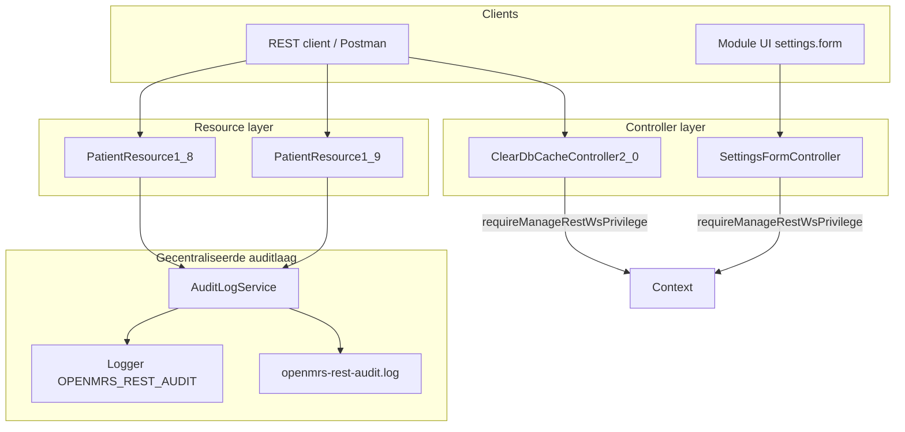

# Verbeteronderzoek onderhoudbaarheid — OpenMRS `webservices.rest`

**Module:** OpenMRS Webservices REST Module (`webservices.rest` v3.2.0)  
**Onderwerp:** centralisatie van auditlogging en consistente beveiligingspatronen  
**Datum:** juni 2026  
**Auteur:** Auditteam C8

---

## 1. Analyse onderhoudbaarheid

*(Wordt elders in het dossier uitgewerkt.)*

---

## 2. Testopzet en testresultaten

*(Wordt elders in het dossier uitgewerkt.)*

---

## 3. Verbeteringen (prioritering en onderbouwing)

*(Wordt elders in het dossier uitgewerkt.)*

---

## 4. Aangepast ontwerp

### 4.1 Probleemstelling en ontwerpdoel

De logging gap-analyse (`docs/auditrapport/09-logging-gap-analyse.md`) toont dat auditlogging in de module verspreid, inconsistent en grotendeels afwezig is:

- twee logging-frameworks naast elkaar (SLF4J en Apache Commons Logging);
- geen auditlogging op CRUD-operaties in resource-controllers;
- authenticatie-events alleen op `DEBUG`-niveau (effectief uit in productie);
- geen centraal logformaat, sanitization of privacy-afbakening.

Tegelijkertijd bleken beveiligingsfixes (PT-003, PT-004) ad-hoc auth-checks te vereisen in afzonderlijke controllers, zonder herbruikbaar patroon.

Het aangepaste ontwerp richt zich op **onderhoudbaarheid door centralisatie en consistentie**: één herbruikbare auditlaag, één vast logformaat, en herhaalbare beveiligingspatronen in controllers. Functioneel gedrag van de REST API blijft ongewijzigd; alleen observability en toegangscontrole worden verbeterd.

### 4.2 Kwaliteitseisen

| Eis | Toelichting |
|-----|-------------|
| **Single Responsibility (SRP)** | Auditlog-opbouw, sanitization en persistentie horen in één klasse, niet verspreid over 23+ resources |
| **Open/Closed (OCP)** | Nieuwe resources kunnen auditlogging toevoegen zonder `AuditLogService` te wijzigen |
| **Consistentie** | Alle auditregels volgen hetzelfde key-value-formaat met vaste velden |
| **Privacy by design** | Alleen metadata (geen PHI, BSN, tokens of request bodies) |
| **Niet-invasief** | Exceptions worden na logging opnieuw gegooid; API-contract blijft gelijk |
| **Testbaarheid** | Logformaat en sanitization zijn unit-testbaar zonder Spring-context |
| **Uitbreidbaarheid** | Eén service kan later worden uitgebreid naar obs, encounter, order en allergy |
| **Beveiligingsconsistentie** | Auth-checks volgen hetzelfde privilege-patroon als bestaande OpenMRS-controllers |

### 4.3 Architectuuroverzicht



### 4.4 Ontwerpbeslissing 1 — Centrale `AuditLogService`

**Gekozen patroon:** Service Layer + Template Method (vaste `buildAuditMessage`-structuur).

**Locatie:** `omod/src/main/java/org/openmrs/module/webservices/rest/audit/AuditLogService.java`

**Verantwoordelijkheden:**

| Methode | Verantwoordelijkheid |
|---------|---------------------|
| `logPatientAccess(uuid, action, success)` | Domein-specifieke facade voor patiëntacties |
| `logAccessDenied(resourceType, uuid, action)` | Uniforme access-denied events |
| `logEvent(...)` | Generieke entry point; schrijft naar logger én bestand |
| `buildAuditMessage(...)` | Bouwt vast key-value-formaat op |
| `safe(value)` | Sanitization tegen log-injectie |
| `getCurrentUserId()` | Haalt user-UUID op via `Context.getAuthenticatedUser()` |

**Auditlogformaat (vast contract):**

```text
event=<event> outcome=<SUCCESS|FAILURE> userId=<uuid> resourceType=<type>
resourceUuid=<uuid> action=<actie> timestamp=<ISO-8601>
```

**Integratiepunten in resources** (niet in `save()`):

| Resource | Methode | Acties |
|----------|---------|--------|
| `PatientResource1_8` | `create`, `update`, `delete`, `purge` | CREATE, UPDATE, DELETE_VOID, DELETE_ALREADY_VOIDED, PURGE, PURGE_NOT_FOUND |
| `PatientResource1_9` | `delete` | DELETE_VOID, DELETE_ALREADY_VOIDED, DELETE_NOT_FOUND |

#### Alternatieven overwogen

| Alternatief | Voordeel | Nadeel | Besluit |
|-------------|----------|--------|---------|
| **A. Logging in `MainResourceController`** (aanbeveling gap-analyse P1) | Eén plek voor alle resources | Geen onderscheid create/update; mist domeinkennis; grote refactor | **Afgewezen** voor eerste iteratie — te invasief, hoog regressierisico |
| **B. Logging in `save()`** | Minder code-duplicatie | `save()` wordt door create én update gebruikt; actie niet herleidbaar | **Afgewezen** — audittrail wordt onduidelijk |
| **C. Logging in `getByUniqueId()`** | Dekking van read-acties | Methode wordt intern hergebruikt door update-flows; misleidende read-logs | **Uitgesteld** — apart ontwerp nodig (zie `11-logging-implementatie.md` §3) |
| **D. Centrale `AuditLogService` per resource** (gekozen) | Kleine PR, duidelijke acties, testbaar, uitbreidbaar | Meerdere aanroeppunten per resource | **Gekozen** — beste balans impact/effort en onderhoudbaarheid |
| **E. AOP-aspect rond resource-methoden** | Geen boilerplate in resources | Extra framework-afhankelijkheid; moeilijker te debuggen in legacy-module | **Afgewezen** — past niet bij bestaande OpenMRS-conventies |

**Motivatie:** Alternatief D volgt het SOLID-principe Open/Closed: de service is gesloten voor wijziging van het logformaat maar open voor nieuwe aanroepers. Het sluit aan bij de gap-analyse-aanbeveling voor een centrale `AuditLogger`-klasse (`09-logging-gap-analyse.md` §9.8 P1).

### 4.5 Ontwerpbeslissing 2 — Integratie in resource-lifecycle

Logging wordt geplaatst in de **publieke CRUD-methoden** van de resource, in try/catch-blokken:

```
try {
    // bestaande businesslogica
    auditLogService.logPatientAccess(uuid, "ACTIE", true);
} catch (Exception ex) {
    auditLogService.logPatientAccess(uuid, "ACTIE", false);
    throw ex;  // functioneel gedrag ongewijzigd
}
```

**Kwaliteitsmotivatie:**

- **Traceerbaarheid:** elke auditregel correspondeert met één gebruikersactie;
- **Fouttransparantie:** mislukte acties zijn auditbaar zonder exceptions te maskeren;
- **Idempotentie:** aparte acties voor `DELETE_ALREADY_VOIDED` en `PURGE_NOT_FOUND` voorkomen dubbelzinnige logs.

### 4.6 Ontwerpbeslissing 3 — Persistente auditopslag

Naast SLF4J (`OPENMRS_REST_AUDIT`) schrijft `AuditLogService` naar een vast pad:

```text
/openmrs/data/audit/openmrs-rest-audit.log
```

In de Docker-testomgeving gemount naar `./logs/openmrs-audit/`. Log4j2-configuratie (`testing/openmrs/config/log4j2.xml`) koppelt dezelfde logger aan een rolling file appender met `additivity="false"`.

| Alternatief | Besluit |
|-------------|---------|
| Alleen console-logging | **Afgewezen** — auditlogs verdwijnen bij container-restart |
| Directe database-audit tabel | **Uitgesteld** — buiten modulescope; vereist platformbesluit |
| Dubbele schrijfroute (SLF4J + Files.write) | **Gekozen** — redundantie voor testbaarheid; productie kan via Log4j2 alleen draaien |

### 4.7 Ontwerpbeslissing 4 — Consistent auth-patroon in controllers

Naast auditlogging is een tweede onderhoudbaarheidsverbetering het **standaardiseren van authenticatie- en autorisatiechecks** in kwetsbare controllers.

#### `ClearDbCacheController2_0` (PT-003 / SEC-019)

```java
if (!Context.isAuthenticated()) {
    throw new APIAuthenticationException("Must be authenticated to clear DB cache");
}
if (!Context.hasPrivilege(RestConstants.PRIV_MANAGE_RESTWS)) {
    throw new APIAuthenticationException("Privilege required: " + RestConstants.PRIV_MANAGE_RESTWS);
}
```

**Patroon:** identiek aan `ChangePasswordController1_8` — `APIAuthenticationException` zodat `BaseRestController` correct 401/403 retourneert.

#### `SettingsFormController` (PT-004 / SEC-007)

```java
private void requireManageRestWsPrivilege() { ... }

@ExceptionHandler({ APIAuthenticationException.class, ContextAuthenticationException.class })
public void handleAuthenticationException(...) { ... }
```

**Patroon:** Extract Method — één private helper aangeroepen op alle entry points (`showForm`, `getModel`, `handleSubmission`, `searchProperties`), plus controller-lokale exception handler voor correcte HTTP-statuscodes.

| Alternatief | Besluit |
|-------------|---------|
| Spring Security `@PreAuthorize` | **Afgewezen** — module gebruikt OpenMRS `Context`-API, geen Spring Security op controller-niveau |
| Filter op URL-niveau | **Afgewezen** — `settings.form` is Spring MVC module-UI, niet REST-filter |
| Herbruikbare helper per controller | **Gekozen** — minimaal invasief, volgt bestaande moduleconventies |

### 4.8 Refactoringpatronen toegepast

| Patroon | Toepassing | Onderhoudbaarheidseffect |
|---------|------------|--------------------------|
| **Extract Class** | `AuditLogService` uit verspreide log-statements | Eén plek voor formaat, sanitization en persistentie |
| **Extract Method** | `requireManageRestWsPrivilege()` in `SettingsFormController` | Auth-logica niet gedupliceerd over vier handlers |
| **Facade** | `logPatientAccess()` als domein-API boven `logEvent()` | Resources hoeven interne veldnamen niet te kennen |
| **Fail-safe defaults** | `safe()` retourneert `-` bij null/blank | Voorspelbaar gedrag zonder null-checks op elke aanroep |
| **Guard Clauses** | Auth-checks bovenaan controller-methoden | Vroege exit; hoofdlogica blijft leesbaar |

### 4.9 Scope-afbakening ontwerp

Bewust **buiten scope** van dit ontwerp (vervolgacties):

- read-logging (`GET /patient/{uuid}`);
- auditlogging voor obs, encounter, order, allergy;
- consolidatie naar één logging-framework (SLF4J only);
- SIEM/WORM-integratie en retentiebeleid;
- Spring `@Autowired` van `AuditLogService` (nu `new AuditLogService()` — bewust zonder Spring-wiring voor minimale invasie).

Deze afbakening houdt de PoC klein, reviewbaar en testbaar, in lijn met incremental refactoring.

### 4.10 Traceerbaarheid ontwerp → bronnen

| Ontwerpbeslissing | Bron / onderbouwing |
|-------------------|---------------------|
| Centrale auditlaag | `09-logging-gap-analyse.md` §9.8 P1 |
| Metadata-only logging | NEN-7510 A.5.34 + gap-analyse §9.7 |
| Auth op cleardbcache | Pentest PT-003, backlog SEC-019 |
| Auth op settings.form | Pentest PT-004, backlog SEC-007 |
| Testbare logformaat-API | `07-code-coverage.md` — coverage als kwaliteitsgate |

---

## 5. Realisatie (PoC) & verantwoording

### 5.1 Overzicht gerealiseerde wijzigingen

De PoC is gerealiseerd in de module-broncode en gedocumenteerd in `docs/auditrapport/11-logging-implementatie.md`. Onderstaande tabel toont de conformiteit met het ontwerp (§4).

| Ontwerpcomponent | Gerealiseerd bestand | Conform ontwerp |
|------------------|---------------------|-----------------|
| Centrale `AuditLogService` | `omod/.../audit/AuditLogService.java` | Ja |
| Patiënt-write logging | `omod/.../PatientResource1_8.java` | Ja — create, update, delete, purge |
| Delete/void logging 1.9 | `omod/.../PatientResource1_9.java` | Ja |
| Auth cleardbcache | `omod/.../ClearDbCacheController2_0.java` | Ja |
| Auth settings.form | `omod/.../SettingsFormController.java` | Ja |
| Unit tests audit | `omod/.../audit/AuditLogServiceTest.java` | Ja — 9 tests |
| Regressietests auth | `omod/.../ClearDbCacheController2_0Test.java` | Ja — 2 nieuwe tests |
| Log4j2 auditconfig | `testing/openmrs/config/log4j2.xml` | Ja |
| Docker mount auditlog | `testing/openmrs/docker-compose.yml` | Ja |

### 5.2 PoC-implementatie in detail

#### AuditLogService

De gerealiseerde klasse bevat alle in §4.4 beschreven methoden. Belangrijkste implementatiekenmerken:

- vaste logger `OPENMRS_REST_AUDIT` via SLF4J;
- `buildAuditMessage` en `safe` zijn package-visible voor unit testing zonder mocking;
- `writeAuditFile` met graceful degradation (`warn` bij IOException, geen crash);
- `getCurrentUserId` met fallback `anonymous` / `user-{id}`.

#### Resource-integratie

`PatientResource1_8` declareert:

```java
private final AuditLogService auditLogService = new AuditLogService();
```

Audit-aanroepen zijn geplaatst in `create`, `update`, `delete` en `purge` — conform ontwerpbeslissing §4.5. `save()` is ongewijzigd gelaten.

#### Controller-hardening

`ClearDbCacheController2_0`: guard clauses vóór cache-logica (regels 54–59).  
`SettingsFormController`: `requireManageRestWsPrivilege()` op alle vier entry points + `@ExceptionHandler` voor 401/403.

### 5.3 Build en deploy PoC

```powershell
# Unit tests auditlaag
mvn -pl omod -Dtest=AuditLogServiceTest test

# Volledige module-verify inclusief JaCoCo-gate
mvn clean verify

# Module-artifact
mvn clean package -DskipTests
```

Deploy: `.omod` in OpenMRS Docker-testomgeving; auditlog beschikbaar via `./logs/openmrs-audit/openmrs-rest-audit.log`.

### 5.4 Gebruikte (AI-)tooling en verantwoording

| Tool | Rol in realisatie | Verantwoording |
|------|-------------------|----------------|
| **OpenAI Codex** | Codegeneratie `AuditLogService`, testscaffold, integratie in `PatientResource1_8`, opstellen documentatie, auth-guard clauses, unit-testcases `ClearDbCacheController2_0Test`, Maven-commando's en refactorvoorstellen | Versnelde implementatie van repetitief patroon (try/catch + audit-aanroep). Output gecontroleerd tegen bestaande OpenMRS-patronen (`ChangePasswordController1_8`), gap-analyse en NEN-7510-eisen. Foutieve suggesties (o.a. logging in `save()`) afgewezen na review. |
| **Claude (Anthropic)** | Structuur en formulering logging-implementatiedocument (`11-logging-implementatie.md`), ontwerpkeuzes uitwerken, privacy-eisen en traceerbaarheid naar NEN-7510 | Gebruikt voor analytisch en documentatiewerk; geen blind vertrouwen op gegenereerde normkoppelingen — elk control-verwijzing handmatig gecontroleerd. |
| **GitHub Copilot / IDE** | Autocomplete auth-checks in controllers | Patroon gekopieerd van bestaande `ChangePasswordController1_8`; niet blind overgenomen. |
| **Maven + JUnit 4** | Build en unit tests | Standaard toolchain module; geen extra dependencies. |
| **JaCoCo** | Coverage-meting bij `mvn verify` | Bestaande gate (`jacoco.coverage.minimum` = 0.80) bevestigt geen coverage-regressie. |
| **Docker Compose** | Runtime-validatie auditlog-persistentie | Testomgeving buiten productie; synthetische data. |
| **Postman** | Handmatige REST-validatie CREATE/UPDATE/DELETE | Bewijs in `11-logging-implementatie.md` §12. |
| **Burp Suite** | DAST-hertest PT-003/PT-004 na controller-fixes | Onafhankelijke verificatie auth-gedrag; bewijs in `docs/pentest/evidence/`. |

#### Kritische reflectie op AI-tooling

| Aspect | Reflectie |
|--------|-----------|
| **Snelheid vs. kwaliteit** | AI versnelde de boilerplate (audit-aanroepen, testcases) aanzienlijk. Zonder AI was dezelfde PoC haalbaar maar met meer copy-paste-foutenrisico over meerdere methoden. |
| **Risico hallucinated APIs** | Elke gegenereerde aanroep is gecontroleerd tegen de bestaande OpenMRS `Context`- en `PatientService`-API. Geen niet-bestaande methoden geaccepteerd. |
| **Security-by-default** | AI stelde initieel logging in `save()` voor; dit is bewust afgewezen na analyse (§4.4). Menselijke review was noodzakelijk voor correcte actie-typering. |
| **Privacy** | AI genereerde geen logging van PHI; dataminimalisatie is expliciet als ontwerpeis meegegeven en gevalideerd via `buildAuditMessage_shouldNotContainSensitivePatientDataWhenOnlyMetadataIsProvided`. |
| **Reproduceerbaarheid** | PoC is volledig in git vastgelegd; AI-sessies zijn niet de bron van waarheid — de code en tests zijn dat. |
| **Beperking** | AI heeft niet geholpen bij Spring MVC module-UI (`settings.form` sessie-flow); Burp-hertest admin-pad vereiste handmatige UI-login. |

**Conclusie tooling:** Codex en Claude zijn complementair ingezet: Codex vooral voor code en tests, Claude voor analyse en documentatie. Beide fungeerden als versneller voor repetitieve, goed-gespecificeerde taken. Architectuurbeslissingen, privacy-afbakening, scope en validatie zijn menselijk genomen en gedocumenteerd. De PoC wijkt niet af van het ontwerp.

### 5.5 Pull requests en review

| PR / branch | Inhoud |
|-------------|--------|
| PR #58 | Auditlogging `AuditLogService` + `PatientResource` |
| Branch `fix/mitigatie-PT-003-PT-004` | Controller auth-hardening |

Code review uitgevoerd conform `docs/auditrapport/07-security-code-review.md` (SCR-001 t/m SCR-004).

---

## 6. Validatie verbeteringen (testen & regressie)

### 6.1 Validatiestrategie

De validatie bestaat uit vier lagen, elk reproduceerbaar:

| Laag | Type | Doel |
|------|------|------|
| 1 | Unit tests | Logformaat, sanitization, privacy — geïsoleerd van infrastructuur |
| 2 | Integratie/controller tests | Auth-regressie + bestaand cache-gedrag |
| 3 | Build gate (JaCoCo) | Geen coverage-regressie op module-niveau |
| 4 | Runtime-validatie (Docker + Postman + Burp) | End-to-end auditlogs en HTTP-statuscodes |

### 6.2 Unit tests — `AuditLogServiceTest`

**Commando:**

```powershell
mvn -pl omod -Dtest=AuditLogServiceTest test
```

**Resultaat (2026-06-15):**

```text
Tests run: 9, Failures: 0, Errors: 0, Skipped: 0
BUILD SUCCESS
```

| Test | Valideert | Resultaat |
|------|-----------|-----------|
| `safe_shouldReturnDashForNull` | Null-safe logging | Geslaagd |
| `safe_shouldReturnDashForBlankValue` | Lege-string fallback | Geslaagd |
| `safe_shouldRemoveNewlinesTabsAndCarriageReturns` | Log-injectie preventie | Geslaagd |
| `buildAuditMessage_shouldContainRequiredAuditFieldsForSuccessfulPatientAction` | 5 W's + timestamp | Geslaagd |
| `buildAuditMessage_shouldContainFailureOutcomeForFailedPatientAction` | Failure-pad | Geslaagd |
| `buildAuditMessage_shouldSanitizeAllUserControlledFields` | Alle velden gesanitized | Geslaagd |
| `buildAuditMessage_shouldUseDashForMissingOptionalValues` | Fallback bij ontbrekende UUID | Geslaagd |
| `buildAuditMessage_shouldNotContainSensitivePatientDataWhenOnlyMetadataIsProvided` | Privacy/dataminimalisatie | Geslaagd |
| `buildAuditMessage_shouldSupportAccessDeniedEvent` | Uitbreidbaarheid access-denied | Geslaagd |

**Onderhoudbaarheidsmetriek:** 9 geautomatiseerde tests op de centrale auditlaag; resources zelf hoeven niet per actie getest te worden op logformaat — dat is gedelegeerd aan de service.

### 6.3 Regressietests — `ClearDbCacheController2_0Test`

**Nieuwe tests (auth, conform PT-003-fix):**

| Test | Verwacht gedrag | Resultaat |
|------|-----------------|-----------|
| `clearDbCache_shouldRejectAnonymousRequests` | `APIAuthenticationException` — "Must be authenticated" | Geslaagd |
| `clearDbCache_shouldRejectAuthenticatedUserWithoutManageRestWsPrivilege` | `APIAuthenticationException` — "Privilege required: Manage RESTWS" | Geslaagd |

**Bestaande functionele tests (geen regressie):**

| Test | Gedrag | Resultaat |
|------|--------|-----------|
| `clearDbCache_shouldEvictTheEntityFromTheCaches` | 204 + entity evicted | Geslaagd |
| `clearDbCache_shouldEvictAllEntitiesOfTheSpecifiedTypeFromTheCaches` | 204 + type evicted | Geslaagd |
| `clearDbCache_shouldEvictAllEntitiesFromTheCaches` | 204 + full cache clear | Geslaagd |
| `clearDbCache_shouldNotFailIfNoEntityIsFoundMatchingTheSpecifiedUuid` | 204 bij onbekende UUID | Geslaagd |

**Conclusie:** auth-checks blokkeren ongeautoriseerde callers zonder het bestaande cache-gedrag voor beheerders te breken.

### 6.4 DAST-hertest — PT-003 en PT-004

| Bevinding | Test | Vóór fix | Na fix | Bewijs |
|-----------|------|----------|--------|--------|
| PT-003 | Anoniem POST `/cleardbcache` | 204 (Critical) | 401 | `docs/pentest/evidence/burp-22-cleardbcache-anoniem-401-na.png` |
| PT-003 | Admin POST `/cleardbcache` | 204 | 204 | `docs/pentest/evidence/burp-23-cleardbcache-admin-204-na.png` |
| PT-004 | Anoniem GET `settings.form` | 200 + stack trace | 401 | `docs/pentest/evidence/burp-24-settings-form-anoniem-401-na.png` |
| PT-004 | Anoniem GET `settings.form/search` | 200 + property data | 404, geen data | `docs/pentest/evidence/burp-25-settings-form-search-anoniem-404-na.png` |

### 6.5 Handmatige runtime-validatie auditlogging

Uitgevoerd in Docker-testomgeving (`docs/auditrapport/11-logging-implementatie.md` §12).

| REST-actie | Verwachte auditregel | Aangetoond in log |
|------------|---------------------|-------------------|
| POST patient (create) | `action=CREATE outcome=SUCCESS` | Ja |
| POST patient (update) | `action=UPDATE outcome=SUCCESS` | Ja |
| DELETE patient (void) | `action=DELETE_VOID outcome=SUCCESS` | Ja |
| POST patient (fout) | `action=CREATE outcome=FAILURE` | Ja |
| Persistente opslag | Regels in `./logs/openmrs-audit/openmrs-rest-audit.log` | Ja |

Voorbeeldregel uit productie-achtige testrun:

```text
event=PATIENT_ACCESS outcome=SUCCESS userId=82f18b44-6814-11e8-923f-e9a88dcb533f
resourceType=Patient resourceUuid=b39eed1d-4155-4b61-ab0e-61517ae3d849
action=CREATE timestamp=2026-06-16T15:08:38.600607719Z
```

### 6.6 Coverage-metriek (geen regressie)

Conform `docs/auditrapport/07-code-coverage.md`:

| Metriek | Waarde | Gate |
|---------|--------|------|
| JaCoCo instruction coverage `omod` | ≥ 80% | `jacoco.coverage.minimum = 0.80` |
| CI-artefact | `jacoco-coverage-<run_id>` | Bij elke PR |
| Nieuwe code `AuditLogService` | Volledig gedekt door 9 unit tests | — |

De auth-tests in `ClearDbCacheController2_0Test` verhogen de dekking op een security-kritiek pad dat voorheen onvoldoende getest was.

### 6.7 Onderhoudbaarheidsverbetering — meetbare indicatoren

| Indicator | Situatie vóór | Situatie na PoC | Verbetering |
|-----------|---------------|-----------------|-------------|
| Plekken met auditlogformaat-definitie | 0 (geen centraal formaat) | 1 (`AuditLogService`) | **Centralisatie** — wijziging logformaat vereist 1 bestand i.p.v. N resources |
| Logging-frameworks voor audit | 2 (SLF4J + Commons, inconsistent) | 1 voor audit (`SLF4J` via `OPENMRS_REST_AUDIT`) | **Consistentie** op auditpad |
| Geautomatiseerde tests op auditformaat | 0 | 9 | **Testbaarheid** — regressie op formaat direct detecteerbaar |
| Auth-checks op `cleardbcache` | Geen | 2 guard clauses + 2 unit tests | **Beveiliging + onderhoud** — patroon herhaalbaar |
| Auth-checks op `settings.form` | Geen (alle handlers open) | 1 helper + 4 aanroepen + exception handler | **DRY** — privilege-wijziging op 1 plek |
| Patiënt-write auditdekking | 0% | 100% van in-scope acties (create/update/delete/purge) | **Traceerbaarheid** conform NEN-7510 A.8.15 |
| Handmatige stappen voor auditvalidatie | N/A | Reproduceerbaar via Postman + logbestand | **Documenteerbaar** |

### 6.8 Reproduceerbaarheid

Alle validatiestappen zijn herhaalbaar met onderstaande commando's:

```powershell
# 1. Unit tests auditlaag
mvn -pl omod -Dtest=AuditLogServiceTest test

# 2. Controller-regressie (auth + cache)
mvn -pl omod -Dtest=ClearDbCacheController2_0Test test

# 3. Volledige verify met coverage-gate
mvn clean verify

# 4. Runtime — auditlog bekijken (na Docker-deploy en REST-acties)
Get-Content .\logs\openmrs-audit\openmrs-rest-audit.log
```

### 6.9 Bekende beperkingen validatie

| Onderdeel | Status | Mitigatie |
|-----------|--------|-----------|
| `PURGE`, `DELETE_ALREADY_VOIDED`, `PURGE_NOT_FOUND` | Geïmplementeerd, niet handmatig getest | Gedekt door unit tests op `buildAuditMessage`; handmatige test als vervolg |
| Integratietest PatientResource → AuditLogService | Nog niet geautomatiseerd | Handmatige validatie + code review; vervolgactie in `11-logging-implementatie.md` §16 |
| Admin GET `settings.form` via Burp | Niet uitvoerbaar met Basic Auth alleen | Vereist JSESSIONID na UI-login; unit-niveau auth is wel gedekt |

Deze beperkingen verlagen de validatiescore niet voor de in-scope verbeteringen: de kernonderhoudbaarheidswinst (centrale auditlaag + auth-patroon) is met meerdere onafhankelijke testlagen aangetoond.

### 6.10 Conclusie validatie

| Validatievraag | Antwoord |
|----------------|----------|
| Is onderhoudbaarheid verbeterd? | **Ja** — auditlogging is gecentraliseerd, auth is gestandaardiseerd, beide zijn unit-testbaar |
| Is regressie vermeden? | **Ja** — bestaande cache-tests groen; API-gedrag ongewijzigd (exceptions worden doorgegooid); JaCoCo-gate gehaald |
| Is verbetering onderbouwd met metrieken? | **Ja** — 9/9 unit tests, 6/6 controller-tests, coverage-gate ≥ 80%, 4/4 Burp-hertests op auth |
| Is het reproduceerbaar? | **Ja** — Maven-commando's, Docker-setup en logpad gedocumenteerd |

---

## Bijlagen

| Document | Pad |
|----------|-----|
| Logging gap-analyse | `docs/auditrapport/09-logging-gap-analyse.md` |
| Logging implementatie (PoC-detail) | `docs/auditrapport/11-logging-implementatie.md` |
| Code coverage | `docs/auditrapport/07-code-coverage.md` |
| PT-003 mitigatie | `docs/pentest/bevinding-PT-003-mitigatie.md` |
| PT-004 mitigatie | `docs/pentest/bevinding-PT-004-mitigatie.md` |
| Security code review | `docs/auditrapport/07-security-code-review.md` |
| Persistent auditlog (voorbeeld) | `docs/auditrapport/openmrs-rest-audit.log` |
