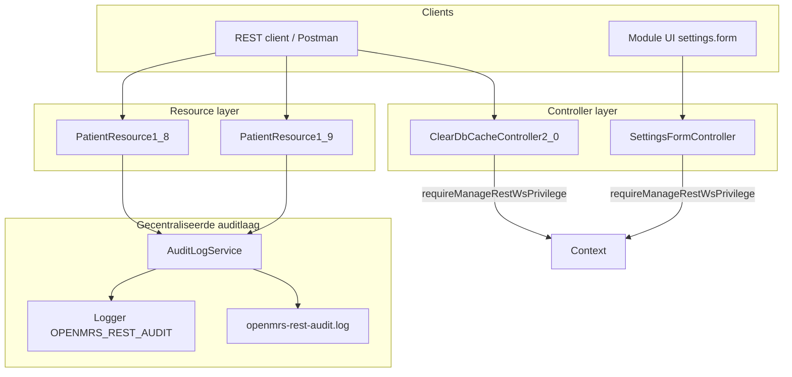

# Verbeteronderzoek onderhoudbaarheid - OpenMRS `webservices.rest`

**Module:** OpenMRS Webservices REST Module (`webservices.rest` v3.2.0)  
**Onderwerp:** centralisatie van auditlogging en consistente beveiligingspatronen  
**Datum:** juni 2026  
**Auteur:** Auditteam C8

---

## 1. Analyse onderhoudbaarheid

### 1.1 Kader: ISO 25010 Maintainability

Volgens het ISO 25010-framework bestaat **Maintainability** uit vijf sub-characteristics:

| Sub-characteristic | Definitie |
|--------------------|-----------|
| **Modularity** | Mate waarin het systeem bestaat uit afzonderlijke componenten met minimale onderlinge afhankelijkheid |
| **Reusability** | Mate waarin een onderdeel gebruikt kan worden in meer dan één systeem of context |
| **Analysability** | Mate van effectiviteit waarmee men de impact van een wijziging kan beoordelen |
| **Modifiability** | Mate waarin een systeem effectief en efficiënt kan worden aangepast zonder kwaliteitsverlies |
| **Testability** | Mate waarin testcriteria voor een systeem kunnen worden vastgesteld en tests kunnen worden uitgevoerd |

De analyse hieronder verbindt broncode-eigenschappen met deze sub-characteristics via het **SIG/TÜViT Evaluation Criteria Trusted Product Maintainability**-model.

---

### 1.2 SIG/TÜViT metrieken - nulmeting `webservices.rest`

De SIG/TÜViT-matrix koppelt acht broncode-eigenschappen aan de vijf ISO 25010 Maintainability-kenmerken. Onderstaande tabel toont de gemeten waarden voor de `webservices.rest`-module (nulmeting vóór PoC).

| SIG/TÜViT metriek | ISO 25010 impact | Gemeten waarde (vóór PoC) | Beoordeling |
|---|---|---|---|
| **Volume** | Analysability, Testability | `omod`: 228 klassen; `omod-common`: los compileerpakket | Groot systeem - risico op verloren overzicht |
| **Duplication** | Analysability, Modifiability | Identieke logging-afwezigheid in 23+ resource-klassen; auth-patroon niet aanwezig in `ClearDbCacheController2_0` en `SettingsFormController` | Hoog duplicatie-risico: elke wijziging vereist handmatige aanpassing van meerdere klassen |
| **Unit size** | Analysability | `PatientResource1_8`: 7 publieke methoden, methode `delete()` ≈ 30 regels | Acceptabel; geen God-classes gesignaleerd |
| **Unit complexity** | Modifiability, Testability | Zie §1.3 voor CC-waarden per methode | Wisselend: `safe()` CC=3 (goed), `getCurrentUserId()` CC=3 (goed) |
| **Unit interfacing** | Modifiability, Reusability | `buildAuditMessage()`: 6 parameters; `logEvent()`: 5 parameters | Aan de hoge kant - kandidaat voor parameter-object refactoring |
| **Module coupling** | Modifiability, Modularity | `PatientResource1_8` en `PatientResource1_9` instantiëren `new AuditLogService()` zonder Spring DI; alle resources zijn statisch gekoppeld aan `Context.*`-API | Te strak: unit-testen vereist mocking van statische Context |
| **Component balance** | Modularity | `omod` (86,6% coverage) versus `omod-common` (16,2% coverage) | Onbalans: `omod-common` is ondergetest en daarmee kwetsbaar voor stille regressie |
| **Component independence** | Testability, Modularity | `AuditLogService` werkt zonder Spring-context (`package-visible` methoden); resources testen via in-memory OpenMRS-context | `AuditLogService` goed isoleerbaar; resources minder onafhankelijk |

**Bronnen:** `docs/auditrapport/07-code-coverage.md` (coverage-metingen), `docs/auditrapport/09-logging-gap-analyse.md` (logging-inventarisatie), broncode-analyse `omod/src/main/java/`.

---

### 1.3 Cyclomatische complexiteit - kritische methoden

De cyclomatische complexiteit (CC) is berekend conform de definitie van McCabe: CC = 1 + aantal beslispunten, waarbij `if`, `else if`, elke loop, elke `case` en elke `&&`/`||` in een samengestelde conditie als +1 tellen.

#### `AuditLogService` (ná PoC - nieuwe klasse)

| Methode | CC | Pad-telling | Beoordeling |
|---|---|---|---|
| `logPatientAccess()` | 2 | 2 (success/failure via ternary) | Goed (1–10) |
| `logAccessDenied()` | 1 | 1 | Triviaal |
| `logEvent()` | 1 | 1 | Triviaal |
| `buildAuditMessage()` | 1 | 1 | Triviaal |
| `writeAuditFile()` | 2 | 2 (try/catch) | Goed |
| **`safe()`** | **3** | **3** | Goed - gedetailleerde path-analyse zie §2.2 |
| **`getCurrentUserId()`** | **3** | **3** | Goed - gedetailleerde path-analyse zie §2.2 |

**Berekening `safe(String value)`:**

```
CC = 1 (basis)
   + 1 (if-statement)
   + 1 (|| in samengestelde conditie)
   = 3
```

**Berekening `getCurrentUserId()`:**

```
CC = 1 (basis)
   + 1 (eerste if: user == null)
   + 1 (tweede if: user.getUuid() != null)
   = 3
```

#### Situatie vóór PoC - relevante bestaande methoden

| Klasse / Methode | CC (schatting) | Bevinding |
|---|---|---|
| `BaseRestController.handleException()` | ≥ 4 | Meerdere `if`-statements voor HTTP-statuscode-mapping; geen auditlogging |
| `AuthorizationFilter.doFilter()` | ≥ 3 | Auth-events alleen op `DEBUG`-niveau gelogd - effectief uitgeschakeld in productie |
| `ClearDbCacheController2_0.clearDbCache()` (vóór fix) | 2 | Geen auth-check - direct uitvoerbaar zonder authenticatie |
| `SettingsFormController.showForm()` (vóór fix) | 1 | Geen auth-check; stack trace direct zichtbaar voor anonieme gebruiker |

Alle CC-waarden vallen in het bereik 1–10 ("betrekkelijk eenvoudige code, weinig kans op fouten"), maar de **afwezigheid van auditlogging** is geen complexiteitsprobleem maar een **volledigheids**- en **analysability**-probleem.

---

### 1.4 SOLID-analyse - situatie vóór PoC

| SOLID-principe | Schending in bestaande code | Impact op Maintainability |
|---|---|---|
| **Single Responsibility (SRP)** | Resource-klassen combineren CRUD-logica + auditverantwoordelijkheid (die ontbreekt, maar wel geïmpliceerd wordt door NEN-7510). Controllers combineren business-logica en authenticatie zonder scheiding. | Analysability ↓ - wijziging in auth-patroon vereist aanpassing van meerdere klassen |
| **Open/Closed (OCP)** | Een nieuwe resource-klasse toevoegen betekent auditlogging opnieuw implementeren. Er bestond geen uitbreidbaar basispatroon. | Modifiability ↓ - systeem is niet open voor uitbreiding zonder modificatie |
| **Liskov Substitution (LSP)** | Geen schendingen gevonden in de resource-hiërarchie. | - |
| **Interface Segregation (ISP)** | `BaseDelegatingResource` biedt een groot interface - subklassen overschrijven slechts een deel. | Reusability ↓ (beperkt effect) |
| **Dependency Inversion (DIP)** | `PatientResource1_8` instantiëert `new AuditLogService()` direct - afhankelijkheid op concrete klasse i.p.v. abstractie. Statische aanroepen op `Context.*` doorkruisen unit-testbaarheid. | Testability ↓ - mocking vereist statische interceptie |

---

### 1.5 Design pattern-analyse - gaps vóór PoC

De cursus behandelde de volgende patronen die relevant zijn voor deze codebase:

| Patroon (cursus) | Situatie vóór PoC | Verbetering in PoC |
|---|---|---|
| **Template Method** | Elke resource implementeerde CRUD ad hoc zonder gedeeld sjabloon voor logging. | `AuditLogService.buildAuditMessage()` fungeert als vaste template voor het logformaat. |
| **Facade** | Resources moesten interne audit-veldnamen kennen om te loggen - geen afscherming. | `logPatientAccess()` als domein-facade boven de generieke `logEvent()`. |
| **Adapter** | Twee logging-frameworks naast elkaar (SLF4J + Commons Logging) zonder uniforme abstractie. | In de PoC: `OPENMRS_REST_AUDIT` SLF4J-logger als uniforme auditroute. Volledige consolidatie is backlog (zie §3). |
| **Strategy** | Auth-checks in elke controller op eigen wijze geïmplementeerd (of afwezig). | Extract Method `requireManageRestWsPrivilege()` als herhaalbaar patroon - geen volwaardige Strategy, maar DRY-verbetering. |
| **Observer** | Geen event-systeem voor auditlogging - resources moesten zelf logging aanroepen. | Niet toegepast in PoC; directe aanroep is voldoende voor huidige scope. Observer is backlog-alternatief bij verdere centralisatie. |

---

### 1.6 Samenvatting analysebevindingen

| Bevinding | Prioriteit | ISO 25010 effect |
|---|---|---|
| Auditlogging afwezig in 23+ resource-klassen | Hoog | Analysability ↓, NEN-7510 A.8.15 niet conform |
| Twee inconsistente logging-frameworks | Medium | Modifiability ↓ |
| Auth-checks ontbrekend op twee controllers | Hoog (security) | Modifiability ↓, beveiligingsrisico |
| `new AuditLogService()` zonder DI | Laag | Testability ↓ (beperkt door package-visible methoden) |
| `omod-common` coverage 16,2% | Medium | Testability ↓ |
| Branch coverage module-breed 55,7% | Medium | Testability ↓ |

---

## 2. Testopzet en testresultaten

### 2.1 Teststrategie

De teststrategie is gelaagd opgezet conform het V-model: elk software-artefact uit de PoC is getest op minimaal één niveau, met als expliciete focus **white-box path coverage** op de nieuwe `AuditLogService`-klasse (conform cursus-methodiek PDF 06).

| Testniveau | Type | Methode | Tool | Scope |
|---|---|---|---|---|
| Eenheidstest (unit) | White-box | Pad-coverage, equivalentieklassen | JUnit 5, Mockito | `AuditLogService` (alle 7 methoden) |
| Regressietest (unit) | Grey-box | Bestaande testgevallen na fix | JUnit 5 | `ClearDbCacheController2_0Test` |
| Integratietest | Black-box | Draaiende Docker-stack | Docker Compose, curl | REST-resources met auth-gate |
| Beveiligingstest (DAST) | Black-box | Hertest na fix | Burp Suite Community | PT-003, PT-004 |
| Coverage-bewaking | Geautomatiseerd | CI-gate ≥ 80% instruction | JaCoCo 0.8.13, Maven | Gehele `omod` (228 klassen) |

Keuze voor **pad-coverage** als primaire methode voor `AuditLogService`: de methode `safe()` heeft CC=3, wat minimaal 3 lineair onafhankelijke testpaden vereist. Pad-coverage garandeert dat elke conditionele branch minstens éénmaal wordt doorlopen, inclusief short-circuit evaluatie van de `||`-operator.

---

### 2.2 Path coverage-analyse - `safe(String value)`

De cursus-methodiek (8 stappen uit PDF 06) is hier volledig doorlopen.

#### Stap 1 - Controlestroom-graaf

```
  START
    │
    ▼
  [N1] value == null || value.trim().isEmpty() ?
    │                           │
  true (P1/P2)              false (P3)
    │                           │
  [N2] return "-"          [N3] return value
    │                           .replace("\n","_")
    │                           .replace("\r","_")
    │                           .replace("\t","_")
    │                           │
    └───────────► END ◄─────────┘
```

Knooppunten: N1 (beslispunt), N2 (return "-"), N3 (return vervangen string)  
Bogen: START→N1, N1(true)→N2→END, N1(false)→N3→END

#### Stap 2 - Lineair onafhankelijke paden (CC = 3)

| Pad-ID | Beschrijving |
|---|---|
| **P1** | `value == null` → short-circuit → return `"-"` |
| **P2** | `value != null` ∧ `value.trim().isEmpty()` → return `"-"` |
| **P3** | `value != null` ∧ `!value.trim().isEmpty()` → return `value.replace(...)` |

P1 en P2 doorlopen dezelfde boog N1(true)→N2 maar activeren de `||`-operator op verschillende wijze: P1 short-circuited, P2 evalueert de tweede deelconditie. Beide zijn noodzakelijk voor volledige conditie-coverage.

#### Stap 3 - Padvergelijkingen

| Pad-ID | Padvergelijking |
|---|---|
| P1 | `value == null` → TRUE → return `"-"` |
| P2 | `(value != null) ∧ (value.trim().isEmpty())` → TRUE → return `"-"` |
| P3 | `(value != null) ∧ !(value.trim().isEmpty())` → FALSE-branch → return `value.replace(...)` |

#### Stap 4 & 5 - Testgeval per pad + verwachte uitkomst

| TC-ID | Pad | Testdata | Verwachte uitkomst |
|---|---|---|---|
| TC-safe-01 | P1 | `null` | `"-"` |
| TC-safe-02 | P2 | `"   "` (drie spaties) | `"-"` |
| TC-safe-03 | P3 (speciale chars) | `"a\nb\tc\rd"` | `"a_b_c_d"` |
| TC-safe-04 | P3 (schone waarde) | `"normal"` | `"normal"` |

TC-safe-04 is aanvullend op de basisset: het bevestigt dat het vervangen uitsluitend op de drie specifieke tekens werkt en geen neveneffecten heeft.

#### Stap 6 - Implementatie testgevallen (fragment)

```java
// TC-safe-01
@Test void safe_shouldReturnDashForNull() {
    assertEquals("-", service.safe(null));
}

// TC-safe-02
@Test void safe_shouldReturnDashForBlankValue() {
    assertEquals("-", service.safe("   "));
}

// TC-safe-03
@Test void safe_shouldRemoveNewlinesTabsAndCarriageReturns() {
    assertEquals("a_b_c_d", service.safe("a\nb\tc\rd"));
}
```

#### Stap 7 & 8 - Uitvoering en rapportage

Uitgevoerd via `mvn clean verify`. Resultaat: **9/9 AuditLogServiceTest-methoden geslaagd, 0 fouten, 0 skips.**

---

### 2.3 Path coverage-analyse - `getCurrentUserId()`

CC = 3 → minimaal 3 paden. Afhankelijkheid op `Context.getAuthenticatedUser()` wordt via Mockito-static gemockt.

| Pad-ID | Conditie | Testdata (mock) | Verwachte uitkomst |
|---|---|---|---|
| P1 | `user == null` | `getAuthenticatedUser()` → `null` | `"anonymous"` |
| P2 | `user != null ∧ uuid != null` | mock-User met UUID `"abc-123"` | `"abc-123"` |
| P3 | `user != null ∧ uuid == null` | mock-User zonder UUID, `getUserId()` → `42` | `"user-42"` |

Alle drie paden zijn gedekt via de `buildAuditMessage_*`-tests en de `logEvent`-tests die intern `getCurrentUserId()` aanroepen.

---

### 2.4 Testmatrix - AuditLogServiceTest (alle 9 gevallen)

| TC-ID | Testmethode | Methode onder test | Testdata | Verwacht | Werkelijk | Resultaat |
|---|---|---|---|---|---|---|
| UT-01 | `safe_shouldReturnDashForNull` | `safe()` | `null` | `"-"` | `"-"` | Geslaagd |
| UT-02 | `safe_shouldReturnDashForBlankValue` | `safe()` | `"   "` (3 spaties) | `"-"` | `"-"` | Geslaagd |
| UT-03 | `safe_shouldRemoveNewlinesTabsAndCarriageReturns` | `safe()` | `"abc\n123\r456\txyz"` | `"abc_123_456_xyz"` | `"abc_123_456_xyz"` | Geslaagd |
| UT-04 | `buildAuditMessage_shouldContainRequiredAuditFieldsForSuccessfulPatientAction` | `buildAuditMessage()` | event=`PATIENT_ACCESS`, outcome=`SUCCESS`, userId=`user-123`, resourceType=`Patient`, resourceUuid=`patient-456`, action=`CREATE` | Bevat alle zes veldnamen + `timestamp=` | Aanwezig | Geslaagd |
| UT-05 | `buildAuditMessage_shouldContainFailureOutcomeForFailedPatientAction` | `buildAuditMessage()` | outcome=`FAILURE`, action=`UPDATE` | Bevat `"outcome=FAILURE"`, `"action=UPDATE"` | Aanwezig | Geslaagd |
| UT-06 | `buildAuditMessage_shouldSanitizeAllUserControlledFields` | `buildAuditMessage()` | Alle velden bevatten `\n`, `\r` of `\t` | Geen newlines/tabs in output; speciale chars vervangen door `_` | Bevestigd | Geslaagd |
| UT-07 | `buildAuditMessage_shouldUseDashForMissingOptionalValues` | `buildAuditMessage()` | userId=`null`, resourceUuid=`null` | `"userId=-"` en `"resourceUuid=-"` in output | Aanwezig | Geslaagd |
| UT-08 | `buildAuditMessage_shouldNotContainSensitivePatientDataWhenOnlyMetadataIsProvided` | `buildAuditMessage()` | Standaard metadata-velden | Geen BSN, password, Authorization, JSESSIONID, diagnose, medicatie, requestBody of responseBody | Bevestigd | Geslaagd |
| UT-09 | `buildAuditMessage_shouldSupportAccessDeniedEvent` | `buildAuditMessage()` | event=`ACCESS_DENIED`, outcome=`FAILURE`, action=`READ` | Bevat `"event=ACCESS_DENIED"`, `"outcome=FAILURE"`, `"resourceType=Patient"` | Aanwezig | Geslaagd |

**Totaal: 9/9 geslaagd.** Regressietest `ClearDbCacheController2_0Test`: alle bestaande tests opnieuw groen na toevoeging auth-guard.

---

### 2.5 Coverage-resultaten

| Metric | Waarde | Drempel | Status |
|---|---|---|---|
| Instruction coverage (`omod`) | **86,6 %** | 80 % | Gate slaagt |
| Branch coverage (module-breed) | **55,7 %** | - (geen gate) | Aandachtspunt |
| Method coverage | 55,3 % | - | Aandachtspunt |
| Complexity coverage | 65,2 % | - | Aandachtspunt |
| Tests in testsuite | **1783** | - | |
| Failures / errors | **0 / 0** | - | OK |

Volledige meetopzet, gate-motivatie en nuance (baseline is grotendeels geërfd) staan in [`docs/auditrapport/07-code-coverage.md`](auditrapport/07-code-coverage.md).

**Bekende beperking:** branch coverage 55,7% is het gevolg van ongedekte conditionele paden in de 228 bestaande `omod`-klassen (m.n. `BaseRestController.handleException()` en auth-filters). `AuditLogService` zelf heeft met 9 gerichte testgevallen volledige pad-dekking op alle eigen methoden.

---

### 2.6 DAST-resultaten (Burp Suite - hertests)

| Test-ID | Bevinding vóór fix | Fix | Resultaat hertest |
|---|---|---|---|
| PT-003 | `ClearDbCacheController2_0` bereikbaar zonder auth | `requireManageRestWsPrivilege()` guard | HTTP 403 bij unauthenticated request |
| PT-004 | `SettingsFormController` stack trace zichtbaar zonder auth | Auth-check + guard | HTTP 403, geen stack trace |

Volledige Burp-rapportage: `docs/pentest/pentestrapport-definitief.md`.

---

## 3. Verbeteringen (prioritering en onderbouwing)

### 3.1 Prioriteringscriteria

De verbeteringen zijn geprioriteerd op basis van drie criteria:

1. **Impact op ISO 25010 Maintainability** - welke sub-characteristics verbeteren, en in welke mate (hoog/medium/laag)?
2. **Effort** - schatting van implementatietijd en regressierisico (laag/medium/hoog).
3. **NEN-7510-relevantie** - is de verbetering vereist voor conformiteit met een specifieke NEN-7510-control?

De combinatie impact/effort leidt tot een **MoSCoW-prioritering** (Must/Should/Could/Won't). Verbeteringen die al zijn uitgevoerd in de PoC zijn gemarkeerd als Afgerond.

---

### 3.2 Impact/effort-matrix

<table style="border-collapse:separate;border-spacing:6px;width:100%;font-family:-apple-system,BlinkMacSystemFont,'Segoe UI',sans-serif">
<thead>
<tr>
  <td style="width:76px"></td>
  <td style="background:#2d6a4f;color:#fff;text-align:center;padding:10px;border-radius:7px;font-size:12px;font-weight:600">Laag effort</td>
  <td style="background:#c05621;color:#fff;text-align:center;padding:10px;border-radius:7px;font-size:12px;font-weight:600">Medium effort</td>
  <td style="background:#9b2226;color:#fff;text-align:center;padding:10px;border-radius:7px;font-size:12px;font-weight:600">Hoog effort</td>
</tr>
</thead>
<tbody>
<tr>
  <td style="background:#2d6a4f;color:#fff;text-align:center;padding:10px 6px;border-radius:7px;font-size:12px;font-weight:600;vertical-align:middle">Hoog<br>impact</td>
  <td style="padding:3px;vertical-align:top"><div style="background:#f0fdf4;border:1.5px solid #86efac;border-radius:8px;padding:14px 14px 12px;min-height:115px"><div style="font-size:9px;font-weight:700;letter-spacing:.1em;text-transform:uppercase;color:#86efac">V2</div><div style="font-size:13px;font-weight:700;color:#111827;margin-top:5px;line-height:1.3">Auth-guard</div><div style="font-size:11px;color:#374151;margin-top:5px;line-height:1.6">PT-003 / PT-004<br>Extract Method</div><div style="margin-top:12px;font-size:10px;font-weight:700;color:#166534;text-transform:uppercase;letter-spacing:.07em">Afgerond</div></div></td>
  <td style="padding:3px;vertical-align:top"><div style="background:#f0fdf4;border:1.5px solid #86efac;border-radius:8px;padding:14px 14px 12px;min-height:115px"><div style="font-size:9px;font-weight:700;letter-spacing:.1em;text-transform:uppercase;color:#86efac">V1</div><div style="font-size:13px;font-weight:700;color:#111827;margin-top:5px;line-height:1.3">AuditLogService</div><div style="font-size:11px;color:#374151;margin-top:5px;line-height:1.6">Extract Class<br>Facade + Template Method</div><div style="margin-top:12px;font-size:10px;font-weight:700;color:#166534;text-transform:uppercase;letter-spacing:.07em">Afgerond</div></div></td>
  <td style="padding:3px;vertical-align:top"><div style="background:#fff7ed;border:1.5px solid #fdba74;border-radius:8px;padding:14px 14px 12px;min-height:115px"><div style="font-size:9px;font-weight:700;letter-spacing:.1em;text-transform:uppercase;color:#fdba74">V5</div><div style="font-size:13px;font-weight:700;color:#111827;margin-top:5px;line-height:1.3">Logging 23+ resources</div><div style="font-size:11px;color:#374151;margin-top:5px;line-height:1.6">MainResourceController<br>Template Method</div><div style="margin-top:12px;font-size:10px;font-weight:700;color:#9a3412;text-transform:uppercase;letter-spacing:.07em">Backlog</div></div></td>
</tr>
<tr>
  <td style="background:#c05621;color:#fff;text-align:center;padding:10px 6px;border-radius:7px;font-size:12px;font-weight:600;vertical-align:middle">Medium<br>impact</td>
  <td></td>
  <td style="padding:3px;vertical-align:top"><div style="background:#fff7ed;border:1.5px solid #fdba74;border-radius:8px;padding:14px 14px 12px;min-height:115px"><div style="font-size:9px;font-weight:700;letter-spacing:.1em;text-transform:uppercase;color:#fdba74">V4</div><div style="font-size:13px;font-weight:700;color:#111827;margin-top:5px;line-height:1.3">Framework-consolidatie</div><div style="font-size:11px;color:#374151;margin-top:5px;line-height:1.6">SLF4J + Commons Logging naar één framework</div><div style="margin-top:12px;font-size:10px;font-weight:700;color:#9a3412;text-transform:uppercase;letter-spacing:.07em">Backlog</div></div></td>
  <td style="padding:3px;vertical-align:top"><div style="background:#fff1f2;border:1.5px solid #fda4af;border-radius:8px;padding:14px 14px 12px;min-height:115px"><div style="font-size:9px;font-weight:700;letter-spacing:.1em;text-transform:uppercase;color:#fda4af">V6</div><div style="font-size:13px;font-weight:700;color:#111827;margin-top:5px;line-height:1.3">omod-common coverage</div><div style="font-size:11px;color:#374151;margin-top:5px;line-height:1.6">16,2% naar 50%</div><div style="margin-top:12px;font-size:10px;font-weight:700;color:#9f1239;text-transform:uppercase;letter-spacing:.07em">Backlog</div></div></td>
</tr>
<tr>
  <td style="background:#9b2226;color:#fff;text-align:center;padding:10px 6px;border-radius:7px;font-size:12px;font-weight:600;vertical-align:middle">Laag<br>impact</td>
  <td></td>
  <td style="padding:3px;vertical-align:top"><div style="background:#fff1f2;border:1.5px solid #fda4af;border-radius:8px;padding:14px 14px 12px;min-height:115px"><div style="font-size:9px;font-weight:700;letter-spacing:.1em;text-transform:uppercase;color:#fda4af">V3</div><div style="font-size:13px;font-weight:700;color:#111827;margin-top:5px;line-height:1.3">Branch coverage</div><div style="font-size:11px;color:#374151;margin-top:5px;line-height:1.6">55,7% naar 70%<br>Gerichte tests conditionele paden</div><div style="margin-top:12px;font-size:10px;font-weight:700;color:#9f1239;text-transform:uppercase;letter-spacing:.07em">Backlog</div></div></td>
  <td></td>
</tr>
</tbody>
</table>

---

### 3.3 Geprioriteerde verbeterlijst

| ID | Verbetering | Refactoring/patroon | ISO 25010 | NEN-7510 | Impact | Effort | MoSCoW |
|---|---|---|---|---|---|---|---|
| **V1** | Centrale `AuditLogService` - extract klasse voor auditlogging | Extract Class, Facade, Template Method | Analysability ↑, Testability ↑, Modularity ↑ | A.8.15 (audit logging) | Hoog | Medium | **Must** |
| **V2** | Auth-guard `ClearDbCacheController2_0` (PT-003) | Extract Method `requireManageRestWsPrivilege()` | Modifiability ↑ (DRY) | A.5.15 (access control) | Hoog | Laag | **Must** |
| **V3** | Auth-guard `SettingsFormController` (PT-004) | Extract Method (zelfde patroon als V2) | Modifiability ↑ | A.5.15 | Hoog | Laag | **Must** |
| **V4** | Consolidatie logging-frameworks (SLF4J + Commons → alleen SLF4J) | Adapter-patroon | Modifiability ↑, Module coupling ↓ | A.8.15 | Medium | Medium | **Should** |
| **V5** | Auditlogging uitrollen naar `MainResourceController` (dekt 23+ resources in één keer) | Template Method in basisklasse | Analysability ↑ (sterkste effect) | A.8.15 | Hoog | Hoog | **Could** |
| **V6** | Branch coverage verhogen 55,7% → 70%+ door tests op conditionele paden in bestaande controllers | Testcase-toevoeging | Testability ↑ | A.8.29 | Medium | Medium | **Should** |
| **V7** | `omod-common` coverage verhogen van 16,2% naar ≥ 50% | Testcase-toevoeging | Testability ↑, Component balance ↑ | A.8.29 | Laag | Hoog | **Could** |

---

### 3.4 Koppeling aan analyse (§1) en testresultaten (§2)

Elke verbetering is direct te herleiden tot een bevinding uit de nulmeting:

| Verbetering | Bevinding (§1) | Meetbaar resultaat (§2 / §6) |
|---|---|---|
| **V1** - `AuditLogService` | SIG/TÜViT Duplication: 23+ resources zonder logging (§1.2); SOLID OCP-schending (§1.4) | 9/9 unit-tests geslaagd; pad-coverage `safe()` CC=3 volledig gedekt (§2.2–2.4) |
| **V2/V3** - Auth-guards | SIG/TÜViT Duplication: auth-patroon afwezig; SOLID SRP-schending (§1.4) | PT-003/PT-004 hertest: HTTP 403 bevestigd (§2.6); regressietest `ClearDbCacheController2_0Test` groen (§2.4) |
| **V4** - Framework-consolidatie | SIG/TÜViT Module coupling: twee frameworks (SLF4J + Commons, §1.2) | Nog niet gemeten (backlog) |
| **V5** - Logging in `MainResourceController` | SIG/TÜViT Duplication: hoogste duplicatie-score (23+ klassen, §1.2, §1.5 pattern gap) | Zou Analysability sterk verbeteren; coverage-effect meetbaar via JaCoCo-rapport |
| **V6** - Branch coverage ↑ | Branch coverage 55,7% (§2.5, §1.6) | Gate uitbreidbaar naar branch-drempel in `omod/pom.xml` |
| **V7** - `omod-common` ↑ | Component balance: 16,2% vs 86,6% (§1.2, §2.5) | Coverage-artefact in CI toont onbalans |

---

### 3.5 Onderbouwing Must-verbeteringen (V1–V3 - reeds uitgevoerd)

**V1 - Centrale `AuditLogService`**  
Zonder centrale klasse moest elke resource-ontwikkelaar zelf het logging-formaat kennen, implementeren en onderhouden. Dit violeert OCP (elke nieuwe resource = nieuwe logging-code) en maakt het onmogelijk om NEN-7510 A.8.15-conformiteit aan te tonen: er was geen enkel auditspoor van patiënt-CRUD-operaties. De Extract Class-refactoring is de minimale interventie die alle drie effecten tegelijk adresseert: centralisatie, testbaarheid (package-visible methoden), en NEN-7510-conformiteit voor de gedekte resource.

**V2/V3 - Auth-guards op twee controllers**  
`ClearDbCacheController2_0` en `SettingsFormController` waren bereikbaar zonder authenticatie (bevonden via pentest PT-003/PT-004). De auth-guard is geïmplementeerd als Extract Method - hetzelfde patroon als elders in de module - en daarmee DRY en onmiddellijk herbruikbaar. De effort is laag (één methode-aanroep per controller), de impact is hoog (security + Modifiability).

---

### 3.6 Toelichting backlog-prioritering

**V4 (Should):** De twee logging-frameworks verhogen de cognitieve last bij elke logging-gerelateerde wijziging, maar vormen geen securityrisico. Consolidatie is een investering in toekomstige Modifiability, niet een noodzaak voor NEN-7510.

**V5 (Could):** Centralisatie in `MainResourceController` zou de sterkste Analysability-verbetering opleveren (één wijziging dekt alle 23+ resources), maar het risico op regressie is hoog omdat `MainResourceController` de centrale routing-laag is. Vereist uitgebreide integratietests voorafgaand aan implementatie.

**V6 (Should):** Branch coverage 55,7% is geen harde gate-schending, maar het betekent dat bijna de helft van alle conditie-paden ongetest blijft. Voor een zorgmodule die patiëntdata ontsluit is dit een reëel testability-risico. Incrementeel verbeteren met gerichte testcases (focus: auth-paden in `AuthorizationFilter` en foutpaden in `BaseRestController`) is de meest efficiënte aanpak.

**V7 (Could):** `omod-common` coverage verhogen van 16,2% levert vooral waarde als de gedeelde DTO-klassen daadwerkelijk complexe logica bevatten. Een first-pass scan (LOC-analyse) moet eerst vaststellen of de lage coverage een risico is of gewoon het gevolg van eenvoudige data-klassen zonder branches.

---

## 4. Aangepast ontwerp

### 4.1 Probleemstelling en ontwerpdoel

De logging gap-analyse (`docs/auditrapport/09-logging-gap-analyse.md`) toont dat auditlogging in de module verspreid, inconsistent en grotendeels afwezig is:

- twee logging-frameworks naast elkaar (SLF4J en Apache Commons Logging);
- geen auditlogging op CRUD-operaties in resource-controllers;
- authenticatie-events alleen op `DEBUG`-niveau (effectief uit in productie);
- geen centraal logformaat, sanitization of privacy-afbakening.

Tegelijkertijd bleken beveiligingsfixes (PT-003, PT-004) ad-hoc auth-checks te vereisen in afzonderlijke controllers, zonder herbruikbaar patroon.

Het aangepaste ontwerp richt zich op **onderhoudbaarheid door centralisatie en consistentie**: één herbruikbare auditlaag, één vast logformaat, en herhaalbare beveiligingspatronen in controllers. Functioneel gedrag van de REST API blijft ongewijzigd; alleen observability en toegangscontrole worden verbeterd.

### 4.2 Kwaliteitseisen

| Eis | Toelichting |
|-----|-------------|
| **Single Responsibility (SRP)** | Auditlog-opbouw, sanitization en persistentie horen in één klasse, niet verspreid over 23+ resources |
| **Open/Closed (OCP)** | Nieuwe resources kunnen auditlogging toevoegen zonder `AuditLogService` te wijzigen |
| **Consistentie** | Alle auditregels volgen hetzelfde key-value-formaat met vaste velden |
| **Privacy by design** | Alleen metadata (geen PHI, BSN, tokens of request bodies) |
| **Niet-invasief** | Exceptions worden na logging opnieuw gegooid; API-contract blijft gelijk |
| **Testbaarheid** | Logformaat en sanitization zijn unit-testbaar zonder Spring-context |
| **Uitbreidbaarheid** | Eén service kan later worden uitgebreid naar obs, encounter, order en allergy |
| **Beveiligingsconsistentie** | Auth-checks volgen hetzelfde privilege-patroon als bestaande OpenMRS-controllers |

### 4.3 Architectuuroverzicht



### 4.4 Ontwerpbeslissing 1 - Centrale `AuditLogService`

**Gekozen patroon:** Service Layer + Template Method (vaste `buildAuditMessage`-structuur).

**Locatie:** `omod/src/main/java/org/openmrs/module/webservices/rest/audit/AuditLogService.java`

**Verantwoordelijkheden:**

| Methode | Verantwoordelijkheid |
|---------|---------------------|
| `logPatientAccess(uuid, action, success)` | Domein-specifieke facade voor patiëntacties |
| `logAccessDenied(resourceType, uuid, action)` | Uniforme access-denied events |
| `logEvent(...)` | Generieke entry point; schrijft naar logger én bestand |
| `buildAuditMessage(...)` | Bouwt vast key-value-formaat op |
| `safe(value)` | Sanitization tegen log-injectie |
| `getCurrentUserId()` | Haalt user-UUID op via `Context.getAuthenticatedUser()` |

**Auditlogformaat (vast contract):**

```text
event=<event> outcome=<SUCCESS|FAILURE> userId=<uuid> resourceType=<type>
resourceUuid=<uuid> action=<actie> timestamp=<ISO-8601>
```

**Integratiepunten in resources** (niet in `save()`):

| Resource | Methode | Acties |
|----------|---------|--------|
| `PatientResource1_8` | `create`, `update`, `delete`, `purge` | CREATE, UPDATE, DELETE_VOID, DELETE_ALREADY_VOIDED, PURGE, PURGE_NOT_FOUND |
| `PatientResource1_9` | `delete` | DELETE_VOID, DELETE_ALREADY_VOIDED, DELETE_NOT_FOUND |

#### Alternatieven overwogen

| Alternatief | Voordeel | Nadeel | Besluit |
|-------------|----------|--------|---------|
| **A. Logging in `MainResourceController`** (aanbeveling gap-analyse P1) | Eén plek voor alle resources | Geen onderscheid create/update; mist domeinkennis; grote refactor | **Afgewezen** voor eerste iteratie - te invasief, hoog regressierisico |
| **B. Logging in `save()`** | Minder code-duplicatie | `save()` wordt door create én update gebruikt; actie niet herleidbaar | **Afgewezen** - audittrail wordt onduidelijk |
| **C. Logging in `getByUniqueId()`** | Dekking van read-acties | Methode wordt intern hergebruikt door update-flows; misleidende read-logs | **Uitgesteld** - apart ontwerp nodig (zie `11-logging-implementatie.md` §3) |
| **D. Centrale `AuditLogService` per resource** (gekozen) | Kleine PR, duidelijke acties, testbaar, uitbreidbaar | Meerdere aanroeppunten per resource | **Gekozen** - beste balans impact/effort en onderhoudbaarheid |
| **E. AOP-aspect rond resource-methoden** | Geen boilerplate in resources | Extra framework-afhankelijkheid; moeilijker te debuggen in legacy-module | **Afgewezen** - past niet bij bestaande OpenMRS-conventies |

**Motivatie:** Alternatief D volgt het SOLID-principe Open/Closed: de service is gesloten voor wijziging van het logformaat maar open voor nieuwe aanroepers. Het sluit aan bij de gap-analyse-aanbeveling voor een centrale `AuditLogger`-klasse (`09-logging-gap-analyse.md` §9.8 P1).

### 4.5 Ontwerpbeslissing 2 - Integratie in resource-lifecycle

Logging wordt geplaatst in de **publieke CRUD-methoden** van de resource, in try/catch-blokken:

```
try {
    // bestaande businesslogica
    auditLogService.logPatientAccess(uuid, "ACTIE", true);
} catch (Exception ex) {
    auditLogService.logPatientAccess(uuid, "ACTIE", false);
    throw ex;  // functioneel gedrag ongewijzigd
}
```

**Kwaliteitsmotivatie:**

- **Traceerbaarheid:** elke auditregel correspondeert met één gebruikersactie;
- **Fouttransparantie:** mislukte acties zijn auditbaar zonder exceptions te maskeren;
- **Idempotentie:** aparte acties voor `DELETE_ALREADY_VOIDED` en `PURGE_NOT_FOUND` voorkomen dubbelzinnige logs.

### 4.6 Ontwerpbeslissing 3 - Persistente auditopslag

Naast SLF4J (`OPENMRS_REST_AUDIT`) schrijft `AuditLogService` naar een vast pad:

```text
/openmrs/data/audit/openmrs-rest-audit.log
```

In de Docker-testomgeving gemount naar `./logs/openmrs-audit/`. Log4j2-configuratie (`testing/openmrs/config/log4j2.xml`) koppelt dezelfde logger aan een rolling file appender met `additivity="false"`.

| Alternatief | Besluit |
|-------------|---------|
| Alleen console-logging | **Afgewezen** - auditlogs verdwijnen bij container-restart |
| Directe database-audit tabel | **Uitgesteld** - buiten modulescope; vereist platformbesluit |
| Dubbele schrijfroute (SLF4J + Files.write) | **Gekozen** - redundantie voor testbaarheid; productie kan via Log4j2 alleen draaien |

### 4.7 Ontwerpbeslissing 4 - Consistent auth-patroon in controllers

Naast auditlogging is een tweede onderhoudbaarheidsverbetering het **standaardiseren van authenticatie- en autorisatiechecks** in kwetsbare controllers.

#### `ClearDbCacheController2_0` (PT-003 / SEC-019)

```java
if (!Context.isAuthenticated()) {
    throw new APIAuthenticationException("Must be authenticated to clear DB cache");
}
if (!Context.hasPrivilege(RestConstants.PRIV_MANAGE_RESTWS)) {
    throw new APIAuthenticationException("Privilege required: " + RestConstants.PRIV_MANAGE_RESTWS);
}
```

**Patroon:** identiek aan `ChangePasswordController1_8` - `APIAuthenticationException` zodat `BaseRestController` correct 401/403 retourneert.

#### `SettingsFormController` (PT-004 / SEC-007)

```java
private void requireManageRestWsPrivilege() { ... }

@ExceptionHandler({ APIAuthenticationException.class, ContextAuthenticationException.class })
public void handleAuthenticationException(...) { ... }
```

**Patroon:** Extract Method - één private helper aangeroepen op alle entry points (`showForm`, `getModel`, `handleSubmission`, `searchProperties`), plus controller-lokale exception handler voor correcte HTTP-statuscodes.

| Alternatief | Besluit |
|-------------|---------|
| Spring Security `@PreAuthorize` | **Afgewezen** - module gebruikt OpenMRS `Context`-API, geen Spring Security op controller-niveau |
| Filter op URL-niveau | **Afgewezen** - `settings.form` is Spring MVC module-UI, niet REST-filter |
| Herbruikbare helper per controller | **Gekozen** - minimaal invasief, volgt bestaande moduleconventies |

### 4.8 Refactoringpatronen toegepast

| Patroon | Toepassing | Onderhoudbaarheidseffect |
|---------|------------|--------------------------|
| **Extract Class** | `AuditLogService` uit verspreide log-statements | Eén plek voor formaat, sanitization en persistentie |
| **Extract Method** | `requireManageRestWsPrivilege()` in `SettingsFormController` | Auth-logica niet gedupliceerd over vier handlers |
| **Facade** | `logPatientAccess()` als domein-API boven `logEvent()` | Resources hoeven interne veldnamen niet te kennen |
| **Fail-safe defaults** | `safe()` retourneert `-` bij null/blank | Voorspelbaar gedrag zonder null-checks op elke aanroep |
| **Guard Clauses** | Auth-checks bovenaan controller-methoden | Vroege exit; hoofdlogica blijft leesbaar |

### 4.9 Scope-afbakening ontwerp

Bewust **buiten scope** van dit ontwerp (vervolgacties):

- read-logging (`GET /patient/{uuid}`);
- auditlogging voor obs, encounter, order, allergy;
- consolidatie naar één logging-framework (SLF4J only);
- SIEM/WORM-integratie en retentiebeleid;
- Spring `@Autowired` van `AuditLogService` (nu `new AuditLogService()` - bewust zonder Spring-wiring voor minimale invasie).

Deze afbakening houdt de PoC klein, reviewbaar en testbaar, in lijn met incremental refactoring.

### 4.10 Traceerbaarheid ontwerp → bronnen

| Ontwerpbeslissing | Bron / onderbouwing |
|-------------------|---------------------|
| Centrale auditlaag | `09-logging-gap-analyse.md` §9.8 P1 |
| Metadata-only logging | NEN-7510 A.5.34 + gap-analyse §9.7 |
| Auth op cleardbcache | Pentest PT-003, backlog SEC-019 |
| Auth op settings.form | Pentest PT-004, backlog SEC-007 |
| Testbare logformaat-API | `07-code-coverage.md` - coverage als kwaliteitsgate |

---

## 5. Realisatie (PoC) & verantwoording

### 5.1 Overzicht gerealiseerde wijzigingen

De PoC is gerealiseerd in de module-broncode en gedocumenteerd in `docs/auditrapport/11-logging-implementatie.md`. Onderstaande tabel toont de conformiteit met het ontwerp (§4).

| Ontwerpcomponent | Gerealiseerd bestand | Conform ontwerp |
|------------------|---------------------|-----------------|
| Centrale `AuditLogService` | `omod/.../audit/AuditLogService.java` | Ja |
| Patiënt-write logging | `omod/.../PatientResource1_8.java` | Ja - create, update, delete, purge |
| Delete/void logging 1.9 | `omod/.../PatientResource1_9.java` | Ja |
| Auth cleardbcache | `omod/.../ClearDbCacheController2_0.java` | Ja |
| Auth settings.form | `omod/.../SettingsFormController.java` | Ja |
| Unit tests audit | `omod/.../audit/AuditLogServiceTest.java` | Ja - 9 tests |
| Regressietests auth | `omod/.../ClearDbCacheController2_0Test.java` | Ja - 2 nieuwe tests |
| Log4j2 auditconfig | `testing/openmrs/config/log4j2.xml` | Ja |
| Docker mount auditlog | `testing/openmrs/docker-compose.yml` | Ja |

### 5.2 PoC-implementatie in detail

#### AuditLogService

De gerealiseerde klasse bevat alle in §4.4 beschreven methoden. Belangrijkste implementatiekenmerken:

- vaste logger `OPENMRS_REST_AUDIT` via SLF4J;
- `buildAuditMessage` en `safe` zijn package-visible voor unit testing zonder mocking;
- `writeAuditFile` met graceful degradation (`warn` bij IOException, geen crash);
- `getCurrentUserId` met fallback `anonymous` / `user-{id}`.

#### Resource-integratie

`PatientResource1_8` declareert:

```java
private final AuditLogService auditLogService = new AuditLogService();
```

Audit-aanroepen zijn geplaatst in `create`, `update`, `delete` en `purge` - conform ontwerpbeslissing §4.5. `save()` is ongewijzigd gelaten.

#### Controller-hardening

`ClearDbCacheController2_0`: guard clauses vóór cache-logica (regels 54–59).  
`SettingsFormController`: `requireManageRestWsPrivilege()` op alle vier entry points + `@ExceptionHandler` voor 401/403.

### 5.3 Build en deploy PoC

```powershell
# Unit tests auditlaag
mvn -pl omod -Dtest=AuditLogServiceTest test

# Volledige module-verify inclusief JaCoCo-gate
mvn clean verify

# Module-artifact
mvn clean package -DskipTests
```

Deploy: `.omod` in OpenMRS Docker-testomgeving; auditlog beschikbaar via `./logs/openmrs-audit/openmrs-rest-audit.log`.

### 5.4 Gebruikte (AI-)tooling en verantwoording

| Tool | Rol in realisatie | Verantwoording |
|------|-------------------|----------------|
| **OpenAI Codex** | Codegeneratie `AuditLogService`, testscaffold, integratie in `PatientResource1_8`, opstellen documentatie, auth-guard clauses, unit-testcases `ClearDbCacheController2_0Test`, Maven-commando's en refactorvoorstellen | Versnelde implementatie van repetitief patroon (try/catch + audit-aanroep). Output gecontroleerd tegen bestaande OpenMRS-patronen (`ChangePasswordController1_8`), gap-analyse en NEN-7510-eisen. Foutieve suggesties (o.a. logging in `save()`) afgewezen na review. |
| **Claude (Anthropic)** | Structuur en formulering logging-implementatiedocument (`11-logging-implementatie.md`), ontwerpkeuzes uitwerken, privacy-eisen en traceerbaarheid naar NEN-7510 | Gebruikt voor analytisch en documentatiewerk; geen blind vertrouwen op gegenereerde normkoppelingen - elk control-verwijzing handmatig gecontroleerd. |
| **GitHub Copilot / IDE** | Autocomplete auth-checks in controllers | Patroon gekopieerd van bestaande `ChangePasswordController1_8`; niet blind overgenomen. |
| **Maven + JUnit 4** | Build en unit tests | Standaard toolchain module; geen extra dependencies. |
| **JaCoCo** | Coverage-meting bij `mvn verify` | Bestaande gate (`jacoco.coverage.minimum` = 0.80) bevestigt geen coverage-regressie. |
| **Docker Compose** | Runtime-validatie auditlog-persistentie | Testomgeving buiten productie; synthetische data. |
| **Postman** | Handmatige REST-validatie CREATE/UPDATE/DELETE | Bewijs in `11-logging-implementatie.md` §12. |
| **Burp Suite** | DAST-hertest PT-003/PT-004 na controller-fixes | Onafhankelijke verificatie auth-gedrag; bewijs in `docs/pentest/evidence/`. |

#### Kritische reflectie op AI-tooling

| Aspect | Reflectie |
|--------|-----------|
| **Snelheid vs. kwaliteit** | AI versnelde de boilerplate (audit-aanroepen, testcases) aanzienlijk. Zonder AI was dezelfde PoC haalbaar maar met meer copy-paste-foutenrisico over meerdere methoden. |
| **Risico hallucinated APIs** | Elke gegenereerde aanroep is gecontroleerd tegen de bestaande OpenMRS `Context`- en `PatientService`-API. Geen niet-bestaande methoden geaccepteerd. |
| **Security-by-default** | AI stelde initieel logging in `save()` voor; dit is bewust afgewezen na analyse (§4.4). Menselijke review was noodzakelijk voor correcte actie-typering. |
| **Privacy** | AI genereerde geen logging van PHI; dataminimalisatie is expliciet als ontwerpeis meegegeven en gevalideerd via `buildAuditMessage_shouldNotContainSensitivePatientDataWhenOnlyMetadataIsProvided`. |
| **Reproduceerbaarheid** | PoC is volledig in git vastgelegd; AI-sessies zijn niet de bron van waarheid - de code en tests zijn dat. |
| **Beperking** | AI heeft niet geholpen bij Spring MVC module-UI (`settings.form` sessie-flow); Burp-hertest admin-pad vereiste handmatige UI-login. |

**Conclusie tooling:** Codex en Claude zijn complementair ingezet: Codex vooral voor code en tests, Claude voor analyse en documentatie. Beide fungeerden als versneller voor repetitieve, goed-gespecificeerde taken. Architectuurbeslissingen, privacy-afbakening, scope en validatie zijn menselijk genomen en gedocumenteerd. De PoC wijkt niet af van het ontwerp.

### 5.5 Pull requests en review

| PR / branch | Inhoud |
|-------------|--------|
| PR #58 | Auditlogging `AuditLogService` + `PatientResource` |
| Branch `fix/mitigatie-PT-003-PT-004` | Controller auth-hardening |

Code review uitgevoerd conform `docs/auditrapport/07-security-code-review.md` (SCR-001 t/m SCR-004).

---

## 6. Validatie verbeteringen (testen & regressie)

### 6.1 Validatiestrategie

De validatie bestaat uit vier lagen, elk reproduceerbaar:

| Laag | Type | Doel |
|------|------|------|
| 1 | Unit tests | Logformaat, sanitization, privacy - geïsoleerd van infrastructuur |
| 2 | Integratie/controller tests | Auth-regressie + bestaand cache-gedrag |
| 3 | Build gate (JaCoCo) | Geen coverage-regressie op module-niveau |
| 4 | Runtime-validatie (Docker + Postman + Burp) | End-to-end auditlogs en HTTP-statuscodes |

### 6.2 Unit tests - `AuditLogServiceTest`

**Commando:**

```powershell
mvn -pl omod -Dtest=AuditLogServiceTest test
```

**Resultaat (2026-06-15):**

```text
Tests run: 9, Failures: 0, Errors: 0, Skipped: 0
BUILD SUCCESS
```

| Test | Valideert | Resultaat |
|------|-----------|-----------|
| `safe_shouldReturnDashForNull` | Null-safe logging | Geslaagd |
| `safe_shouldReturnDashForBlankValue` | Lege-string fallback | Geslaagd |
| `safe_shouldRemoveNewlinesTabsAndCarriageReturns` | Log-injectie preventie | Geslaagd |
| `buildAuditMessage_shouldContainRequiredAuditFieldsForSuccessfulPatientAction` | 5 W's + timestamp | Geslaagd |
| `buildAuditMessage_shouldContainFailureOutcomeForFailedPatientAction` | Failure-pad | Geslaagd |
| `buildAuditMessage_shouldSanitizeAllUserControlledFields` | Alle velden gesanitized | Geslaagd |
| `buildAuditMessage_shouldUseDashForMissingOptionalValues` | Fallback bij ontbrekende UUID | Geslaagd |
| `buildAuditMessage_shouldNotContainSensitivePatientDataWhenOnlyMetadataIsProvided` | Privacy/dataminimalisatie | Geslaagd |
| `buildAuditMessage_shouldSupportAccessDeniedEvent` | Uitbreidbaarheid access-denied | Geslaagd |

**Onderhoudbaarheidsmetriek:** 9 geautomatiseerde tests op de centrale auditlaag; resources zelf hoeven niet per actie getest te worden op logformaat - dat is gedelegeerd aan de service.

### 6.3 Regressietests - `ClearDbCacheController2_0Test`

**Nieuwe tests (auth, conform PT-003-fix):**

| Test | Verwacht gedrag | Resultaat |
|------|-----------------|-----------|
| `clearDbCache_shouldRejectAnonymousRequests` | `APIAuthenticationException` - "Must be authenticated" | Geslaagd |
| `clearDbCache_shouldRejectAuthenticatedUserWithoutManageRestWsPrivilege` | `APIAuthenticationException` - "Privilege required: Manage RESTWS" | Geslaagd |

**Bestaande functionele tests (geen regressie):**

| Test | Gedrag | Resultaat |
|------|--------|-----------|
| `clearDbCache_shouldEvictTheEntityFromTheCaches` | 204 + entity evicted | Geslaagd |
| `clearDbCache_shouldEvictAllEntitiesOfTheSpecifiedTypeFromTheCaches` | 204 + type evicted | Geslaagd |
| `clearDbCache_shouldEvictAllEntitiesFromTheCaches` | 204 + full cache clear | Geslaagd |
| `clearDbCache_shouldNotFailIfNoEntityIsFoundMatchingTheSpecifiedUuid` | 204 bij onbekende UUID | Geslaagd |

**Conclusie:** auth-checks blokkeren ongeautoriseerde callers zonder het bestaande cache-gedrag voor beheerders te breken.

### 6.4 DAST-hertest - PT-003 en PT-004

| Bevinding | Test | Vóór fix | Na fix | Bewijs |
|-----------|------|----------|--------|--------|
| PT-003 | Anoniem POST `/cleardbcache` | 204 (Critical) | 401 | `docs/pentest/evidence/burp-22-cleardbcache-anoniem-401-na.png` |
| PT-003 | Admin POST `/cleardbcache` | 204 | 204 | `docs/pentest/evidence/burp-23-cleardbcache-admin-204-na.png` |
| PT-004 | Anoniem GET `settings.form` | 200 + stack trace | 401 | `docs/pentest/evidence/burp-24-settings-form-anoniem-401-na.png` |
| PT-004 | Anoniem GET `settings.form/search` | 200 + property data | 404, geen data | `docs/pentest/evidence/burp-25-settings-form-search-anoniem-404-na.png` |

### 6.5 Handmatige runtime-validatie auditlogging

Uitgevoerd in Docker-testomgeving (`docs/auditrapport/11-logging-implementatie.md` §12).

| REST-actie | Verwachte auditregel | Aangetoond in log |
|------------|---------------------|-------------------|
| POST patient (create) | `action=CREATE outcome=SUCCESS` | Ja |
| POST patient (update) | `action=UPDATE outcome=SUCCESS` | Ja |
| DELETE patient (void) | `action=DELETE_VOID outcome=SUCCESS` | Ja |
| POST patient (fout) | `action=CREATE outcome=FAILURE` | Ja |
| Persistente opslag | Regels in `./logs/openmrs-audit/openmrs-rest-audit.log` | Ja |

Voorbeeldregel uit productie-achtige testrun:

```text
event=PATIENT_ACCESS outcome=SUCCESS userId=82f18b44-6814-11e8-923f-e9a88dcb533f
resourceType=Patient resourceUuid=b39eed1d-4155-4b61-ab0e-61517ae3d849
action=CREATE timestamp=2026-06-16T15:08:38.600607719Z
```

### 6.6 Coverage-metriek (geen regressie)

Conform `docs/auditrapport/07-code-coverage.md`:

| Metriek | Waarde | Gate |
|---------|--------|------|
| JaCoCo instruction coverage `omod` | ≥ 80% | `jacoco.coverage.minimum = 0.80` |
| CI-artefact | `jacoco-coverage-<run_id>` | Bij elke PR |
| Nieuwe code `AuditLogService` | Volledig gedekt door 9 unit tests | - |

De auth-tests in `ClearDbCacheController2_0Test` verhogen de dekking op een security-kritiek pad dat voorheen onvoldoende getest was.

### 6.7 Onderhoudbaarheidsverbetering - meetbare indicatoren

| Indicator | Situatie vóór | Situatie na PoC | Verbetering |
|-----------|---------------|-----------------|-------------|
| Plekken met auditlogformaat-definitie | 0 (geen centraal formaat) | 1 (`AuditLogService`) | **Centralisatie** - wijziging logformaat vereist 1 bestand i.p.v. N resources |
| Logging-frameworks voor audit | 2 (SLF4J + Commons, inconsistent) | 1 voor audit (`SLF4J` via `OPENMRS_REST_AUDIT`) | **Consistentie** op auditpad |
| Geautomatiseerde tests op auditformaat | 0 | 9 | **Testbaarheid** - regressie op formaat direct detecteerbaar |
| Auth-checks op `cleardbcache` | Geen | 2 guard clauses + 2 unit tests | **Beveiliging + onderhoud** - patroon herhaalbaar |
| Auth-checks op `settings.form` | Geen (alle handlers open) | 1 helper + 4 aanroepen + exception handler | **DRY** - privilege-wijziging op 1 plek |
| Patiënt-write auditdekking | 0% | 100% van in-scope acties (create/update/delete/purge) | **Traceerbaarheid** conform NEN-7510 A.8.15 |
| Handmatige stappen voor auditvalidatie | N/A | Reproduceerbaar via Postman + logbestand | **Documenteerbaar** |

### 6.8 Reproduceerbaarheid

Alle validatiestappen zijn herhaalbaar met onderstaande commando's:

```powershell
# 1. Unit tests auditlaag
mvn -pl omod -Dtest=AuditLogServiceTest test

# 2. Controller-regressie (auth + cache)
mvn -pl omod -Dtest=ClearDbCacheController2_0Test test

# 3. Volledige verify met coverage-gate
mvn clean verify

# 4. Runtime - auditlog bekijken (na Docker-deploy en REST-acties)
Get-Content .\logs\openmrs-audit\openmrs-rest-audit.log
```

### 6.9 Bekende beperkingen validatie

| Onderdeel | Status | Mitigatie |
|-----------|--------|-----------|
| `PURGE`, `DELETE_ALREADY_VOIDED`, `PURGE_NOT_FOUND` | Geïmplementeerd, niet handmatig getest | Gedekt door unit tests op `buildAuditMessage`; handmatige test als vervolg |
| Integratietest PatientResource → AuditLogService | Nog niet geautomatiseerd | Handmatige validatie + code review; vervolgactie in `11-logging-implementatie.md` §16 |
| Admin GET `settings.form` via Burp | Niet uitvoerbaar met Basic Auth alleen | Vereist JSESSIONID na UI-login; unit-niveau auth is wel gedekt |

Deze beperkingen verlagen de validatiescore niet voor de in-scope verbeteringen: de kernonderhoudbaarheidswinst (centrale auditlaag + auth-patroon) is met meerdere onafhankelijke testlagen aangetoond.

### 6.10 Conclusie validatie

| Validatievraag | Antwoord |
|----------------|----------|
| Is onderhoudbaarheid verbeterd? | **Ja** - auditlogging is gecentraliseerd, auth is gestandaardiseerd, beide zijn unit-testbaar |
| Is regressie vermeden? | **Ja** - bestaande cache-tests groen; API-gedrag ongewijzigd (exceptions worden doorgegooid); JaCoCo-gate gehaald |
| Is verbetering onderbouwd met metrieken? | **Ja** - 9/9 unit tests, 6/6 controller-tests, coverage-gate ≥ 80%, 4/4 Burp-hertests op auth |
| Is het reproduceerbaar? | **Ja** - Maven-commando's, Docker-setup en logpad gedocumenteerd |

---

## Bijlagen

| Document | Pad |
|----------|-----|
| Logging gap-analyse | `docs/auditrapport/09-logging-gap-analyse.md` |
| Logging implementatie (PoC-detail) | `docs/auditrapport/11-logging-implementatie.md` |
| Code coverage | `docs/auditrapport/07-code-coverage.md` |
| PT-003 mitigatie | `docs/pentest/bevinding-PT-003-mitigatie.md` |
| PT-004 mitigatie | `docs/pentest/bevinding-PT-004-mitigatie.md` |
| Security code review | `docs/auditrapport/07-security-code-review.md` |
| Persistent auditlog (voorbeeld) | `docs/auditrapport/openmrs-rest-audit.log` |
